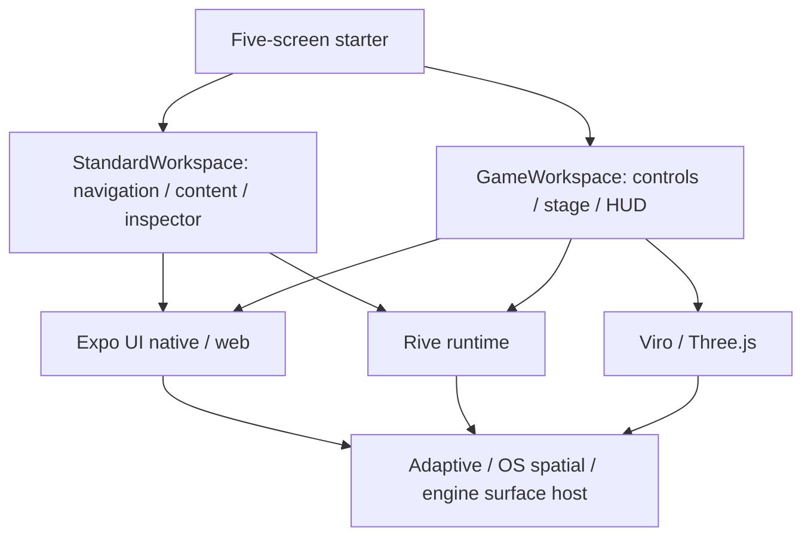

<div align="center">

# ◈ UNIVERSAL SPATIAL STARTER

### Five thoughtful screens. Two layout families. Any supported surface.

**Expo Universal UI · Rive · Kinetrell · Viro / Eskiu · Next.js 16.4 · VisionCamera 5**

[Explore the five screens](#the-experience-at-a-glance) · [Read the docs](docs/README.md) · [Understand the architecture](docs/ARCHITECTURE.md) · [Camera Lab](docs/CAMERA_AND_XR.md)

---

**Phone** · **iPad** · **Foldables / Duo** · **Web** · **Quest** · **PICO** · **visionOS** · **Android XR**

*Target platforms, not a claim that every backend or device has passed hardware verification.*

</div>

> [!IMPORTANT]
> This is a **five-screen reference application**, not a showcase full of unfinished features. Native controls and spatial rendering are composable; **Game Layout is a distinct layout family**. Camera Lab is a **modal experience opened by the raised central scan button**, not a sixth route. XR scanning requires real authorized device sensing: camera frames where available, or native reference-object tracking (including Apple Vision Pro ARKit). No simulated XR camera, prerecorded video, or substitute phone stream.

## The experience at a glance

| Route | Showcase concept | Surface composition | Mobile affordance |
| --- | --- | --- | --- |
| `/` | **01 · Showcase** — discover the system | Motion-led index of demos | Raised **Scan** action in central dock |
| `/native` | **02 · Native Workspace** — productive multitasking | Native rail/list + content + inspector | List/detail transition and inspector sheet |
| `/hybrid` | **03 · Hybrid Rive** — native + interactive art | Native controls + Rive center + native inspector | Immersive Rive stage within adaptive pane |
| `/game` | **04 · Game Workspace** — a small playable loop | Controls + Rive game stage + HUD | Thumb-friendly game controls and session timer |
| `/immersive` | **05 · Immersive Workspace** — engine-hosted space | Native utility panel + Viro/Three.js stage + Rive HUD | Safe 2D stage when not in XR; immersive renderer only when real |

### Two layouts, unlimited combinations



The **layout** defines meaning and behavior. The **renderer** chooses pixels and input. The **host** decides whether that content occupies an adaptive pane, a Meta spatial window, a native Apple window, or a Viro engine surface. One does not impersonate another.

## Design principles

**Art-directed, not overdecorated.** Responsive typography; warm near-black and mineral-white surfaces; deliberate ultramarine/cobalt accents; generous whitespace; strong hover/focus states; meaningful depth. Use custom original vector/3D artwork where needed. No copied game branding, stock-photo placeholder grids, UI kits for decoration, Tamagui or Bento dependency.

**Motion you can understand.** [Kinetrell](docs/KINETRELL_MOTION.md) owns cross-platform entrances, reflow, navigation and scroll choreography. [Rive](docs/RIVE.md) owns authored artboard interactions and state machines. Viro/Eskiu own world-space transforms. Only one system owns any animated property at a time.

**Native-first mobile.** Bottom navigation on compact phones, a **raised 72dp camera action** visually centered over the dock, trailing Inspector as a bottom sheet, RTL-safe navigation, hinge-aware Duo/foldable placement, tablet rail, reduced-motion-aware transitions. The camera opens a polished *Camera Lab* overlay powered by real device sensing: an on-device image detector or a native 3D reference-object tracker. [Mobile design](docs/MOBILE_AND_FOLDABLES.md).

**Real XR, no pretend camera.** On headsets, the scanner requires an actual camera-frame or native object-tracking capability and an authorization path. Vision Pro ARKit recognizes trained real-world objects without exposing raw camera frames to the app. If the required sensing capability is unavailable, show an explicit `sensing-unavailable` or `permission-denied` state; do **not** replace it with simulated frames or captured passthrough compositor pixels. [XR camera requirements](docs/CAMERA_AND_XR.md).

## Package architecture

```text
apps/
  mobile/                    Expo Router 58, mobile + native XR variants
  web/                       Next.js 16.4, React Server Components + Cache Components
  storybook/                 Component stories and interaction coverage
packages/
  app/                       Five routes + demo state only
  ui/                        Universal controls, AdaptivePanes, inspector, camera dock
  spatial/                   Shared contracts, capability negotiation, Rive/Viro hosts
  motion/                    App-level Kinetrell recipes and tokens
  camera/                    VisionCamera source, model pipeline, XR camera adapters
  theme/                     Design tokens, type scale, illustration guidance
  assets/                    Authorized sample assets + model manifest
```

> Repository structure above is the **target of the fork implementation**, not a claim that these folders already exist in NYC-Mon. Existing packages may be reorganized incrementally with compatibility exports. Preserve upstream attribution and third-party notices.

## Quick start (after the fork is built)

```bash
corepack enable
pnpm install --frozen-lockfile
pnpm --filter mobile dev
pnpm --filter web dev
pnpm --filter storybook dev
```

Use **Expo development builds** for VisionCamera, native Rive, native XR SDKs and bridge testing—not Expo Go. Android Quest/PICO flavors and device-only permission requirements are explained in [Platforms](docs/PLATFORMS.md). The five demo routes should boot without login, keys or a production backend. Camera Lab uses a bundled on-device detector for raw-frame hosts, and a bundled Create ML reference-object model for visionOS; it asks permission only upon entering the experience.

## Documentation

| Start here | You will learn |
| --- | --- |
| [Docs index](docs/README.md) | The learning path and decision map |
| [Architecture](docs/ARCHITECTURE.md) | Ownership of the scene, native resources and platform hosts |
| [Layout System](docs/LAYOUT_SYSTEM.md) | Standard vs Game, panel roles, capability negotiation |
| [Components & API](docs/COMPONENTS.md) | Component contracts, examples, events, errors |
| [Kinetrell Motion](docs/KINETRELL_MOTION.md) | Shared motion language, screen recipes, timing, accessibility |
| [Rive Integration](docs/RIVE.md) | Native/web artboards, state machines, lifecycle, typed bindings |
| [Camera & XR](docs/CAMERA_AND_XR.md) | VisionCamera 5, native ARKit object tracking, Lite0, permissions and real XR requirements |
| [Mobile & Foldables](docs/MOBILE_AND_FOLDABLES.md) | Raised scan action, Duo, rail, inspector and hinge rules |
| [Platforms](docs/PLATFORMS.md) | Platform-specific adapter contract and verification status |
| [Testing & Release](docs/TESTING.md) | Device matrix, performance, a11y and CI gates |
| [Contribution Guide](CONTRIBUTING.md) | Changes, API-design discipline, review and attribution |

## Where this came from

The reference fork is derived from [NYC-Mon](https://github.com/mikevocalz/nyc-mon), with shared XR architecture from [viro-external](https://github.com/mikevocalz/viro-external), Expo adaptive patterns adapted from [Moyo Learn](https://github.com/mikevocalz/moyolearn), and motion from [Kinetrell](https://github.com/mikevocalz/Kinetrell). No NYC-Mon story, characters, game assets, or private data belong in this starter.

**Key references:** [Expo UI](https://docs.expo.dev/versions/latest/sdk/ui/universal/) · [Expo Server Components](https://docs.expo.dev/guides/server-components/) · [Next.js Cache Components](https://nextjs.org/docs/app/getting-started/cache-components) · [Meta Layout](https://developers.meta.com/vr/documentation/android-apps/meta-vr-layout-sdk/) · [VisionCamera](https://visioncamera.margelo.com/docs/frame-output) · [Rive](https://rive.app/docs/llms.txt) · [Margelo API design](https://github.com/margelo/react-native-skills/tree/main/skills/api-design)

---

<div align="center"><strong>Designed to be read, explored, tested, and forked.</strong><br/>A small reference app with serious engineering boundaries.</div>
