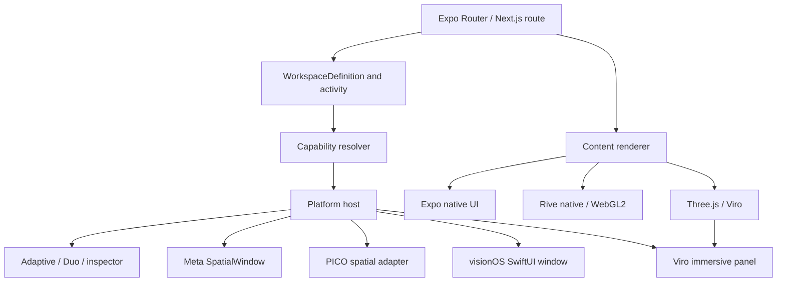

# Architecture and responsibility boundaries

## Intent → renderer → host

1. **App state:** Zustand stores user selection, score, layout activity, camera permission state, and navigation intent. Instance-scoped stores prevent two hosts accidentally sharing pane selection. Long-running gameplay state must not be duplicated into every panel.
2. **Contracts:** `@viro-external/xr-contract` and the starter's proposed layout contracts express what a panel means. Reuse `WorkspaceDefinition` + `WorkspaceActivity`; migrate legacy `SpatialWorkspaceIntent` deliberately.
3. **Renderer:** React Native/Expo UI, Rive, and Three/Viro own different drawing systems. No renderer is a layout type.
4. **Host:** AdaptivePanes tiles/sheets on phones/foldables; Meta and PICO create OS spatial windows; ViroCore/Eskiu own immersive engine panels. OS-managed spatial windows are *not* Viro planes.
5. **Motion:** Kinetrell orchestrates React/native/web chrome; Rive artboards animate themselves; engine panel transforms remain on their renderer's presentation clock. Avoid competing updates to one property.
6. **Inference:** `@starter/camera` owns camera source acquisition, on-device model execution and detections. Its output consists of compact observations, never a copy of camera frames stored in Zustand.

## Server and client boundaries

- **Next.js 16.4:** server-rendered shell, SEO docs/content, optional cached non-sensitive reference catalogs using `'use cache'` and Cache Components. Dynamically personalized values must not enter shared caches.
- **Expo native:** five fully functional client routes offline. Expo RSC/Server Functions experiments belong behind a separate optional lab flag because native navigation and server RSC support are still experimental.
- **Shared:** serializable types, static content, pure layout resolution and Kinetrell motion definitions may cross server/client boundaries.
- **Client only:** Rive runtime, VisionCamera, ViroCore, gesture handling, camera permissions, OS window handles, GPU allocations and interactive Zustand stores.
- **Privacy:** raw frames never cross a network or enter server component props. ML inference runs on-device.

## Reuse rather than rebuild

| Source repo | Reuse | Engineering caution |
| --- | --- | --- |
| NYC-Mon | Expo SDK 58 app, Next.js, Rive Nitro, Viro fork, theme foundation, Storybook | Remove game IP, admin and auth from public starter |
| Moyo Learn | `AdaptivePanes`, fold-safe reserved regions, right rail policy, inspector | Audit patches against Expo Router version before porting |
| viro-external | layout capabilities, Meta resolver, Viro UI, Rive session contract | Keep backwards compatibility; validate native Rive host actually renders |
| Kinetrell | portable motion model and Reanimated/GSAP/Lenis runtime integrations | Resolve SDK peer compatibility; do not handwrite imaginary exports |

## Dependency policy

Target npm's latest stable release **per package**. Record the latest dist-tag, chosen pinned version, date, source, peer constraints and exception reasons. Expo's compatible React / RN / native toolchain overrides blindly installing `latest`. Resolve Rive/Nitro and Reanimated/Worklets peer ranges from actual manifests; no `--force` or hidden warning suppression. Next.js **16.4** is the web target, with regression tests for Cache Components, RSC, hydration and bundler boundaries.

## Strong separation for XR camera

`CameraSource` is a capability-backed resource created by an authorized native provider. For Quest it may be backed by Android Camera2 passthrough; for PICO an OpenXR camera extension; for visionOS native ARKit `ObjectTrackingProvider` can produce **real reference-object anchors** without raw camera frames; a raw main-camera frame provider is a different, restricted capability. VisionCamera 5 is the preferred frame-based camera path when supported; ARKit object tracking is a distinct first-class sensing backend. Never re-label object anchors as raw frames. Vendor acquisition code does not become a magic VisionCamera device just because it returns pixels. Implement/verify a compatible bridge first and expose limitations honestly. The product has **no synthetic XR camera implementation**.
