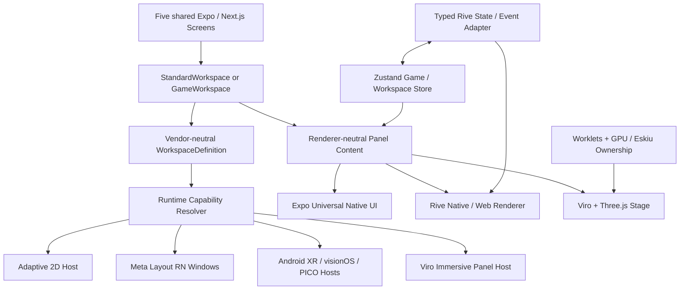

# UNIVERSAL SPATIAL STARTER
## Complete Five-Screen Fork, Spatial Layout + Native UI + Rive Game Layout Engineering Pack

**Specification date:** October 8, 2026  
**Status:** Implementation-ready blueprint, not a claim of completed implementation  
**Source repository:** [`mikevocalz/nyc-mon`](https://github.com/mikevocalz/nyc-mon)  
**Shared spatial foundation:** [`mikevocalz/viro-external`](https://github.com/mikevocalz/viro-external), plus the user's `viro`, `virocore`, and Eskiu work  
**Suggested starter name:** `universal-spatial-starter`  
**Key API design reference:** [`margelo/react-native-skills/skills/api-design`](https://github.com/margelo/react-native-skills/tree/main/skills/api-design)  
**Owner's intent:** Exactly **five product demo screens**. Simple to understand; technically serious; excellent foundation for production apps on phone, tablet, foldable, browser, Quest, Android XR, visionOS, and PICO where the underlying runtimes actually support the features.

> **One-sentence brief:** Fork NYC-Mon into a clean reusable Expo/Next.js spatial starter that demonstrates ordinary native multi-panel UI, native–Rive mixing, a distinct interactive Rive **Game Layout**, and a Viro/Three.js immersive layout—under a small, stable, platform-agnostic component API with honest fallbacks.

---

## 0. Executive decisions (binding)

1. **Exactly five top-level demo routes/screens**, mirrored between Expo mobile and web. Do not add a sixth Settings, Auth, Dashboard, Onboarding, or Profile screen. Settings, diagnostics, and capability information are small overlays or an inspector in the Showcase.
2. **Two layout families, not two renderers:** `StandardWorkspace` (navigation/content/inspector) and `GameWorkspace` (controls/stage/HUD). Rive is a renderer that can appear inside **either** family. The Game Layout has a distinct interaction, session, and focus contract.
3. **Mix-and-match is mandatory:** native + native + native; native + Rive + native; Rive + Rive + Rive; native + Viro/Three.js + Rive. Never encode “Rive means Game Layout” or “Game Layout requires Rive.”
4. **Five screens teach five concepts:** Showcase, Native Workspace, Hybrid Rive Workspace, Rive Game Workspace, Immersive Workspace.
5. **Use real native controls:** Expo Universal (`@expo/ui`) → Compose on Android, SwiftUI on Apple, web host on web. Bridge Meta UI Set controls on Horizon OS only where they materially add hover/focus/gaze-aware behavior and where the implementation is verified.
6. **Use the OS's windowing where available:** Meta's Layout SDK via its **React Native** integration inside Expo; Android XR via supported Compose/Views XR interoperability; visionOS with SwiftUI windows/volumes; PICO with its supported spatial facilities. Use the Viro engine for **immersive world panels**, not as a pretend OS window.
7. **The center stage is the authoritative main surface.** Meta's two secondary windows are left and right when capacity allows. The main app window itself is not promoted as an auxiliary `SpatialWindow`.
8. **Platform parity means equivalent intent and outcomes, not identical native widget appearance, number of windows, or arbitrary system window movement.** Declare requirements separately from preferences and report the resolved outcome.
9. **Rive uses actual `.riv` files and the current Nitro runtime** on supported RN targets; React WebGL2 for browser. A real Viro/Eskiu offscreen Rive texture renderer is a separate native research track, never implied by an existing `RiveView`.
10. **Keep source IP isolated.** Strip NYC-Mon characters, narrative, branding, imagery, routes, private credentials, game databases, and licensing-unclear assets from the public starter. Preserve legally required MIT and third-party notices. A visible GitHub fork retains ancestry and history; if a truly neutral public history is essential, create a separately initialized derived repo after audit while retaining required attribution.
11. **No backend in v1:** no Auth, Payload, Neon, Supabase, Redis, email, billing, third-party analytics, network-dependent demo mechanics, or mandatory API keys. Local state + packaged demo assets only.
12. **Motion policy:** Rive for its authored animations; Kinetrell for shared React Native/web transitions. Do not add GSAP or Lenis directly in apps, competing animation libraries, Tamagui, or Bento as framework dependencies. The starter can use restrained bento-like grouping visually.
13. **No fake capability badges and no fake pass results.** Label hardware-only acceptance criteria `NOT VERIFIED` until a real supported device/build proves them.
14. **The source repo is not to be mutated by this Markdown deliverable.** Engineering implementation proceeds through auditable, focused PRs after fork creation.

### Scope ladder

| Level | Meaning | Ship requirement |
|---|---|---|
| **P0** | All five routes, cross-platform UI shell, native/adaptive layout, usable game logic, screen interaction, theme, accessibility, Storybook | Required |
| **P1** | Verified Rive assets + native Rive/Meta layout bridge, genuine left and right spatial windows on supported Quest; capabilities and fallback | Required for calling starter *spatial-ready* |
| **P2** | Android XR/visionOS/PICO adapter verification, Viro/Eskiu Rive texture experimentation, hand/controller input hardening | Separate acceptance per device; document gaps |
| **Future** | Multiplayer, physics world, Gaussian splats, gaze tracking, auth, asset CMS, advanced multiplayer networking | Explicitly excluded from starter v1 |

---

## 1. Repository audit: what can be reused today

The following paths and versions were checked against the **source repo on October 8, 2026**. This is an inventory, not a claim that every feature has passed hardware QA.

| Source | Present | Starter action |
|---|---|---|
| `apps/mobile` | Expo SDK 58 mobile app; `expo-router`; Quest and PICO Android flavors | **Keep and simplify** to five demo routes; keep variant scripts only if working |
| `apps/web` | Next.js 16 App Router | **Keep**, use same five demos rather than NYC-Mon marketing pages |
| `apps/storybook` | Storybook 10 / Vite / react-native-web | **Keep**, add component/layout stories |
| `apps/admin-vite` | Payload/TanStack admin | **Remove** from starter workspace only after dependency inventory |
| `packages/ui` (`@acme/ui`) | Universal components, adaptive panes, NeonBlade-inspired ports, Skia, Three/WebGPU | **Selectively keep**; neutralize branding and trim to examples |
| `packages/theme` | Shared design tokens | **Keep**, replace domain palette with neutral spatial starter tokens |
| `packages/spatial` | Existing Rive stage and Viro rendering integration | **Keep/adapt**, split Rive interface from immersive renderer |
| `packages/app` | Shared Solito screens/providers | **Keep/reshape** into five shared demo modules |
| `packages/core`, `packages/content` | NYC-Mon simulation/domain records | **Remove game-specific content**; new small deterministic demo `game-core` |
| `packages/auth`, `packages/payload`, `packages/mcp-server` | Auth, CMS, external integrations | **Remove** when unused by the five demos |
| `packages/assets` | Brand/logo/fonts/photos | **Audit and replace** with neutral/demo-owned assets |
| `vendor` | Viro fork package tarball | **Keep only if provenance/build/reproducibility validated** |
| `tooling/` | Asset-copy scripts, generators, platform checks | **Keep useful tooling**, delete game-specific scripts |

### Actual baseline dependencies seen in `pnpm-workspace.yaml`

- Expo `58.0.3`, React Native `0.88.0-rc.3`, React `19.3.0`, `expo-router` `58.0.13`, TypeScript strict configurations.
- `@expo/ui` `58.0.12` in the source catalog; **the public Expo UI docs may display a different recommended package version, so never replace the app's SDK-compatible pin merely from an isolated doc example**. Run Expo's compatibility check before upgrading.
- `@metavr/layout-compat` and `@metavr/layout-window-compat` `1.0.0` are already app dependencies.
- `@rive-app/react-native` `0.5.2`; `@rive-app/react-webgl2` `4.36.0`.
- `react-native-nitro-modules` `0.37.1`. **Known peer concern:** source workspace comments acknowledge that Rive 0.5.2 advertises a Nitro peer range below 0.37.x. Verify real compilation/runtime and resolve compatibility deliberately; do not suppress and call it clean.
- `@reactvision/react-viro` points to a vendored pinned fork. `expo-horizon-core` and `@expo-pico/core` are wired through Git references.
- Three.js `0.186.1`, `react-native-webgpu` `0.10.4`, TypeGPU `0.12.6`, Skia `3.0.2`, Kinetrell git pin, Zustand `5.0.15`.
- Root requires Node `>=24.15.0 <26` and pnpm `12.8.1`.

### Existing source work to reuse, not reinvent

In `mikevocalz/viro-external`:

- `packages/xr-platform-contract/` — vendor-neutral spatial surface intent and lifecycle; `WorkspaceDefinition` / `WorkspaceActivity` stricter contracts.
- `packages/meta-layout/` — pure TypeScript resolver (`resolveMetaWorkspace`) and Meta props mapping. **It does not create OS windows**; the app does that using Meta's native integration.
- `packages/ui/` — `SpatialPanel` for engine-managed 3D panels; `SpatialWorkspaceSlotNode` with LEFT/CENTER/RIGHT mapping.
- `packages/spatial-runtime/` — Worklets, TypeGPU, GPU resource and Eskiu memory ownership policies.

**Cross-repo design rule:** Make the starter consume shared Viro packages (workspace dependencies, tagged package sources, or properly pinned versions) where possible. If the public starter must work without private Git access, publish compatible distributable packages or supply a legal, documented and reproducible alternative. Don't silently copy/paste forked internals into a second codebase.

---

## 2. Product positioning and UX principles

**Audience:** Expo/React Native engineers, designers building Rive experiences, XR prototypers, agency teams, creators of immersive educational tools, spatial dashboards and mixed-reality games.

**Product pitch:** "Build one intelligent interface. Render it naturally on every screen—and spatially where the platform supports it."

**Design feel:** deliberately light enough to be readable, dark enough for cinematic gameplay, professional rather than nightclub neon. Distinct **Studio Light** (standard/hybrid) and **Stage Dark** (game/immersive) contexts; controls retain WCAG-conscious contrast, legible typography and stable hit targets.

Design principles:

- **Demo before documentation:** a developer should understand the layout families by tapping the five screens and interacting with live examples.
- **Cinematic, not noisy:** one strong hero/stage per screen, bounded motion, 0–2 accent colors per surface, very limited glass and glow.
- **One concept per screen:** no giant home screen with every library's feature at once.
- **Natural navigation:** back, close, focus and dialog behavior must match platform; avoid making standard navigation feel like a game unless in Game Layout.
- **Spatial comfort:** large text and easy reach, angular spacing, no essential panel behind the user, no motion of system windows every frame.
- **Progressive enhancement:** fully usable mobile/web experiences; no blank route when XR is unavailable.
- **Honest samples:** actual `.riv` assets and working interactions, not video/GIF pretending to be Rive or a static screenshot pretending to be XR.

### Visual token direction (starter defaults; adjustable)

| Token | Suggested value | Usage |
|---|---|---|
| `color.surface.light` | `#F5F6F8` | General native workspace |
| `color.surface.dark` | `#121722` | Stage, immersive chrome |
| `color.panel.light` | `#FFFFFF` | Native cards/panels |
| `color.panel.dark` | `#202938` | HUD/panel surface |
| `color.text.primary` | `#111827` | Light text foreground |
| `color.text.inverse` | `#F6F8FB` | Game foreground |
| `color.accent.primary` | `#675BEE` | Primary CTAs / active target |
| `color.accent.secondary` | `#21A8BD` | Supporting feedback |
| `radius.panel` | `20` logical px/dp | Consistent outer panels; allow platform adaptation |
| `radius.control` | `12` logical px/dp | Buttons / fields |
| `space.base` | `4` px/dp scale | 4/8/12/16/24/32/48 |
| `focus.ring` | semantic accent + high contrast | All pointer/keyboard/XR focus states |
| `touch.min` | `48dp` | Minimum interactive target on Meta/Android XR; larger by context |

Tokens are semantic, not tied to Meta's internal color/theme class names. Meta UI Set adapter maps them to `UiSetTheme`; other adapters use corresponding native/web theme semantics. Respect user OS contrast, type scaling and reduced motion.

---

## 3. Information architecture: exactly FIVE screens

**One shared screen identity across mobile and web**. Native route names and Next.js paths match conceptually. The five routes:

| # | Screen / route | Layout family | Center renderer | Supporting panels | What user learns |
|---|---|---|---|---|---|
| 1 | **Showcase** `/` | Launchpad | Native content | Capability sheet overlay | Pick an experience; understand capability |
| 2 | **Native Workspace** `/native` | `standard` | Expo Universal / native | Native navigation + inspector | Classic native three-panel across devices |
| 3 | **Hybrid Workspace** `/hybrid` | `standard` | **RivePanel** | Native list + native inspector | Rive in the center **without** game-layout semantics |
| 4 | **Game Workspace** `/game` | **`game`** | **RiveGameStage** | Optional native/Rive controls + HUD | Distinct game semantics, actual play loop |
| 5 | **Immersive Workspace** `/immersive` | `game` or `immersive` presentation | **Viro/Three.js** stage | Native/Rive supporting panels | Engine vs OS windows, spatial input/fallback |

**No login, onboarding, monetization, CMS, user profiles, chat, auth, or extra screens.** A compact Settings/Diagnostics drawer, Help popover, and system dialogs may appear as overlays **within** a current screen and do not count as routes.

### Navigation model

- Native phone: slim bottom tab bar or a segmented launcher; avoid five equally loud tabs if they collide with game interactions. Prefer five Showcase cards + contextual Back/Home affordance on demo screens.
- Tablet/foldable: side rail + split-pane composition; respect hinge/posture and RTL where present.
- Web desktop: compact left rail or header nav; browser back and deep links functional; main content responsive.
- Headset: Showcase opens as main window. In demo screens, center stays main; start/end are auxiliary OS windows when supported. Escape/Back returns to Showcase; never strand user in 3D.
- Deep links: `/native`, `/hybrid`, `/game`, `/immersive` work directly, including refresh on web.

---

## 4. Screen designs — functional specs, not just mood boards

### Screen 01 — SHOWCASE (the gateway)

**Intent:** Make this feel like an excellent starter kit landing inside the app, not a demo dumping ground.

**Content:**

1. Upper hero: "One interface. Every dimension." / short subhead / active platform label.
2. Four polished demo cards: Native, Hybrid, Game, Immersive. Each states one benefit, renderer badges, and a clear "Open demo" action.
3. Tiny *Runtime capabilities* strip: **Available**, **Fallback**, **Unavailable**, never claim physically tested capabilities unless proven.
4. Compact "How to compose" code snippet or linked docs anchored below cards.
5. Header actions: Theme, Motion, and Diagnostics (popover/sheet, not another route).

**Interaction:** open any screen; save theme/motion preferences locally; diagnostics shows feature detection and current resolved layout. Use subdued motion and poster artwork (original/compliant licensed). No account needed.

**Wireframe:**

```text
┌─────────────────────────────────────────────────────────────────────┐
│ UNIVERSAL SPATIAL     One interface. Every dimension.   [?] [⚙]   │
│ Native UI × Rive × Viro × Spatial layouts                        │
├───────────────────────────────┬─────────────────────────────────────┤
│ NATIVE WORKSPACE              │ HYBRID WORKSPACE                    │
│ Three panes. Native controls. │ Rive center + native side panels.  │
│ [Open]                        │ [Open]                              │
├───────────────────────────────┼─────────────────────────────────────┤
│ GAME WORKSPACE                │ IMMERSIVE WORKSPACE                 │
│ Real interactions + game HUD. │ Viro / 3D scene + companion UI.    │
│ [Play]                        │ [Explore]                           │
├─────────────────────────────────────────────────────────────────────┤
│ Runtime: Adaptive ✓ | Spatial windows: fallback | Rive: ready ...│
└─────────────────────────────────────────────────────────────────────┘
```

**Definition of done:** all four cards navigate; capability detection is accurate; theme works; phone, tablet, web and simulator versions remain legible; Storybook has card, hero and state examples.

### Screen 02 — NATIVE WORKSPACE (ordinary app shell)

**Intent:** Demonstrate professional master/detail/inspector composition using native controls, with true window promotion only where supported.

**Scenario:** Simple "Explore Projects" list (dummy local data; neutral names, no NYC-Mon IP).

- **Left:** project list/search/categories via Expo Universal/Meta UI Set controls.
- **Center:** project detail with heading, native form/switch/slider/button, media placeholder, progress, and actionable controls.
- **Right:** inspector with metadata, contextual actions, and a small activity log.

**Behavior:** selecting a project updates center and inspector via shared Zustand store. Search filters immediately; a button opens a native confirmation dialog; changing theme re-themes all panes. On phone list → detail → inspector sheet; on foldables start rail/detail/trailing overlay; on spatial device center stays main and side panels can promote. Parent/child labels stable.

```text
┌───────────┐    ┌────────────────────────┐    ┌─────────────────┐
│ PROJECTS  │    │ SELECTED PROJECT       │    │ INSPECTOR       │
│ [search]  │    │                        │    │ Properties      │
│ ▸ Alpha   │    │ Native forms/controls  │    │ Activity        │
│   Beta    │    │ Native action + dialog │    │ Quick actions   │
└───────────┘    └────────────────────────┘    └─────────────────┘
   START                 MAIN                          END
```

**Definition of done:** accessible search/selection, functional controls, stable cross-window synchronization, phone fallback, no decorative dead buttons.

### Screen 03 — HYBRID WORKSPACE (standard layout, Rive in the middle)

**Intent:** Prove renderer choice does not determine layout type. This is **not** a game layout, even though Rive is central.

**Scenario:** "Signal Studio" interactive Rive-designed control surface—a small animated audio/equalizer/signal visualization or state-machine driven product configurator.

- **Left (native):** 3 preset rows (`Calm`, `Focus`, `Energy`), one selected at a time.
- **Center (Rive):** `signal-studio.riv`; labeled state machine and typed View Model inputs for mode, intensity, playing.
- **Right (native):** accessible slider for intensity, play/pause button, status, current preset and small description.

**Behavior:** selecting preset updates Rive inputs and right inspector; Rive emits a typed interaction event that updates status; intensity slider synchronizes without thrashing layout geometry; pause/resume on lifecycle. Invalid/missing `.riv` asset shows visible fallback panel and error text.

```text
┌─────────────┐     ┌──────────────────────────┐     ┌─────────────┐
│ PRESETS     │     │    INTERACTIVE RIVE      │     │ INSPECTOR   │
│ ○ Calm      │───▶ │  animated visualization  │ ◀───│ Intensity   │
│ ● Focus     │     │  state machine / VM      │     │ Play / Pause│
│ ○ Energy    │     │                          │     │ Status      │
└─────────────┘     └──────────────────────────┘     └─────────────┘
```

**Definition of done:** actual `.riv` changes with native controls; Rive callback reaches inspector; no extra screen; full mobile fallback; screen remains `StandardWorkspace` and retains ordinary navigation/focus semantics.

### Screen 04 — GAME WORKSPACE (distinct layout, playable)

**Intent:** Demonstrate a true `GameWorkspace`: stage-first experience with controls/HUD, deterministic gameplay, pause/resume, sound/haptics opt-in, session lifecycle, controller accessibility.

**Sample game:** **Pulse Catch** (neutral starter IP, fully offline). A rhythmic, short-session reflex/timing mini-game with no back-end and no third-party assets.

**Simple rules:**

- 30-second round, three visible lanes or signal targets; center Rive animates a pulse approaching a target zone.
- Player presses `Catch` or selects a lane when the pulse enters its zone. Gameplay logic lives in TypeScript pure functions and clocks, **not in Rive timelines**.
- Successful hit scores +100, close hit +50, miss +0; deterministic tolerance windows documented; no more than one awarded hit per spawned pulse.
- HUD: score, accuracy/hits, timer, state (`ready` / `playing` / `paused` / `finished`).
- Controls: Start, Pause/Resume, Catch, Restart, Sound toggle. Controller/keyboard/touch equivalents.
- **Layout mode within this same screen:** toggle between `Mixed` (native controls + Rive stage + native HUD) and `Full Rive` (Rive controls + Rive stage + Rive HUD). This is **one route**, not two screens.
- Same game state drives both visual modes. Switching visual mode preserves round state if resources allow; otherwise the UI offers a clearly communicated restart, never silently resets.
- When the `.riv` asset is missing, native/Skia mini-game rendering remains genuinely playable as a **fallback**, but label Rive validation incomplete until actual `.riv` works.

**Distinct game semantics:**

- Stage gets primary focus and input ownership; game controller owns `startRound`, `pauseRound`, `registerAction`, `endRound`, `restartRound`.
- HUD is read-only derived state; controls dispatch typed actions.
- Accessibility: equivalent large native "Catch" action and semantic HUD; never require drag-only or gaze-only action.
- Pause on app background/interruption; use monotonic time and elapsed deltas, not unbounded background ticking.
- Reposition windows only for layout changes, not each animation frame.

```text
┌─────────────────┐  ┌───────────────────────────────┐ ┌─────────────┐
│ GAME CONTROLS   │  │         PULSE CATCH           │ │ LIVE HUD    │
│ [Start] [Pause] │  │  ◯───◎   ◯───◎   ◯───◎       │ │ Score  300  │
│   [ CATCH ]     │  │       [Target zone]          │ │ Time  21 s  │
│ Mixed / Full    │  │     Rive game artboard       │ │ Hits   3/4  │
└─────────────────┘  └───────────────────────────────┘ └─────────────┘
```

**Definition of done:** player can finish a round without a backend; scored hits match pure unit tests; both visual modes work with real `.riv` source where supported; cannot accidentally score after finished; nonspatial fallback and reduced motion work.

### Screen 05 — IMMERSIVE WORKSPACE (world/scene + companion panels)

**Intent:** Show the crucial distinction between app-level OS windows and engine-managed immersive panels. Same game-layout design intent, different stage backend.

**Scenario:** "Orbit Lab"—a small simple orbiting object/world with one interactive target; no huge level, no full NYC map, no asset pipeline requirements.

- **Left:** native scene controls (Reset camera, Toggle grid, Focus object).
- **Center:** Viro scene using existing ViroCore/Eskiu integration where supported, or a Three.js WebGPU/WebGL2 stage on web; a stable lower-fidelity non-XR preview on devices without a compatible renderer.
- **Right:** Rive sensor/HUD panel (live target state, hover/selection, pulse) with native accessible equivalents.
- **Interactions:** focus an object, toggle scene highlight, read selection in right inspector, exit immersive without losing route state.
- **Device behavior:** Meta native windows stay as standard-window companions if allowed; true immersive Viro panels are **engine surfaces**. Do not claim those surfaces are OS SpatialWindows or universally movable/reanchorable.

**Definition of done:** at least one actual interactive 3D object on supported runtime; clean exit; context and state synchronized; documented fallback when no headset/renderer; no fake AR camera preview.

---

## 5. Platform behavior matrix (capability-based)

| Platform/runtime | Standard Workspace | Hybrid Rive | Rive Game | Immersive Workspace | Notes |
|---|---|---|---|---|---|
| iPhone | stack/sheet native | native + RN Rive | full-screen game + HUD sheet | 3D preview or AR only with verified adapter | No fictional floating windows |
| iPad | split view / inspector | Rive center + 2 panes | stage + supporting panes | scene preview, native side panes | Respect split-view and keyboard |
| Android phone/tablet | Compose via Expo UI + adaptive | RN Rive center | game stage | Viro AR only when permissions/path are working | No Meta window API assumption |
| Foldables | hinge-aware pane/rail, posture modes | adaptive Rive center | game stage-first | scene host + inspector fallback | Protect hinge and input bounds |
| Web desktop | responsive CSS/RN Web | Rive WebGL2 | keyboard/mouse game | Three.js WebGPU/WebGL2 | No native XR claim |
| WebXR | Web UI if session unsupported | browser Rive | browser game | WebXR only if live support proven | Do not infer WebXR from mere WebGPU support |
| Meta Horizon OS (supported v207+) | main + 0–2 promoted windows | Rive main + native side windows | Rive stage main + controls/HUD | companion windows + Viro separate mode | React Native Meta Layout SDK; 2 side-window budget |
| Older Horizon / no capacity | inline/adaptive fallback | inline/adaptive | playable inline | fallback preview or honest unsupported | Explicit fallback |
| Android XR | native Android XR Compose when bridged/tested | Rive hosted in verified panel | center stage | app-specific immersive path | Different SDK from Meta Layout |
| visionOS | SwiftUI scene/windows where verified | Apple Rive runtime host | SwiftUI game window | volume/immersive if verified | Do not claim identical window anchoring |
| PICO | window/container adapter where verified | native Android Rive center | stage + panel | Viro/OpenXR path where verified | Device SDK and entitlement checks |

**Hard rules from Meta's current docs:**

- Layout SDK is available as RN and Jetpack Compose integrations; for the Expo app, use the **RN integration** to host OS windows. Compose UI Set is a **separate native control library** requiring an Expo module bridge if chosen.
- Meta spatial windows cannot have a transparent root: paint entire root opaque. Transparent Rive artwork may be *inside* the window.
- Keep main + at most two simultaneously important auxiliary windows; RN reserves two auxiliary window slots. Simulator modeling capacity is not proof that the RN integration can exceed two.
- Horizon OS versions earlier than **v207** or unsupported hardware use configured fallback.
- Stable IDs, sizes, anchors and priorities; use Rive animation **inside**, not per-frame OS window motion.
- Native and JS Meta package versions must be compatible. A clean `expo prebuild --clean` must regenerate required native integration via config plugins.

**Native control bridge scope:** Buttons, icon buttons, switches, sliders, checkboxes, radio, text field, search, navigation items, dialogs, dropdowns, cards, tooltips and themes. Do not promise 1:1 parity for every Expo or Meta control until audited. Require accessibility and fallbacks for every public component.

---

## 6. Technical architecture and ownership



### Ownership boundary contract

| Layer | Owns | Does NOT own |
|---|---|---|
| `@starter/workspace` | Layout families, semantic regions, capability intent/resolution, state/priority, React composition | Quest-specific Kotlin classes, assets, gameplay scoring |
| `@starter/native-ui` | Expo Universal controls, optional Meta UI Set bridge, accessibility and theme | Spatial window geometry or Rive state machines |
| `@starter/rive` | `.riv` source loading, typed VM mapping, Rive events, error/reduced-motion behavior, platform renderer switch | Game authority, network authority, native XR OS windows |
| `@starter/game-core` | Pure deterministic Pulse Catch rules and round state | GPU rendering, Rive artboard, window lifecycle |
| `@starter/spatial` | Integration with `@viro-external/xr-contract` and adapters | Duplicating existing Viro engine primitives |
| `@starter/scene` | Viro/Three.js stage adapters, input hit test, resources | Auth/CMS, standard app controls |
| `@starter/theme` | Semantic tokens, light/dark themes, density and type scale | Hardcoding platform-specific UI internals |
| `apps/mobile` | Expo Router routes, platform config plugins and permissions, development variants | New independent layout engine |
| `apps/web` | Next.js App Router, Rive WebGL2, WebGPU/WebGL2 host | Fake native or spatial window claims |
| `apps/storybook` | Story fixtures, visual/interaction tests | Replacing real headset validation |

### Prioritize reuse of existing XR contracts

`@viro-external/xr-contract` already has `WorkspaceDefinition` (one `main` surface, unique IDs, lifecycle and focus), plus `WorkspaceActivity`. **Do not replace it wholesale**. Introduce layout-family metadata in the starter-facing composer, translate into the existing workspace definition, and extend the shared contract with an RFC/PR only if the use case cannot be expressed already.

`@viro-external/meta-layout` already resolves workspace promotion. Prefer its `resolveMetaWorkspace` rather than writing a second eligibility/priority algorithm. Normalize `{main, window, inline, omitted}` into a single resolved layout result. Keep focus and game event policies above that resolver.

---

## 7. Public TypeScript / React API (Margelo API Design skill)

### Foundational rules

1. **First design TS, then native code.** Export only stable semantic concepts. Public modules include JSDoc on every exported type/member.
2. Do not expose `android`, `ios`, `meta`, `pico`, or `visionos` option bags for functionality expressible as a common semantic intent. Adapter internals can have such platform details.
3. Use **discriminated unions** for mutually exclusive layout/result states; do not return objects with 14 unrelated optional booleans.
4. Distinguish **preference** (`presentation: 'auto' | 'adaptive' | 'spatial'`) from **requirement** (`requiredCapabilities`). Unsupported requirements throw descriptive errors; ignored preferences use explicitly resolved fallbacks.
5. Stable semantic pane IDs and slot names; no stringly typed unvalidated event payloads. Geometry in logical `dp`, duration in `ms`.
6. React components wrap an imperative core. Observable state uses Zustand or `useSyncExternalStore`-based subscribers; hooks adapt to it. Native handles have explicit ownership and cleanup.
7. Surface errors as actual `Error` instances; never silent blank renders. Optional visual effects degrade gracefully; required renderer capability fails clearly.
8. Do not expose native mutable windows or Rive GPU resource handles through generic JSON objects.
9. Package `index.ts` files are **export-only barrels**. Split types and implementation by domain; no 800-line `types.ts`.
10. Use examples to validate the public API before writing the first Kotlin or C++ component; compile type-positive and type-negative fixtures.

### Recommended public exports

```typescript
// @starter/workspace public exports
export { StandardWorkspace } from './standard/StandardWorkspace';
export { GameWorkspace } from './game/GameWorkspace';
export { WorkspacePanel } from './panels/WorkspacePanel';
export { GamePanel } from './game/GamePanel';
export { useWorkspaceResolution } from './hooks/useWorkspaceResolution';
export { getWorkspaceCapabilities } from './capabilities/getWorkspaceCapabilities';
export type { WorkspaceResolution } from './capabilities/WorkspaceResolution';
export type { PresentationPreference } from './presentation/PresentationPreference';

// @starter/rive public exports
export { RivePanel } from './RivePanel';
export { RiveButton } from './RiveButton';
export { RiveGameStage } from './RiveGameStage';
export { useRivePanelBinding } from './binding/useRivePanelBinding';
export type { RiveSource } from './source/RiveSource';
export type { RivePanelEvent } from './events/RivePanelEvent';
```

**A renderer is a React child, not an enum requirement**. Any `WorkspacePanel` can host standard React native content, `RivePanel`, a separate scene component, or composite content; only a stage's contracts are more strict.

### Draft public type definitions

The following is a **design target**. It must be reconciled with existing exported `@viro-external/xr-contract` names during implementation, rather than pasted on top as a duplicate contract.

```typescript
import type { ReactNode } from 'react';

/** Preferred host behavior; see the resolved outcome separately. */
export type PresentationPreference = 'auto' | 'adaptive' | 'spatial';

/** Stable features discovered from the active runtime. */
export type WorkspaceCapability =
  | 'native-controls'
  | 'rive-native'
  | 'rive-web'
  | 'spatial-windows'
  | 'immersive-stage'
  | 'controller-input'
  | 'hand-input';

/** The runtime chose real spatial windows for some optional panels. */
export interface SpatialResolution {
  kind: 'spatial';
  mainPanelId: string;
  promotedPanelIds: readonly string[];
  inlinePanelIds: readonly string[];
}

/** The app remains a fully functioning adaptive single window. */
export interface AdaptiveResolution {
  kind: 'adaptive';
  mainPanelId: string;
  inlinePanelIds: readonly string[];
  reason: 'compact' | 'unavailable' | 'capacity';
}

/** Resolved placement, not requested placement. */
export type WorkspaceResolution = SpatialResolution | AdaptiveResolution;

/** Common layout requirements independent of the vendor SDK. */
export interface WorkspaceRequirements {
  requiredCapabilities?: readonly WorkspaceCapability[];
}

/** App-like three-region layout. */
export interface StandardWorkspaceProps extends WorkspaceRequirements {
  id: string;
  main: ReactNode;
  children?: ReactNode;
  presentation?: PresentationPreference;
  onResolved?: (resolution: WorkspaceResolution) => void;
}

/** Game layout has a mandatory stage and different input/lifecycle policy. */
export interface GameWorkspaceProps extends WorkspaceRequirements {
  id: string;
  stage: ReactNode;
  children?: ReactNode;
  presentation?: PresentationPreference;
  onResolved?: (resolution: WorkspaceResolution) => void;
  onPauseRequested?: () => void;
}

/** Supporting panel; 'main' is provided by StandardWorkspace.main. */
export interface WorkspacePanelProps {
  id: string;
  position: 'start' | 'end';
  children: ReactNode;
  preferredSize?: { widthDp: number; heightDp: number };
  priority?: number;
  fallback?: 'inline' | 'drop';
}

/** A game supporting panel; the main game stage is not optional. */
export interface GamePanelProps extends WorkspacePanelProps {
  role: 'controls' | 'hud' | 'tools';
}
```

**Important API review:** if `requiredCapabilities` contains `spatial-windows`, a runtime with no spatial window support must fail rather than silently selecting adaptive, even if `presentation='auto'`. If no requirement is supplied, adaptive fallback is valid. Validate the impossibility of duplicate IDs or missing main stage before mounting windows.

### Rive source and binding APIs

```typescript
/** Asset sources are explicit and prevent interpreting a URI as a file key. */
export type RiveSource =
  | { kind: 'bundled'; asset: number }
  | { kind: 'remote'; uri: string };

/** Public event model, independent of Rive's underlying event classes. */
export type RivePanelEvent =
  | { type: 'action'; action: 'start' | 'pause' | 'catch' | 'restart' }
  | { type: 'preset-selected'; preset: 'calm' | 'focus' | 'energy' }
  | { type: 'ready' };

export interface RivePanelProps {
  source: RiveSource;
  artboard?: string;
  stateMachine?: string;
  accessibilityLabel: string;
  onEvent?: (event: RivePanelEvent) => void;
  onError?: (error: Error) => void;
  fallback?: ReactNode;
}
```

This `RiveSource` is **our proposed wrapper type**, not a verbatim type from the Rive SDK. The native adapter converts it to the currently supported `useRiveFile()` input. Do not stack a convenience JS parser over a public Nitro `HybridObject`; encapsulate Nitro behind a deliberate higher-level React component API.

**Typed Rive View Model binding:**

- Publish a **small generated TypeScript manifest** from each supplied Rive asset (artboard, state machine, View Model properties, Rive event names and versions).
- Validate that required names/expected property types exist when the Rive file is loaded; throw an actionable asset-mismatch error.
- Surface a typed `RivePanelEvent` union from the manifest and map it to domain actions through a dedicated event adapter.
- The game state is **not** the Rive View Model; Zustand holds logical state, Rive View Model mirrors presentation inputs.
- Cache immutable files per asset and share files where supported. Each visible Rive state-machine instance owns its own inputs/instance lifecycle as required by the runtime.
- Unsubscribe listeners, cancel in-flight loads, and release/avoid using native handles after unmount. Do not hide failures behind arbitrary retries or timers.

### Call-site 1 — Native three-pane app

```tsx
import { StandardWorkspace, WorkspacePanel } from '@starter/workspace';
import { ProjectList, ProjectDetails, ProjectInspector } from '@starter/demo-ui';

export function NativeDemo() {
  return (
    <StandardWorkspace id="native-demo" main={<ProjectDetails />}>
      <WorkspacePanel id="project-list" position="start" fallback="inline">
        <ProjectList />
      </WorkspacePanel>
      <WorkspacePanel id="project-inspector" position="end" fallback="inline">
        <ProjectInspector />
      </WorkspacePanel>
    </StandardWorkspace>
  );
}
```

### Call-site 2 — Mixed Standard Workspace, Rive center

```tsx
import { StandardWorkspace, WorkspacePanel } from '@starter/workspace';
import { RivePanel } from '@starter/rive';
import { riveAssets } from '@starter/assets/rive';

export function HybridDemo() {
  return (
    <StandardWorkspace
      id="signal-studio"
      main={
        <RivePanel
          source={riveAssets.signalStudio}
          artboard="SignalStudio"
          stateMachine="Controller"
          accessibilityLabel="Interactive signal visualization"
          fallback={<SignalStudioFallback />}
        />
      }
    >
      <WorkspacePanel id="preset-list" position="start">
        <NativePresetList />
      </WorkspacePanel>
      <WorkspacePanel id="signal-inspector" position="end">
        <NativeSignalInspector />
      </WorkspacePanel>
    </StandardWorkspace>
  );
}
```

### Call-site 3 — Game Layout, mixed or full Rive (same route)

```tsx
import { GameWorkspace, GamePanel } from '@starter/workspace';
import { RiveGameStage, RivePanel } from '@starter/rive';
import { riveAssets } from '@starter/assets/rive';
import { useDemoPreferences } from '@starter/state';

export function GameDemo() {
  const style = useDemoPreferences((s) => s.gamePanelStyle);
  return (
    <GameWorkspace
      id="pulse-catch"
      stage={
        <RiveGameStage
          source={riveAssets.pulseCatch}
          accessibilityLabel="Pulse Catch game stage"
          fallback={<AccessiblePulseStage />}
        />
      }
      onPauseRequested={pauseGame}
    >
      <GamePanel id="game-controls" position="start" role="controls">
        {style === 'full-rive'
          ? <RivePanel source={riveAssets.gameControls} accessibilityLabel="Game controls" />
          : <NativeGameControls />}
      </GamePanel>
      <GamePanel id="game-hud" position="end" role="hud">
        {style === 'full-rive'
          ? <RivePanel source={riveAssets.gameHud} accessibilityLabel="Game HUD" />
          : <NativeGameHud />}
      </GamePanel>
    </GameWorkspace>
  );
}
```

**Compilation note:** examples are interface targets, not paste-ready imports from existing packages. Domain components, exported assets and `pauseGame` are application implementation dependencies. Typecheck working versions before documenting them as installed APIs.

### Error and subscription example

```typescript
const sub = spatialSession.addOnResolutionChangedListener((resolution) => {
  workspaceStore.getState().applyResolution(resolution);
});

try {
  await spatialSession.start(); // a real async boundary, if adapter needs it
} catch (error) {
  reportError(error instanceof Error ? error : new Error(String(error)));
} finally {
  sub.remove(); // idempotent listener cleanup
  await spatialSession.dispose(); // only if this session owns native resources
}
```

This is a **proposed imperative session API pattern** for adapters that actually own async resources, not a mandate to create an async session for every ordinary React layout. Avoid a fake prepare/start step when a pure resolver suffices.

### API review checklist (apply before implementation)

- [ ] Valid state combinations expressed through discriminated unions.
- [ ] No duplicate semantic identity state or `enableThing` + `thingMode` clusters.
- [ ] Number units are explicit (`widthDp`, `durationMs`, `byteSize`).
- [ ] Required capabilities throw; optional presentation preferences resolve with visible fallback.
- [ ] Runtime capability fields reflect live support, not “Quest supports X” guesses.
- [ ] One source of truth for workspace state; panels do not mutate another panel's private copy.
- [ ] All exports documented with JSDoc and `@see` where meaningful.
- [ ] All event registrations produce removal handles; resources have deterministic cleanup.
- [ ] Hook names begin `use`, are actual hooks, and are not imperative factories.
- [ ] `RiveSource` / error cases have explicit test fixtures.
- [ ] Consumer examples compile under strict TS; negative fixtures reject invalid contracts.
- [ ] Existing `@viro-external/xr-contract` API compatibility tests pass.

---

## 8. Native host adapters: concrete implementation

### A. Expo Universal + Meta UI Set component adapter

1. Keep `@expo/ui` as primary ordinary control API for iOS/Android/web.
2. Build a local `expo-meta-ui-set` Expo module for the handful of Meta native Compose controls needing special VR behavior; use Expo Modules registration, `ExpoUIView`, Compose props and supported modifier mechanisms described in Expo's extension guide.
3. In Kotlin, use the Meta VR UI Set artifact `com.meta.metavrx.uiset:uiset-compose-compat` under the MetaVRX BOM **only for compatible Android targets**.
4. Map semantics: `button` primary/secondary, `switch`, `slider`, `checkbox`, `dialog`, `menu`, `text-field`, `card`, `navigation`, tooltip. Rely on `UiSetTheme`, semantic colors and focus/hover behavior where available.
5. On non-Horizon devices use Expo Universal/native equivalents. Do not import unavailable Android-only native UI views in web/Apple bundles.
6. Test that Expo component children and native controls compose without breaking accessibility, state updates or window ownership. Do not promise arbitrary Rive content can be nested *inside* a Kotlin composable if Expo/RN view composition does not support that path; host the Rive React Native view in an RN-managed content region instead.

**Compose control integration and Layout window integration are deliberately separate.** A Compose `LabelButton` is a control; a Meta RN `<SpatialWindow>` is a host. They are not interchangeable.

### B. Meta Horizon OS spatial windows

Existing source deps: `@metavr/layout-compat`, `@metavr/layout-window-compat`. Use once at the app root on eligible Android builds:

```tsx
// Illustrative native Meta adapter; not an app-wide universal import.
import { SpatialSceneProvider } from '@metavr/layout-compat';
import { SpatialWindow } from '@metavr/layout-window-compat';

const SIDE_WINDOW = { windowWidth: 340, windowHeight: 520 } as const;

export function MetaThreePanelHost() {
  return (
    <SpatialSceneProvider>
      <GameMainStage />
      <SpatialWindow
        label="game-controls"
        {...SIDE_WINDOW}
        anchor="start"
        priority={3}
        fallback="inline"
      >
        <OpaqueWindowRoot><GameControls /></OpaqueWindowRoot>
      </SpatialWindow>
      <SpatialWindow
        label="game-hud"
        {...SIDE_WINDOW}
        anchor="end"
        priority={2}
        fallback="inline"
      >
        <OpaqueWindowRoot><GameHud /></OpaqueWindowRoot>
      </SpatialWindow>
    </SpatialSceneProvider>
  );
}
```

The real adapter MUST place inline fallback content in a meaningful row/stack at the **declaration site**, not assume floating-window placement magically converts to a useful mobile screen. Meta may choose final placement based on available area.

**Config plugin responsibility:** preserve Gradle version catalog + BOM version, Android Layout native libraries, compatible package versions, manifest requirements and Expo autolinking through `expo prebuild --clean`. `@metavr` JS packages remain direct dependencies of the native Expo app. Do not manually register Meta's `SpatialWindowPackage` when autolinking already manages it.

**Beware integration collision:** NYC-Mon's `app.config.ts` currently configures the Viro plugin with `metaSpatialLayout: true` plus its BOM version. Inspect generated native changes and existing Viro integration before adding another config plugin, or duplicate Gradle/manifest setup may conflict. Resolve in one idempotent source of truth.

### C. Android XR Compose host

Android XR is **not the Meta Layout SDK**. Its Compose XR model includes `Subspace`, `SpatialPanel`, `SpatialRow`, `SpatialColumn`, `SpatialBox`, and `Orbiter`; native views may be hosted using verified interoperability routes. Map workspace intent to those controls behind an adapter. Verify activity/lifecycle and React Native interop in a real runnable prototype before claiming full parity. The React Native app should keep one authoritative RN state tree.

### D. visionOS host

SwiftUI windows/volumes/immersive spaces are distinct lifecycle objects. Implement via an Apple-specific host and test Rive Apple runtime compatibility; do not promise automatic Quest-style anchoring, identical panel counts, or Metal texture sharing without an actual implementation. The same semantic workspace state must drive the scene configuration.

### E. PICO and Viro / Eskiu

Use existing `expo-pico`, PICO layout package, Viro XR platform contract, and ViroCore/Eskiu native scene ownership. Distinguish a system window from a Viro `SpatialPanel`. For offscreen Rive → GPU texture, maintain a separate proof-of-concept interface with documented GPU surface format, threading, lifetime, pointer coordinate conversion, alpha blending and resize semantics.

### F. Web and WebXR

Web uses responsive layout primitives, Rive React WebGL2, and Three.js WebGPU with WebGL2 fallback where supported. WebXR is a separate capability; browsers with WebGPU or Three.js support do not necessarily have immersive WebXR sessions. Runtime capability detection and a real `requestSession` workflow should gate immersive entry. No fake 3D screenshots.

---

## 9. Rive integration: native panels, buttons, game stage, and GPU Canvas

### Runtime choice

- **React Native:** `@rive-app/react-native` new Nitro-backed runtime (`RiveView`, `useRiveFile`, View Model bindings), on Expo development builds.
- **Web:** `@rive-app/react-webgl2` with `useRive` or Rive component and `enableGPUCanvas` **only when an actual asset requires it and the target is supported**.
- **Apple/native/visionOS:** use currently verified Rive native runtime path; Apple platform SDK availability alone doesn't prove Expo/visionOS packaging is done.
- **Jetpack Compose:** investigate optional native Compose Rive adapter only if direct UI Set integration justifies it; don't create a second full Rive runtime per panel.
- **Viro immersive texture:** pending engineered adapter; never advertise as P0 native capability.

### Asset authoring contracts

At minimum ship **four original or appropriately licensed, local, functional `.riv` files**, or retain visible `ASSET PENDING` blockers until they exist:

| Asset | Used by | State machine | Required bindings |
|---|---|---|---|
| `signal-studio.riv` | Hybrid center | `Controller` | mode, intensity, playing; selected/preset events |
| `pulse-catch.riv` | Game center | `Gameplay` | gameState, score, lane, pulse position, hit trigger |
| `game-controls.riv` | Game Full Rive left | `Controls` | start/pause/catch/restart events, disabled states |
| `game-hud.riv` | Game Full Rive right | `Hud` | score, secondsRemaining, hits, attempts, paused |
| `sensor-hud.riv` (optional) | Immersive right | `Sensor` | selectedObject, highlightState, interaction event |

**File authoring:** Create real state machines, export assets, generate/import a typed bindings manifest, validate named properties and events on native and web. These are not assumed to exist in NYC-Mon. Never substitute an image/GIF and call it a Rive panel. A local fallback is good UX, but the Rive integration completion gate stays open until actual files work.

### Rive runtime wrapper behavior

1. Load and cache immutable `RiveFile` data; instantiate separate view/model state for each panel.
2. Display explicit `loading` / `ready` / `error` states; error fallback must be navigable.
3. Map Rive VM input properties to Zustand selectors with change detection and rate limiting for high-frequency cosmetic signals.
4. Map Rive click/trigger events back into typed actions; don't allow Rive to be a hidden parallel game rules engine.
5. Pause or reduce state machine animations when offscreen/backgrounded and when user prefers reduced motion.
6. Keep touch focus and responder priority consistent with native panels. A native accessible action must exist for controls that don't expose meaningful accessibility directly through the Rive runtime.
7. Avoid synchronously copying full animation data into JS each frame. Prefer typed commands/bindings; use an owned worklet/native path for truly high-frequency updates.

### GPU Canvas & shaders

- `@rive-app/react-webgl2` has opt-in **experimental** GPU Canvas; Rive docs say it uses a WebGL context per canvas and does not support shared-offscreen rendering on that path. Avoid enabling it on ten decorative buttons at once.
- Keep `useOffscreenRenderer: false` for the browser Rive GPU Canvas path where required by docs.
- Feature-gate shader-heavy effects; compare fallback fidelity (static/native/Rive standard renderer) and measure browser GPU memory.
- Use TypeGPU / WebGPU / Three.js for the Viro/world stage as the *engine's* responsibility; do not assume the browser Rive WebGL context can be shared directly with React Native WebGPU or ViroCore.
- Kinetrell owns React layout transitions; Rive owns animations authored inside `.riv`. No competing global animation timelines.

### Performance budgets (project targets, not measured facts)

| Metric | Initial target | Measurement |
|---|---|---|
| UI interaction responsiveness | immediate visible press response; no long JS block | Profiling under normal use |
| Game update logic | fixed/delta-time deterministic, no duplicated score events | Unit tests, dev overlay |
| Native/flat stage | aim 60 fps on reference devices, with reduced effects as needed | Frame metrics |
| XR stage | target headset-supported cadence, profile actual runtime | Device profiling, not simulator alone |
| Panel switches | no dropped/duplicated game state | State invariants |
| `.riv` reload | caching prevents needless file reparse | Profiling / Rive cache instrumentation |
| Memory | no monotonically increasing retained native objects after 20 screen switches | Heap/native/GPU snapshots |

Do not turn aspirational FPS budgets into unsupported performance guarantees.

---

## 10. Shared state, events, gameplay and input

### Architecture rule: Zustand is the single application state authority

- One small **workspace store**: selected demo context, panel visibility, selected project/preset, theme, user motion preference and resolved layout.
- One **game store**: `PulseCatchRound` state and typed commands (`start`, `pause`, `resume`, `catch`, `finish`, `restart`).
- One **scene store**: selected 3D object, selected material/grid state, camera preset.
- Stores are split by domain and do not mirror each other's authoritative data. Cross-domain effects use explicit actions/subscriptions.
- UI components can use selectors; Rive View Models are bound projections of this state; avoid frame-by-frame React rerenders.
- Persist theme/preferences locally if necessary; demo round state need not survive app relaunch. Never persist native window handles or Rive pointer addresses.

### Game model (design)

```typescript
/** Phases with coherent fields, not one interface full of nullable values. */
export type PulseCatchRound =
  | { phase: 'ready'; bestScore: number }
  | {
      phase: 'playing';
      startedAtMs: number;
      endsAtMs: number;
      score: number;
      hits: number;
      attempts: number;
      activePulseId: string;
    }
  | {
      phase: 'paused';
      remainingMs: number;
      score: number;
      hits: number;
      attempts: number;
      activePulseId: string;
    }
  | {
      phase: 'finished';
      score: number;
      hits: number;
      attempts: number;
      accuracy: number;
    };

export type PulseCatchAction =
  | { type: 'start'; nowMs: number }
  | { type: 'pause'; nowMs: number }
  | { type: 'resume'; nowMs: number }
  | { type: 'catch'; nowMs: number; lane: 0 | 1 | 2; pulseId: string }
  | { type: 'tick'; nowMs: number }
  | { type: 'restart' };
```

The reducer and pulse schedule belong in pure `@starter/game-core`. Fix the round duration at `30_000ms`, test allowed time bands, ensure a pulse can only be scored once, and derive accuracy without dividing by zero. Run a deterministic seeded pulse schedule or monotonic clock deltas, never use Rive playback time as the sole source of score truth. A backgrounded session pauses reliably. There is no server or leaderboard for v1.

### Cross-panel event flow

```text
UI action from left/native or left/Rive
  -> typed command -> Zustand domain controller
  -> pure state transition + invariants
  -> subscriber projection to center Rive VM / Viro stage
  -> subscriber projection to right native/Rive HUD
  -> accessibility announcer + optional haptics/audio
```

**Never:** bind an arbitrary Rive event directly to an unrestricted internal store setter; allow Rive game inputs to skip scoring validation; store full textures/geometry blobs in Zustand; reanchor Meta OS windows every frame; duplicate a JS state tree per native window.

### Input mapping

| Input source | Standard workspace | Game workspace | Immersive scene |
|---|---|---|---|
| Touch | Select/scroll/action | Press Catch, lane selector | Tap object if preview supports it |
| Mouse | Hover/select | Click stage/control | Raycast/pointer action |
| Keyboard | Tab/Enter/Escape, arrows in lists | Space/Enter Catch, arrows lane, P pause, Esc exit | Arrow/orbit optional with visible guidance |
| Controller | Semantic focus and action | Controller primary action/Catch | Native pointer/ray selection |
| Hand / look-pinch | Native UI semantics on eligible headset | Focus + confirm, never gaze-only scoring | Native/runtime supported gestures only |
| Screen reader | Logical regions and labels | Announce state, score changes carefully; alternative semantic controls | Scene selection described through native inspector |

The minimum functional parity is **action parity**, not exact gesture parity. Don't claim raw eye-gaze data, hand skeletal tracking, or arbitrary controller pose unless actual runtime support is verified. Input source, targeting and commit phase remain separate.

### System lifecycle and focus

- When app becomes inactive: pause Pulse Catch, mute game sound, suspend heavy rendering when appropriate; do not leak Rive handles.
- When returning: show Paused state and explicit Resume control; do not quietly grant scoring time.
- On changing Game Mixed↔Full Rive: retain game state; rebind UI renderers to the same store.
- On headset removing/capacity downgrade: side panels fold inline; center stage stays functional; user focus moves logically.
- On unmount: listeners removed, subscriptions idempotently cleaned, timers canceled, scene resources released, no zombie audio/worklet execution.

---

## 11. Suggested monorepo layout after extraction

**Keep this small.** This is a proposed destination tree, not a statement that files already exist:

```text
universal-spatial-starter/
├── README.md
├── LICENSE                         # preserve correct upstream notices
├── THIRD_PARTY_NOTICES.md           # material carried from source/NeonBlade
├── package.json
├── pnpm-workspace.yaml              # single pinned catalog
├── turbo.json
├── .env.example                     # ideally zero required values
├── apps/
│   ├── mobile/
│   │   ├── app.config.ts
│   │   ├── app/
│   │   │   ├── _layout.tsx
│   │   │   ├── index.tsx             # 1 Showcase
│   │   │   ├── native.tsx            # 2 Native Workspace
│   │   │   ├── hybrid.tsx            # 3 Hybrid Rive
│   │   │   ├── game.tsx              # 4 Rive Game Layout
│   │   │   └── immersive.tsx         # 5 Immersive Workspace
│   │   ├── src/platform/
│   │   ├── modules/expo-meta-ui-set/
│   │   └── plugins/withSpatialHost.ts
│   ├── web/
│   │   ├── app/
│   │   │   ├── page.tsx               # same Showcase
│   │   │   ├── native/page.tsx
│   │   │   ├── hybrid/page.tsx
│   │   │   ├── game/page.tsx
│   │   │   └── immersive/page.tsx
│   │   └── components/
│   └── storybook/
├── packages/
│   ├── app/                          # five shared screen implementations
│   │   └── src/screens/
│   │       ├── ShowcaseScreen.tsx
│   │       ├── NativeScreen.tsx
│   │       ├── HybridScreen.tsx
│   │       ├── GameScreen.tsx
│   │       └── ImmersiveScreen.tsx
│   ├── workspace/                    # StandardWorkspace, GameWorkspace
│   │   └── src/{standard,game,panels,capabilities,presentation,hooks}/
│   ├── native-ui/                    # Expo UI facade + Meta Compose adapter
│   ├── rive/                         # Rive panel/button/stage + typed bindings
│   │   └── src/{source,binding,events,components,platform}/
│   ├── spatial/                      # existing Viro/XR adapter wiring
│   ├── scene/                        # Orbit Lab stage and fallback
│   ├── game-core/                    # Pulse Catch pure reducer/simulator/tests
│   ├── state/                        # Zustand domain stores
│   ├── ui/                           # neutral UI/visual primitives, adaptive panes
│   ├── theme/                        # semantic tokens
│   ├── assets/
│   │   ├── rive/
│   │   │   ├── signal-studio.riv
│   │   │   ├── pulse-catch.riv
│   │   │   ├── game-controls.riv
│   │   │   ├── game-hud.riv
│   │   │   └── generated-bindings.ts
│   │   └── artwork/
│   └── config/
├── tooling/
│   ├── verify-deps.mjs
│   ├── verify-rive-assets.mjs
│   ├── verify-spatial-config.mjs
│   ├── verify-five-routes.mjs
│   └── verify-no-nycmon-ips.mjs
└── docs/
    ├── ARCHITECTURE.md
    ├── API.md
    ├── DEVICE_MATRIX.md
    ├── DEMO_ASSET_LICENSES.md
    ├── DESIGN_SYSTEM.md
    ├── ADR/0001-workspace-families.md
    ├── ADR/0002-native-vs-engine-panels.md
    ├── ADR/0003-rive-renderer-binding.md
    └── plans/FIVE_SCREEN_PLAN.md
```

### Keep the import boundaries strict

```text
apps/* -> packages/app -> {workspace, native-ui, rive, scene, ui, state}
workspace -> {xr contract, capabilities}
rive -> {Rive platform runtimes, bindings}
game-core -> TypeScript only, no React native APIs
auth/CMS/vendor APIs -> not imported at all in starter
```

`packages/ui` can continue using its existing `@acme/ui` internal package scope during the initial fork compilation. **Renaming all package scopes can be a separate focused PR**; do not break everything by mixing massive renames with the first platform integration.

### Five screens, not five copies

- `packages/app/src/screens/` is the single authored implementation for each demo, shared by Solito/Expo and Next.js where feasible.
- Native `apps/mobile/app/*.tsx` and Next.js `apps/web/app/*/page.tsx` should be **thin route entrypoints**, not duplicate screen logic.
- Native-only host components use `.native.tsx`; browser adapters use `.web.tsx`. Do not pretend Rive WebGL2 belongs in the native bundle.
- Server rendering on Next.js should not instantiate native XR or WebGPU APIs at module evaluation time. Use client boundaries and safe dynamic loading for interactive stages.
- `Storybook` showcases component variants but does not count as a sixth app/product screen.

---

## 12. Forking and cleanup process

### Repo strategy

The desired workflow is to **fork NYC-Mon as an internal engineering starting point**, then extract the reusable runtime into a minimal starter. GitHub forks expose their source relationship and, generally, the inherited commit history. A branding-clean public template that must not show NYC-Mon-specific history should be initialized as a separate Git repository after lawful copying/cleanup and license retention; do not assume deleting files in a fork removes secrets/history.

**Do not clone with production tokens or copy `.env.local`.** Inspect Git history for accidentally committed credentials before any public publication. Secret removal in Git history requires appropriate history rewrite/rotation procedures, not just file deletion.

### Extraction steps

1. Choose public vs private starter; audit source license and third-party notices. The existing source `LICENSE` says MIT and names **Gursel Cakar** as copyright holder. **Preserve that text and all other applicable notices**; inspect ownership and provenance of reused files rather than claiming the whole starter as original.
2. Create a fork/working branch from a **recorded source commit SHA**. Create `docs/SOURCE_PROVENANCE.md` with exact source URL, commit, Viro tarball checksum and retained licensed components.
3. Freeze baseline: `pnpm install --frozen-lockfile`, `pnpm typecheck`, `pnpm test`, `pnpm lint`, `pnpm --filter mobile ...` as appropriate; capture baseline results and failures before deleting anything.
4. Inventory imports from admin/CMS/auth/content/core. Replace NYC-Mon game rules with `@starter/game-core`; do not remove packages until import tests prove no dependents.
5. Replace app ID, scheme, display name, icons, splash, route names, image assets, text strings, package metadata and application data stores with neutral starter identity.
6. Keep only five shared demo screens and matching web/native route entrypoints. Existing admin-vite app and product/marketing site are out of scope; move to the source repo only, not the new starter.
7. Keep SDK 58/RN 0.88 lane pinned; test Rive/Nitro peer issue; verify Meta/Rive/Skia/Viro native conflicts and Expo CNG idempotency.
8. Implement APIs, Rive sources, pure game logic, actual OS window integration, platform fallbacks and Storybook stories.
9. Run sanitizer on source tree **and Git history** before publication: game branding, storyline, characters, copied secret/config values, docs/canon, old AI prompt artifacts, unrelated dev files; preserve compliant authorship/license notices.
10. Publish only after tests; if any hardware is missing, mark its capability status `NOT VERIFIED`, not `supported`.

### Commands (read-only or local setup; do not execute blindly)

```bash
# Clone the user's own repo to a scratch folder for an extraction audit.
git clone https://github.com/mikevocalz/nyc-mon.git universal-spatial-starter
cd universal-spatial-starter

git rev-parse HEAD          # record exact source revision
git status --short         # must be clean before scripted removal
node --version            # source requires >=24.15 <26
pnpm --version            # source pins pnpm 12.8.1
pnpm install --frozen-lockfile
pnpm typecheck
pnpm test
pnpm lint
```

These commands **do not actually create a GitHub fork** or neutralize Git history. If making a separate public repo, use GitHub's repo creation flow or your permitted GitHub tooling, after compliance/security audit, and add source provenance/required attribution.

### Asset and IP safety

- **Do not copy:** NYC-Mon characters, canonical names/lore, original illustrated monsters, card art, H-Lynk product marks, city maps tied to the game, user/customer data, unpublished music, production API keys, copied prompt histories, paid fonts/assets without redistribution rights.
- **Do reuse after verification:** general React/Expo UI code, adapter architecture, license-compatible NeonBlade-inspired component work with its original notices, generalized algorithms and generic original code.
- **Rive sample assets:** either author fresh `.riv` files or obtain licenses explicitly permitting redistribution in an open-source starter. Store provenance in `docs/DEMO_ASSET_LICENSES.md`.
- **Source metadata:** a clean README should have no badges claiming hardware tests that haven't happened and no company/character branding from the parent app.

### Concrete dependency risks before implementation

| Risk | Existing evidence | Required mitigation |
|---|---|---|
| Rive RN 0.5.2 ↔ Nitro 0.37.1 | Source `pnpm-workspace.yaml` comments call out peer incompatibility | Compile clean supported matrix; pin tested versions; open upstream issue/PR if needed |
| Meta Layout RN ↔ Viro config | Source already has `metaSpatialLayout: true` in Viro plugin and direct Meta dependencies | Audit generated native Gradle/manifest; create one idempotent config owner |
| Source XR vendored tarball | Pinned local `.tgz` under `vendor/` | Confirm checksum, legal distribution and CI install without private repo credentials |
| Rive asset nonexistence | Four new original assets not part of confirmed source inventory | Create/license real assets, automated binding verification; runnable fallback in meantime |
| Quest simulator vs physical device | Simulator differs from headset geometry/input | Separate simulator and physical test gates |
| Unverified visionOS/PICO/Android XR | Adapter API may exist without real device testing | Report capability as unverified until validated |
| Rive GPU Canvas in web | Experimental GPU Canvas / per-canvas context | Opt in selectively; measure GPU resource impact |
| Removing backend | Source apps have imports from auth/Payload | Import graph analysis, prune after replacement, deterministic local fixtures |

---

## 13. Implementation phases and PR stack

### PR 0 — Audit, fork plan, and source safety

**Deliverables:** source commit and dependency manifest, safe extraction map, source/third-party notices, screen inventory, baseline build/test report, UI screenshots, existing XR packages linkage and risks.

**Gate:** no secret/assets/license blockers remain untracked; no claim that starter exists on GitHub until the fork/new repo is actually created.

### PR 1 — Neutral fork + five-route shell

**Deliverables:** five working routes mirrored Expo/Next.js, neutral theme/brand, shared screen component structure, Showcase and navigation, no backend requirement, Storybook startup and route smoke tests.

**Gate:** five routes exactly, no NYC-Mon IP in visible output, builds run on regular mobile and web, no extra auth/onboarding/settings route.

### PR 2 — Standard layout + Meta UI parity

**Deliverables:** `StandardWorkspace` API, native sample screen, Expo native controls and optional Meta Compose UI Set module, adaptive panes, stable panel IDs, native/dialog/search tests and Storybook.

**Gate:** screen 2 useful on web/phone; Meta config survives clean prebuild; no duplicate Meta Gradle wiring; accessibility focus is correct.

### PR 3 — Rive adapter + Hybrid screen

**Deliverables:** `RivePanel` and `RiveButton` wrapper, asset contract and typed VM bindings, `signal-studio.riv`, native/web platform adapters, error/loading/fallback states, controlled interactive screen 3.

**Gate:** one actual `.riv` file in center updates from the left native controls and right native slider and emits at least one typed callback; no hidden loop of duplicate state.

### PR 4 — Game Layout + playable Rive game

**Deliverables:** semantic `GameWorkspace` API, game state reducer/tests, `pulse-catch.riv`, controls and HUD, Mixed / Full Rive in the same route, background pause/resume, input alternatives and performance instrumentation.

**Gate:** finish 30-second round on two tested platforms; scoring invariants and accessibility; real Rive binds to game state. Full Rive requires actual `game-controls.riv` and `game-hud.riv` working; do not disguise placeholders as completion.

### PR 5 — Immersive host + cross-platform fallbacks

**Deliverables:** Viro/Three.js Orbit Lab stage, scene control input and Rive inspector, actual capability gates, documented Quest + Android XR + visionOS + PICO adapter statuses, lifecycle and memory tests.

**Gate:** one real 3D object responds to selection on verified supported runtime; ability to exit; no window crashes/black screens; unverified platforms labeled.

### PR 6 — Quality, cleanup and starter handoff

**Deliverables:** CI matrix, docs/ADRs, examples, device reports, license audits, reusable templates, user-facing quickstart, benchmark snapshots, story captures, production-ready component API reference.

**Gate:** release checklist signed with clear PASS/FAIL/NOT VERIFIED rows. No broad “supports every headset” claim unsupported by hardware.

### Milestone slicing when a small team is available

- **M1 (small, quickly demonstrable):** neutral fork + five routes + functional Native/Hybrid/Game logic fallbacks; no headset required.
- **M2:** real Rive assets and Meta spatial windows, one Quest simulator/device verification.
- **M3:** immersive native bridge, other headset adapters and full QA.

Keep separate PRs small enough to review, avoid one massive patch that touches SDK pins, Rive runtime, Viro native code, all screens and styling simultaneously.

---

## 14. Engineering and design roster

All roles are responsibilities, not a claim that people are assigned. A small team may cover multiple roles, but each domain's test obligations remain.

| Role | Ownership | Required output |
|---|---|---|
| **Staff Architect / Technical Lead** | Cross-platform boundaries, API stability, migration strategy | ADRs + dependency map + compatibility signoff |
| **Senior Expo / RN Engineer** | Expo Router, CNG, RN modules, iOS/Android build | Five routes + idempotent config plugins |
| **Android Compose / Horizon OS Engineer** | UI Set wrapper, Meta Layout SDK integration | Native module + actual spatial windows + Quest logs |
| **Apple SwiftUI / visionOS Engineer** | Apple scene adapter, Rive runtime lifecycle | Verified platform behavior + graceful fallback |
| **XR / OpenXR / ViroCore Engineer** | Quest/PICO/Android XR/Viro/Eskiu stage, input and scene ownership | Immersive prototype + lifecycle report |
| **Rive Runtime / Nitro Specialist** | `.riv` binding, native file lifetime, events, Rive RN peer version | `@starter/rive`, type-safe asset contract, memory report |
| **Rive Animator / Interactive Designer** | Actual Rive artboards, state machines, shaders and fallbacks | Four redistributable `.riv` assets + manifest |
| **Game Systems Engineer** | Deterministic Pulse Catch reducer, timing rules/input | Functional game core + invariant tests |
| **Senior Web/Three.js Engineer** | Next.js, Rive WebGL2, WebGPU/WebGL2 fallback, SSR isolation | Stable desktop/web demo + 3D interaction |
| **Senior Product / UX Designer** | Screen IA, responsive states, dark/light tokens | Figma/storyboards + native/spatial layout rules |
| **Interaction / Motion Designer** | Rive gestures, transitions, Kinetrell policy | Motion tokens, reduced-motion alternatives |
| **Accessibility QA Engineer** | Input parity, focus, semantic actions, type scale | a11y test suite + manual device findings |
| **Performance / Memory QA Engineer** | Native/GPU leak testing, Worklets/Eskiu, startup | Measured performance report + regression thresholds |
| **Build / Release Engineer** | CI workflows, pnpm catalog, artifacts, signing setup | Reproducible install/prebuild/build report |
| **Security / License Reviewer** | Source IP, inherited history, assets, tokens | License notices and publication clearance |

**Roster discipline:** names/roles are task ownership; do not invent external team members, devices or measured benchmarks. Assign engineer pairing for cross-boundary PRs (Rive+Native; Viro+GPU; QA+accessibility).

---

## 15. Skills and reference workflow

### Binding named skills (use relevant ones before editing)

1. **Primary public API design:** [Margelo `api-design`](https://github.com/margelo/react-native-skills/tree/main/skills/api-design) — design typed API first; realistic call sites, cleanup/error paths, typed events, JSDoc and no leaking native classes.
2. **Expo native implementation / build:** [Expo skills](https://github.com/expo/skills), Expo Modules and `@expo/ui` extension docs. Use a **native module builder** only for actual native work; don't replace universal API with Android-only types.
3. **TypeScript:** [Matt Pocock skills](https://github.com/mattpocock/skills) — discriminated unions, type tests, library ergonomics.
4. **On-device QA:** [Argent `agent-device`](https://github.com/Argent/agent-device) — real mobile automation and repeatable input tests where applicable; headset simulator/device tests remain separate.
5. **Design quality:** [Impeccable](https://github.com/pbakaus/impeccable), design critique/user research; sample real app patterns via [Mobbin](https://mobbin.com/) as inspiration without cloning proprietary screens.
6. **Repository polish:** [Peter Yang `no-ai-slop`](https://github.com/petergyang/no-ai-slop) — understandable, maintainer-quality docs/code, no orphan prompts or speculative claims.
7. **Developer site/product copy:** [Marketing skills](https://github.com/coreyhaines31/marketingskills) — use selectively for README/demo clarity, not to create a marketing app.
8. **Incident and native crash debugging:** root-cause/debug/incident skills where available; reproduce, isolate, fix, regression-test and document failure.
9. **Native Nitro specialism:** [Margelo react-native-skills](https://github.com/margelo/react-native-skills) native-module skills *only where a new Nitro HybridObject or native adapter is necessary*; Rive itself already uses Nitro and should not be reimplemented.

If a skill is unavailable in an execution environment, explicitly say so in the PR and follow its documented practices where its source is accessible. Do not claim the skill ran when it was only linked in this spec.

### Design references to actually study

- Meta VR UI Set component gallery and Horizon OS layout example; pay attention to hover, focus, target dimensions and themes.
- Expo Universal native controls and SwiftUI/Compose extensions.
- Rive data binding, runtime performance, interactive state-machine patterns, new GPU Canvas capabilities.
- Android XR spatial panel and Orbiter guidance for comfortable side-panel placement.
- Apple visionOS windows/volumes and safe scene lifecycle.
- High-quality product apps with clear progressive detail panels (through Mobbin or original design research); avoid copying visuals/IP.

---

## 16. Quality assurance and evidence matrix

### Automated tests

| Area | Test | Acceptance |
|---|---|---|
| Screen count | Static Expo and Next route inventory | Exactly five demo routes; framework fallback routes allowed but not product screens |
| Navigation | Web Playwright and native smoke | Direct URLs/deep links/back behavior all pass |
| Type API | `tsc` positive and negative fixtures | Invalid stage/panel/source configurations rejected |
| Workspace resolver | Pure unit tests: no XR, max 0/1/2 slots, ties, inline/drop, selection | Stable deterministic result; no duplicate main |
| Rive binding | Mocked manifest/source, errors, missing names, cleanup | Type-safe events; errors visible; no listener leak |
| Gameplay | Clock boundaries, hit windows, double hits, pause/resume, restart, finish | Pure deterministic tests |
| State | Three panel changes, Game Mixed ↔ Full Rive | One store truth; no score reset or duplicate events |
| Responsive | 320/375/768/1024/1440px; rotated phone; fold posture | No clipped essential controls; no hinge obstruction |
| Accessibility | Axe where applicable; keyboard/manual native focus | All actions accessible; labels + contrast + reduced motion |
| Prebuild | `expo prebuild --clean` followed by config diff/gradle build | Idempotent native setup; no lost Meta dependencies |
| Dependency consistency | Expo doctor / pnpm peer checks and pinned graph | Known Rive Nitro conflict resolved or documented as blocking |
| Security/IP | Secret scanner + notices + game strings audit | No copied secrets/private game/IP artifacts |
| Performance | Native/web memory + frame profiling | Measured evidence stored; avoid memory growth across repeated mounts |

### Device validation matrix — never fabricate result

| Target | Build/install | Input | Spatial placement | Rive stage | Current status at spec authoring |
|---|---|---|---|---|---|
| iOS simulator | To run | touch, keyboard | adaptive only | To run | **NOT VERIFIED** |
| Physical iPhone | To run | touch/VoiceOver | adaptive | To run | **NOT VERIFIED** |
| Android emulator/phone | To run | touch/accessibility | adaptive | To run | **NOT VERIFIED** |
| Desktop browser | To run | mouse/keyboard | adaptive | To run | **NOT VERIFIED** |
| Foldable emulator/device | To run | posture, keyboard | hinge-safe | To run | **NOT VERIFIED** |
| Meta Spatial Simulator | To run | supported simulated input | main + auxiliaries | To run | **NOT VERIFIED** |
| Meta Quest real headset | To run | controller, hand, look-pinch | real spatial placement | To run | **NOT VERIFIED** |
| Android XR target | To run | controller/input | Compose XR | To run | **NOT VERIFIED** |
| visionOS simulator/device | To run | supported input | SwiftUI windows/volume | To run | **NOT VERIFIED** |
| PICO headset | To run | controller/hand | verified PICO window | To run | **NOT VERIFIED** |

### Hard failures that block “starter complete”

- Any of the five product routes is blank, has dead primary controls, or cannot navigate back.
- Hybrid screen uses only an image/GIF instead of a running Rive artboard while claiming Rive integration completed.
- Full Rive mode is marked implemented without real Rive control/HUD interactions.
- Native/Meta window black screen, transparent window root, duplicate labels or post-prebuild missing native deps.
- Game scores double on one pulse, keeps running after background without intended pause, or loses game state when switching renderer.
- Rive crash or native memory leak from repeated mount/unmount, or unhandled Rive load errors.
- Mobile/Web fallback depends on XR to be installed or claims unsupported spatial behavior.
- NYC-Mon IP, credentials, canon, or personal data leaks into the starter.
- Missing required MIT/third-party legal notices.

---

## 17. Delivery checklist

### Must hand off

- [ ] Neutral GitHub starter URL (only when genuinely created), source provenance and licensing review.
- [ ] Exactly five working screens on Expo and web, with direct routes.
- [ ] `README.md` installation and platform usage instructions.
- [ ] `docs/ARCHITECTURE.md` with shared/OS/engine ownership diagram.
- [ ] `docs/API.md` generated or checked from actual types and JSDoc, not aspirational snippets.
- [ ] Rive asset list, source/license manifest and validated state machine contracts.
- [ ] `StandardWorkspace` and distinct `GameWorkspace` component APIs.
- [ ] Native/mixed/full Rive examples as described; actual playable game demo.
- [ ] Meta RN layout integration, root-opaque windows, adaptive fallback.
- [ ] Native Compose UI Set parity adapter where supported/verified.
- [ ] Viro/Three.js Orbit Lab example, with explicit backend/renderer status.
- [ ] Storybook component gallery (controls, panels, game controls, Rive error/loading/ready, adaptive states).
- [ ] CI checks for lint/typecheck/test/build; human-readable pass/fail notes.
- [ ] Device evidence and `NOT VERIFIED` marks for missing hardware.
- [ ] Screenshot/video examples from tested builds (no simulated screenshots passed off as device evidence).
- [ ] No extraneous auth, CMS, NYC-Mon lore, long dead docs, or junk agent-specific clutter in repo root.

### Minimal developer onboarding (target)

```bash
corepack enable
pnpm install --frozen-lockfile
pnpm --filter web dev
pnpm --filter storybook dev
pnpm --filter mobile ios              # macOS/Xcode setup required
pnpm --filter mobile android          # Android SDK/device required
pnpm --filter mobile android:quest    # Quest development/signing setup required
pnpm --filter mobile android:pico     # PICO setup/entitlements required
```

These are the source repo's existing command names (or natural retained commands), **not test results**. The new fork should document the final commands after package/variant pruning. A quick web preview should never demand Quest-specific credentials.

### PR template requirements

Every PR must include:

- One clear scope and demo/screen impact; source paths changed.
- Architecture/ADR impact and why no duplicate contract was introduced.
- Public API diff and TypeScript examples when relevant.
- Device/platform matrix: **PASS / FAIL / NOT VERIFIED**, with OS/build/device details.
- Commands executed and raw test results; no invented PASS badges.
- Screenshots or short capture where visual changes occur.
- Memory and cleanup considerations for native/Rive/Viro resources.
- Regression risks, follow-ups, and explicit reviewer ownership.
- Legal/third-party provenance changes when assets/code are added.

---

## 18. Suggested README front page for the future starter

> # Universal Spatial Starter
>
> Build native, animated and immersive React interfaces with one spatial workspace contract.
>
> Five hands-on examples show Expo Universal controls, real Rive interactive panels, a separate Game Layout, and Viro/Three.js scenes—with sensible phone/tablet/web fallbacks and spatial windows on supported headsets.
>
> **Demos:** Showcase · Native Workspace · Hybrid Rive · Rive Game · Immersive Workspace.
>
> **Stacks:** Expo + React Native · Next.js · Expo UI / Compose / SwiftUI · Rive · Meta Layout SDK · Viro / ViroCore · Three.js WebGPU · Zustand.
>
> No backend or account required to run the samples. Device-specific XR features are capability-gated and individually verified.

**Keep the README factual:** don't label a Viro C++ Rive texture prototype "shipped," or assert Quest/visionOS/PICO hardware parity until actual tests pass.

---

## 19. MASTER ENGINEERING AGENT PROMPT — copy as-is

```text
ROLE
You are the lead Staff/Principal Expo, React Native, native UI, XR, and Rive engineering team. You are building Universal Spatial Starter, a clean, five-screen fork/extraction of https://github.com/mikevocalz/nyc-mon. You must follow this spec, read the actual working repository before editing, and treat device support claims as evidence-based.

DESIGN AND ENGINEERING ROSTER
- Staff/Principal API Architect
- Senior Expo/RN and Solito/Next Engineer
- Android Jetpack Compose + Meta Horizon OS Layout Engineer
- Apple SwiftUI / visionOS Engineer
- Viro/ViroCore/Eskiu/OpenXR Engineer
- Rive runtime/Nitro Engineer + Rive Interactive Designer
- Three.js WebGPU/TypeGPU Engineer
- Game Systems / Deterministic Simulation Engineer
- Product Designer + Spatial Interaction Designer + Motion Designer
- Accessibility / Performance / Native Memory QA / Security & Licensing
Take on those specialties explicitly during review even if one coding agent carries multiple roles.

READ SKILLS BEFORE EDITING
- https://github.com/margelo/react-native-skills/tree/main/skills/api-design (MANDATORY: public TS API first, types/call sites/error/cleanup/typed events)
- https://github.com/expo/skills
- https://github.com/mattpocock/skills
- https://github.com/Argent/agent-device
- https://github.com/pbakaus/impeccable
- https://github.com/petergyang/no-ai-slop
- https://github.com/coreyhaines31/marketingskills (README/demo copy only)
- Relevant current Expo UI, Meta Layout/UI Set, Rive, Viro and Android XR docs.
Do not claim use of an unavailable skill. Preserve user motion policy: Kinetrell + Rive only; do not introduce a separate GSAP/Lenis usage layer in app code.

START WITH AUDIT
1. Inspect repo tree, app.config.ts, pnpm catalog, shared UI packages, existing Rive native/web stage, Storybook, asset/legal notices, and source git revision.
2. Inspect relevant viro-external packages: xr-platform-contract, meta-layout, ui, spatial-runtime. Reuse their workspace resolver and adapters; do not fork/duplicate logic without justification.
3. Verify latest official Meta/Expo/Rive API docs and actual installed type signatures. Confirm source catalog vs Expo compatibility; do not casually bump SDK/RN deps.
4. Reproduce baseline pnpm install/typecheck/test/lint and record pass/fail honestly.
5. Identify licensing, secrets, history and NYC-Mon branded dependencies before public extraction. Preserve MIT and NeonBlade attribution.

NONNEGOTIABLE PRODUCT SCOPE
- EXACTLY FIVE PRODUCT SCREENS and only five:
  /             Showcase
  /native       native standard workspace
  /hybrid       native left + Rive center + native right standard workspace
  /game         distinct playable Rive Game Layout, toggle Mixed / Full Rive inside same screen
  /immersive    Viro/Three.js interactive Orbit Lab with native/Rive companion panels
- No Auth, Profile, Onboarding, marketing subsite, Payload CMS, Neon database, multiplayer, payment, or other extra screens.
- Same semantic screens in Expo and Next.js with thin route files; Storybook is component gallery only.
- Simple, premium and well-designed; avoid boilerplate dashboard clutter or excessive glass/neon.

API BEFORE IMPLEMENTATION
Design and typecheck the public APIs for StandardWorkspace, GameWorkspace, WorkspacePanel, GamePanel, RivePanel, RiveButton and RiveGameStage. Ensure:
- GameWorkspace requires a central stage and has distinct gameplay lifecycle/focus.
- Rive content is permitted in EITHER layout type, with full mixed composition.
- Semantic layout intent is separate from renderer/backend selection.
- Real capability requirements vs fallback presentation preferences are explicit.
- Discriminated result unions, stable IDs, typed Rive event unions, JSDoc, error handling, owned listener cleanup.
- Existing shared xr-contract compatibility maintained; Meta windows resolved with existing meta-layout package.
- Two or three realistic compilable call-site examples plus negative type fixtures.
- Export-only package barrels. No broad undocumented any/unknown dictionaries, no gratuitous native-vendor option bags.

SCREEN 1 SHOWCASE
Four polished interactive demo cards and tiny honest runtime/capability inspector. Four buttons actually navigate. Theme, motion, diagnostics are overlays, not routes.

SCREEN 2 NATIVE WORKSPACE
Left project list/search, center details with functional Expo Universal controls, right contextual inspector; adaptive phone/foldable/web layout; Quest main + eligible start/end native OS windows; state sync. Meta Compose UI Set native adapter only as a verified UI component enhancement.

SCREEN 3 HYBRID WORKSPACE
Left native Signal Studio presets, center ACTUAL signal-studio.riv with typed View Model and state machine, right native intensity controls/status. Demonstrate bidirectional typed actions. This is StandardWorkspace, never classified as Game Layout merely because the renderer is Rive. Handle missing asset visibly; do not call a fake image Rive.

SCREEN 4 GAME WORKSPACE
Build a fully playable deterministic offline 30-second Pulse Catch mini-game; Rive center, input controls left, HUD right. Mixed mode uses native controls/HUD; Full Rive mode uses functioning Rive controls/HUD, same Zustand authoritative state. Implement scoring invariants, pause/resume, alternate keyboard/touch/controller controls, reduced motion and lifecycle. Never score twice per pulse or reset unexpectedly on mode switch.

SCREEN 5 IMMERSIVE WORKSPACE
Simple 3D Orbit Lab with one interactive object. Viro stage where supported and Three.js WebGPU/WebGL2 fallback on web; native controls left and Rive HUD right. Keep engine spatial panel identity separate from Meta system windows. Graceful non-XR preview. No invented head tracking or fake headset screenshots.

PLATFORM HOST RULES
- Use Meta React Native Layout SDK in Expo (SpatialSceneProvider, SpatialWindow); main center stays in main window; left/right auxiliary capacity is variable and RN integration has two slots. Stable labels/anchors/priorities; windows roots OPAQUE; preserve meaningful inline fallback.
- Meta UI Set is Compose control library; bridge via Expo Modules without replacing RN application root.
- Check for duplicate Gradle/plugin wiring because NYC-Mon Viro plugin already has metaSpatialLayout enabled.
- Android XR uses Compose XR, different from Meta Layout SDK; SwiftUI/visionOS and PICO have distinct native hosts.
- Unavailable requirements fail; preferences degrade to fully usable adaptive layout.
- Viro/Eskiu immersive panels do not automatically become Meta SpatialWindow hosts.

RIVE RULES
- Native: new @rive-app/react-native Nitro runtime; web: @rive-app/react-webgl2. Verify real SDK signatures and version compatibility (the source repo flags a Rive 0.5.2 vs Nitro 0.37.1 peer issue).
- Build/license real .riv artboards and state machines for hybrid, central game, Rive controls and HUD. Generate typed property/event manifests; verify input/output. Store game authority in TypeScript/Zustand, not Rive VM.
- Explicit loading/error/fallback; actual accessibility controls; unsubscribe/dispose on unmount. GPU Canvas is experimental on web and opt-in only when useful.
- Treat offscreen Rive -> Viro/Eskiu texture as an independently tested native P2 item. Do not advertise it as implemented until it renders and accepts pointer events on a device.

REPO CLEANUP
- Preserve license/provenance, do not copy NYC-Mon brand/canon/game IP/customer data, no secrets, no AI prompt debris scattered across production packages.
- Remove unused admin/auth/CMS tooling after checking import graph; keep assets only when legally redistributable.
- Preserve reproducible SDK 58/pnpm lockfile; pnpm catalog owns versions.
- Keep Storybook stories beside components; no unexplained dead code/abandoned alternate implementations.

TEST GATES
- pnpm install --frozen-lockfile, lint, typecheck, unit/interaction tests, web build and native variant compile where possible.
- Exactly five routes, no nonfunctional primary action.
- Quest simulation + physical device checks separately. Hardware not available = NOT VERIFIED, never PASS.
- Test 320/375/768/1024/1440 widths and folded/posture conditions, keyboard, mouse, touch, controller/focus where available, reduced motion and VoiceOver/TalkBack equivalents.
- Test Rive asset load/missing-name errors; game timing/double scoring; 20+ mount/unmount cycles for resource leaks; panel promotion/fallback at 0/1/2 slots.
- Test expo prebuild --clean idempotency and correct JS-native Meta dependency pairing.
- Record screenshots/video, exact commands/logs, PASS/FAIL/NOT VERIFIED, and significant memory/performance readings.

DELIVER IN REVIEWABLE PRs
PR0 audit/provenance and risk register
PR1 neutral source + exactly five routes
PR2 StandardWorkspace and native/Meta bridge
PR3 Hybrid Rive panel and bindings
PR4 GameWorkspace and playable Rive game
PR5 Immersive stage and spatial runtime adapters
PR6 quality, docs, Storybook, device validation
Keep separate concerns in separate PRs. Do not merge without tests and reviewer signoff. Do not silently modify upstream nyc-mon or other libraries.

FINAL REQUIRED REPORT
- Repo/branch/PR URLs only if actually created.
- Five-screen status table.
- Public API surface and three compiled call-site snippets.
- Files added/removed and why; license/provenance confirmation.
- Native device matrix with PASS/FAIL/NOT VERIFIED and real evidence.
- Tests run and exact failures/blockers.
- Rive asset file inventory and manifest validation.
- Unresolved native/Rive/Meta version collisions and plan.
- No claims of hardware certification without physical-device evidence.

BUILD IT AS A MAINTAINABLE STARTER, NOT A ONE-OFF DEMO.
```

---

## 20. Official documentation and primary source links (checked October 8, 2026)

### User-owned source repositories

- NYC-Mon: https://github.com/mikevocalz/nyc-mon
- Viro external workspace: https://github.com/mikevocalz/viro-external
- Viro React fork: https://github.com/mikevocalz/viro
- ViroCore fork: https://github.com/mikevocalz/virocore
- Expo PICO: https://github.com/mikevocalz/expo-pico
- Kinetrell: https://github.com/mikevocalz/Kinetrell

### Native UI, spatial layout and XR

- Expo UI Universal: https://docs.expo.dev/versions/latest/sdk/ui/universal/
- Expo Compose extension guide: https://docs.expo.dev/versions/latest/sdk/ui/jetpack-compose/extending/
- Meta Layout SDK overview: https://developers.meta.com/vr/documentation/android-apps/meta-vr-layout-sdk/
- Meta Layout best practices: https://developers.meta.com/vr/documentation/android-apps/meta-vr-layout-best-practices/
- Meta anchoring and layout: https://developers.meta.com/vr/documentation/android-apps/meta-vr-layout-anchors/
- Meta priority: https://developers.meta.com/vr/documentation/android-apps/meta-vr-layout-priority/
- Meta fallback and compatibility: https://developers.meta.com/vr/documentation/android-apps/meta-vr-layout-fallback/
- Meta Layout troubleshooting: https://developers.meta.com/vr/documentation/android-apps/meta-vr-layout-troubleshooting/
- Meta UI Set: https://developers.meta.com/vr/documentation/android-apps/meta-vr-ui-set-sdk/
- Meta Expo + RN: https://developers.meta.com/vr/documentation/android-apps/react-native-apps/
- Android XR Compose: https://developer.android.com/develop/xr/jetpack-xr-sdk/ui-compose
- Android XR Views interoperability: https://developer.android.com/develop/xr/jetpack-xr-sdk/ui-views
- Android XR spatial panel design: https://developer.android.com/develop/xr/jetpack-xr-sdk/add-xr-to-existing
- visionOS app docs: https://developer.apple.com/documentation/visionos/

### Rive

- Rive docs index: https://rive.app/docs/llms.txt
- Rive React Native: https://rive.app/docs/runtimes/react-native/react-native
- Rive in Expo: https://rive.app/docs/runtimes/react-native/adding-rive-to-expo
- Rive loading assets: https://rive.app/docs/runtimes/react-native/loading-rive-files
- Rive React WebGL2 GPU Canvas: https://rive.app/docs/runtimes/react/gpu-canvas
- Rive React runtime: https://rive.app/docs/runtimes/react/react
- Rive Nitro React Native source: https://github.com/rive-app/rive-nitro-react-native
- Rive runtime update, October 1, 2026: https://community.rive.app/c/announcements/rive-runtime-updates-october-1-2026

### Skills and design quality

- Margelo API Design: https://github.com/margelo/react-native-skills/tree/main/skills/api-design
- Expo skills: https://github.com/expo/skills
- Matt Pocock TypeScript skills: https://github.com/mattpocock/skills
- Argent device automation: https://github.com/Argent/agent-device
- Impeccable: https://github.com/pbakaus/impeccable
- No AI slop: https://github.com/petergyang/no-ai-slop
- Marketing skills: https://github.com/coreyhaines31/marketingskills
- Mobbin: https://mobbin.com/

---

## 21. Final acceptance contract

A reviewer should be able to open the starter and say:

> "There are exactly five deliberate screens. I can use the standard native workspace, place a true interactive Rive panel between ordinary native panels, play a short complete game in a **distinct Game Layout**, switch its side panels between native and Rive without changing the game state, and inspect a real Viro/Three.js stage. Everything still works on regular phone, tablet, foldable and web screens, and spatial windows are used only where a runtime actually supports them. The API is typed, documented, testable and independent of Meta- or Apple-specific classes. The project is clean, reusable, legally attributable, and honest about unverified headset paths."

**Do not close the project until this statement is supported by source code and testing—not just docs or visual mockups.**

---

*End of engineering pack — v1, October 8, 2026.*
