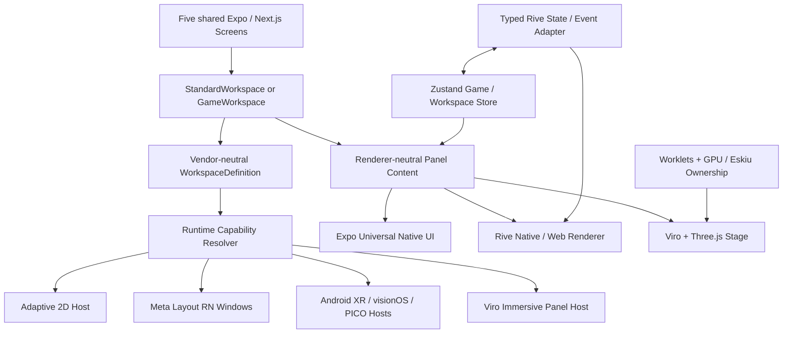

# UNIVERSAL SPATIAL STARTER
## Complete Five-Screen Fork, Next.js 16.4, Expo Server Components, Adaptive Mobile, Rive Game Layout, Kinetrell Motion, Camera Lab Perception, Viro External API Modernization, and the v5 Roster / Skills / Subagent Program

**Specification date:** October 8, 2026 (revision v5; v1–v4 content retained; v3 addendum §§31–40 and v5 extension §§41–48 take precedence, v5 highest)  
**Status:** Revised implementation blueprint; no fork, dependency upgrade, compile, or hardware test is claimed complete  
**Revision focus (v5):** creator/spec-author-tier **roster** (E1–E20 engineering lanes, D1–D10 design lanes; "Senior"/bare "Principal" banned), the **complete named skill set** with required outputs (standing Margelo / Callstack / everything-claude-code / no-ai-slop toolkit, the per-screen UX/design sequence with Mobbin, the `engineering:*` bundle, the ReactVision `viroreact-*` XR pack, Expo / Vercel / Anthropic / Figma skills, project-local `uss-*` skills), **mandatory subagent orchestration**, engineering-standards hardening (Zustand-only, "C++ is Nitro", `tsc --noEmit` gate, no-slop reader test), and a single consolidated **master prompt**. Canonical files: [`prompts/ROSTER.md`](../prompts/ROSTER.md), [`prompts/SKILLS.md`](../prompts/SKILLS.md), [`prompts/SUBAGENTS.md`](../prompts/SUBAGENTS.md), [`prompts/MASTER_PROMPT_V5.md`](../prompts/MASTER_PROMPT_V5.md). Companion: [`VIRO_EXTERNAL_API_MODERNIZATION_PLAYBOOK.md`](./VIRO_EXTERNAL_API_MODERNIZATION_PLAYBOOK.md).  
**Source repository:** [`mikevocalz/nyc-mon`](https://github.com/mikevocalz/nyc-mon)  
**Shared spatial foundation:** [`mikevocalz/viro-external`](https://github.com/mikevocalz/viro-external), plus the user's `viro`, `virocore`, and Eskiu work  
**Suggested starter name:** `universal-spatial-starter`  
**Key API design reference:** [`margelo/react-native-skills/skills/api-design`](https://github.com/margelo/react-native-skills/tree/main/skills/api-design)  
**Owner's intent:** Exactly **five product demo screens**. Simple to understand; technically serious; excellent foundation for production apps on phone, tablet, foldable, browser, Quest, Android XR, visionOS, and PICO where the underlying runtimes actually support the features.

> **One-sentence brief:** Fork NYC-Mon into a clean reusable Expo/Next.js spatial starter that demonstrates ordinary native multi-panel UI, native–Rive mixing, a distinct interactive Rive **Game Layout**, and a Viro/Three.js immersive layout—with **Kinetrell motion**, art-directed five-screen UX and a small stable platform-agnostic API with honest fallbacks. Improve `viro-external` through a separate reviewed API modernization program.

---

## 0. Executive decisions (binding)

1. **Exactly five top-level demo routes/screens**, mirrored between Expo mobile and web. Do not add a sixth Settings, Auth, Dashboard, Onboarding, or Profile screen. Settings, diagnostics, and capability information are small overlays or an inspector in the Showcase.
2. **Two layout families, not two renderers:** `StandardWorkspace` (navigation/content/inspector) and `GameWorkspace` (controls/stage/HUD). Rive is a renderer that can appear inside **either** family. The Game Layout has a distinct interaction, session, and focus contract.
3. **Mix-and-match is mandatory:** native + native + native; native + Rive + native; Rive + Rive + Rive; native + Viro/Three.js + Rive. Never encode “Rive means Game Layout” or “Game Layout requires Rive.”
4. **Five screens teach five concepts:** Showcase, Native Workspace, Hybrid Rive Workspace, Rive Game Workspace, Immersive Workspace.
5. **Use real native controls:** Expo Universal (`@expo/ui`) → Compose on Android, SwiftUI on Apple, web host on web. Bridge Meta UI Set controls on Horizon OS only where they materially add hover/focus/gaze-aware behavior and where the implementation is verified.
6. **Use the OS's windowing where available:** Meta's Layout SDK via its **React Native** integration inside Expo; Android XR via supported Compose/Views XR interoperability; visionOS with SwiftUI windows/volumes; PICO with its supported spatial facilities. Use the Viro engine for **immersive world panels**, not as a pretend OS window.
7. **The center stage is the authoritative main surface.** Meta's two secondary windows are left and right when capacity allows. The main app window itself is not promoted as an auxiliary `SpatialWindow`.
8. **Platform parity means equivalent intent and outcomes, not identical native widget appearance, number of windows, or arbitrary system window movement.** Declare requirements separately from preferences and report the resolved outcome.
9. **Rive uses actual `.riv` files and the current Nitro runtime** on supported RN targets; React WebGL2 for browser. A real Viro/Eskiu offscreen Rive texture renderer is a separate native research track, never implied by an existing `RiveView`.
10. **Keep source IP isolated.** Strip NYC-Mon characters, narrative, branding, imagery, routes, private credentials, game databases, and licensing-unclear assets from the public starter. Preserve legally required MIT and third-party notices. A visible GitHub fork retains ancestry and history; if a truly neutral public history is essential, create a separately initialized derived repo after audit while retaining required attribution.
11. **No required backend in v1:** no Auth, Payload, Neon, Supabase, Redis, email, billing, third-party analytics, network-dependent demo mechanics, or mandatory API keys. All five screens remain offline-functional. Optional, isolated Expo RSC/Server Function learning lab may use a local/deployed server; it must be disabled by default and must never gate navigation or the playable demo.
12. **Motion policy:** Rive for its authored animations; Kinetrell for shared React Native/web transitions. Do not add GSAP or Lenis directly in apps, competing animation libraries, Tamagui, or Bento as framework dependencies. The starter can use restrained bento-like grouping visually.
13. **No fake capability badges and no fake pass results.** Label hardware-only acceptance criteria `NOT VERIFIED` until a real supported device/build proves them.
14. **The source repo is not to be mutated by this Markdown deliverable.** Engineering implementation proceeds through auditable, focused PRs after fork creation.
15. **New v2 dependency policy:** inventory every current npm package and target the current npm `latest` dist-tag; Next.js **16.4.0** is the verified web target as of this document. Expo SDK/React/React Native native compatibility and native vendor SDKs are hard constraints. Publish a machine-readable exception register rather than force broken latest versions.
16. **New v2 mobile policy:** preserve Moyo Learn’s proven semantic `AdaptivePanes` behavior, iPhone Duo reserved regions, fold-aware Android rails, and inspector patterns, while testing the Expo native `SplitView`/`Inspector` backend separately. No sixth screen is permitted.
17. **New v2 server-rendering policy:** Next.js 16.4 Server Components + Cache Components are the primary production web path; Expo native Server Functions/RSC are an opt-in experimental learning track, never required for local interactive Rive/game/XR screens.

### Scope ladder

| Level | Meaning | Ship requirement |
|---|---|---|
| **P0** | All five routes, cross-platform UI shell, native/adaptive/dual-screen layout, rail and inspector, offline playable game, mobile interactions, theme, accessibility, Storybook, Next.js 16.4 migration | Required |
| **P1** | Verified Rive assets + native Rive/Meta layout bridge, genuine left and right spatial windows on supported Quest; capabilities and fallback | Required for calling starter *spatial-ready* |
| **P2** | Android XR/visionOS/PICO adapter verification, Viro/Eskiu Rive texture experimentation, hand/controller input hardening | Separate acceptance per device; document gaps |
| **Optional lab** | Expo native React Server Functions / RSC behind a feature flag, never necessary for the five working screens | Experimental, separately verified |
| **Future** | Multiplayer, physics world, Gaussian splats, gaze tracking, auth, asset CMS, advanced multiplayer networking | Explicitly excluded from starter v1 |

---

## 1. Repository audit: what can be reused today

The following paths and versions were checked against the **source repo on October 8, 2026**. This is an inventory, not a claim that every feature has passed hardware QA.

| Source | Present | Starter action |
|---|---|---|
| `apps/mobile` | Expo SDK 58 mobile app; `expo-router`; Quest and PICO Android flavors | **Keep and simplify** to five demo routes; keep variant scripts only if working |
| `apps/web` | Next.js 16 App Router | **Keep**, use same five demos rather than NYC-Mon marketing pages |
| `apps/storybook` | Storybook 10 / Vite / react-native-web | **Keep**, add component/layout stories |
| `apps/admin-vite` | Payload/TanStack admin | **Remove** from starter workspace only after dependency inventory |
| `packages/ui` (`@acme/ui`) | Universal components, adaptive panes, NeonBlade-inspired ports, Skia, Three/WebGPU | **Selectively keep**; neutralize branding and trim to examples |
| `packages/theme` | Shared design tokens | **Keep**, replace domain palette with neutral spatial starter tokens |
| `packages/spatial` | Existing Rive stage and Viro rendering integration | **Keep/adapt**, split Rive interface from immersive renderer |
| `packages/app` | Shared Solito screens/providers | **Keep/reshape** into five shared demo modules |
| `packages/core`, `packages/content` | NYC-Mon simulation/domain records | **Remove game-specific content**; new small deterministic demo `game-core` |
| `packages/auth`, `packages/payload`, `packages/mcp-server` | Auth, CMS, external integrations | **Remove** when unused by the five demos |
| `packages/assets` | Brand/logo/fonts/photos | **Audit and replace** with neutral/demo-owned assets |
| `vendor` | Viro fork package tarball | **Keep only if provenance/build/reproducibility validated** |
| `tooling/` | Asset-copy scripts, generators, platform checks | **Keep useful tooling**, delete game-specific scripts |

### Actual SOURCE baseline dependencies seen in `pnpm-workspace.yaml` (not upgrade targets)

- Expo `58.0.3`, React Native `0.88.0-rc.3`, React `19.3.0`, `expo-router` `58.0.13`, TypeScript strict configurations.
- `@expo/ui` `58.0.12` in the source catalog; **the public Expo UI docs may display a different recommended package version, so never replace the app's SDK-compatible pin merely from an isolated doc example**. Run Expo's compatibility check before upgrading.
- `@metavr/layout-compat` and `@metavr/layout-window-compat` `1.0.0` are already app dependencies.
- `@rive-app/react-native` `0.5.2`; `@rive-app/react-webgl2` `4.36.0`.
- `react-native-nitro-modules` `0.37.1`. **Known peer concern:** source workspace comments acknowledge that Rive 0.5.2 advertises a Nitro peer range below 0.37.x. Verify real compilation/runtime and resolve compatibility deliberately; do not suppress and call it clean.
- `@reactvision/react-viro` points to a vendored pinned fork. `expo-horizon-core` and `@expo-pico/core` are wired through Git references.
- Three.js `0.186.1`, `react-native-webgpu` `0.10.4`, TypeGPU `0.12.6`, Skia `3.0.2`, Kinetrell git pin, Zustand `5.0.15`.
- Root requires Node `>=24.15.0 <26` and pnpm `12.8.1` **at source baseline**. For the starter, reevaluate Node/pnpm engines against the new latest compatible release lines and build tools, and record exact selected versions.

**Important v2 distinction:** `latest` is an npm dist-tag, not an instruction to combine mutually incompatible native ABI versions. The v2 target is fully inventoried highest currently compatible releases plus a visible remediation plan for packages that cannot safely move to npm latest. See §22.

### Existing source work to reuse, not reinvent

In `mikevocalz/viro-external`:

- `packages/xr-platform-contract/` — vendor-neutral spatial surface intent and lifecycle; `WorkspaceDefinition` / `WorkspaceActivity` stricter contracts.
- `packages/meta-layout/` — pure TypeScript resolver (`resolveMetaWorkspace`) and Meta props mapping. **It does not create OS windows**; the app does that using Meta's native integration.
- `packages/ui/` — `SpatialPanel` for engine-managed 3D panels; `SpatialWorkspaceSlotNode` with LEFT/CENTER/RIGHT mapping.
- `packages/spatial-runtime/` — Worklets, TypeGPU, GPU resource and Eskiu memory ownership policies.

**Cross-repo design rule:** Make the starter consume shared Viro packages (workspace dependencies, tagged package sources, or properly pinned versions) where possible. If the public starter must work without private Git access, publish compatible distributable packages or supply a legal, documented and reproducible alternative. Don't silently copy/paste forked internals into a second codebase.

---

## 2. Product positioning and UX principles

**Audience:** Expo/React Native engineers, designers building Rive experiences, XR prototypers, agency teams, creators of immersive educational tools, spatial dashboards and mixed-reality games.

**Product pitch:** "Build one intelligent interface. Render it naturally on every screen—and spatially where the platform supports it."

**Design feel:** deliberately light enough to be readable, dark enough for cinematic gameplay, professional rather than nightclub neon. Distinct **Studio Light** (standard/hybrid) and **Stage Dark** (game/immersive) contexts; controls retain WCAG-conscious contrast, legible typography and stable hit targets.

Design principles:

- **Demo before documentation:** a developer should understand the layout families by tapping the five screens and interacting with live examples.
- **Cinematic, not noisy:** one strong hero/stage per screen, bounded motion, 0–2 accent colors per surface, very limited glass and glow.
- **One concept per screen:** no giant home screen with every library's feature at once.
- **Natural navigation:** back, close, focus and dialog behavior must match platform; avoid making standard navigation feel like a game unless in Game Layout.
- **Spatial comfort:** large text and easy reach, angular spacing, no essential panel behind the user, no motion of system windows every frame.
- **Progressive enhancement:** fully usable mobile/web experiences; no blank route when XR is unavailable.
- **Honest samples:** actual `.riv` assets and working interactions, not video/GIF pretending to be Rive or a static screenshot pretending to be XR.

### Visual token direction (starter defaults; adjustable)

| Token | Suggested value | Usage |
|---|---|---|
| `color.surface.light` | `#F5F6F8` | General native workspace |
| `color.surface.dark` | `#121722` | Stage, immersive chrome |
| `color.panel.light` | `#FFFFFF` | Native cards/panels |
| `color.panel.dark` | `#202938` | HUD/panel surface |
| `color.text.primary` | `#111827` | Light text foreground |
| `color.text.inverse` | `#F6F8FB` | Game foreground |
| `color.accent.primary` | `#675BEE` | Primary CTAs / active target |
| `color.accent.secondary` | `#21A8BD` | Supporting feedback |
| `radius.panel` | `20` logical px/dp | Consistent outer panels; allow platform adaptation |
| `radius.control` | `12` logical px/dp | Buttons / fields |
| `space.base` | `4` px/dp scale | 4/8/12/16/24/32/48 |
| `focus.ring` | semantic accent + high contrast | All pointer/keyboard/XR focus states |
| `touch.min` | `48dp` | Minimum interactive target on Meta/Android XR; larger by context |

Tokens are semantic, not tied to Meta's internal color/theme class names. Meta UI Set adapter maps them to `UiSetTheme`; other adapters use corresponding native/web theme semantics. Respect user OS contrast, type scaling and reduced motion.

---

## 3. Information architecture: exactly FIVE screens

**One shared screen identity across mobile and web**. Native route names and Next.js paths match conceptually. The five routes:

| # | Screen / route | Layout family | Center renderer | Supporting panels | What user learns |
|---|---|---|---|---|---|
| 1 | **Showcase** `/` | Launchpad | Native content | Capability sheet overlay | Pick an experience; understand capability |
| 2 | **Native Workspace** `/native` | `standard` | Expo Universal / native | Native navigation + inspector | Classic native three-panel across devices |
| 3 | **Hybrid Workspace** `/hybrid` | `standard` | **RivePanel** | Native list + native inspector | Rive in the center **without** game-layout semantics |
| 4 | **Game Workspace** `/game` | **`game`** | **RiveGameStage** | Optional native/Rive controls + HUD | Distinct game semantics, actual play loop |
| 5 | **Immersive Workspace** `/immersive` | `game` or `immersive` presentation | **Viro/Three.js** stage | Native/Rive supporting panels | Engine vs OS windows, spatial input/fallback |

**No login, onboarding, monetization, CMS, user profiles, chat, auth, or extra screens.** A compact Settings/Diagnostics drawer, Help popover, and system dialogs may appear as overlays **within** a current screen and do not count as routes.

### Navigation model

- Native phone: slim bottom tab bar or a segmented launcher; avoid five equally loud tabs if they collide with game interactions. Prefer five Showcase cards + contextual Back/Home affordance on demo screens.
- Tablet/foldable: side rail + split-pane composition; respect hinge/posture and RTL where present.
- Web desktop: compact left rail or header nav; browser back and deep links functional; main content responsive.
- Headset: Showcase opens as main window. In demo screens, center stays main; start/end are auxiliary OS windows when supported. Escape/Back returns to Showcase; never strand user in 3D.
- Deep links: `/native`, `/hybrid`, `/game`, `/immersive` work directly, including refresh on web.

---

## 4. Screen designs — functional specs, not just mood boards

### Screen 01 — SHOWCASE (the gateway)

**Intent:** Make this feel like an excellent starter kit landing inside the app, not a demo dumping ground.

**Content:**

1. Upper hero: "One interface. Every dimension." / short subhead / active platform label.
2. Four polished demo cards: Native, Hybrid, Game, Immersive. Each states one benefit, renderer badges, and a clear "Open demo" action.
3. Tiny *Runtime capabilities* strip: **Available**, **Fallback**, **Unavailable**, never claim physically tested capabilities unless proven.
4. Compact "How to compose" code snippet or linked docs anchored below cards.
5. Header actions: Theme, Motion, and Diagnostics (popover/sheet, not another route).

**Interaction:** open any screen; save theme/motion preferences locally; diagnostics shows feature detection and current resolved layout. Use subdued motion and poster artwork (original/compliant licensed). No account needed.

**Wireframe:**

```text
┌─────────────────────────────────────────────────────────────────────┐
│ UNIVERSAL SPATIAL     One interface. Every dimension.   [?] [⚙]   │
│ Native UI × Rive × Viro × Spatial layouts                        │
├───────────────────────────────┬─────────────────────────────────────┤
│ NATIVE WORKSPACE              │ HYBRID WORKSPACE                    │
│ Three panes. Native controls. │ Rive center + native side panels.  │
│ [Open]                        │ [Open]                              │
├───────────────────────────────┼─────────────────────────────────────┤
│ GAME WORKSPACE                │ IMMERSIVE WORKSPACE                 │
│ Real interactions + game HUD. │ Viro / 3D scene + companion UI.    │
│ [Play]                        │ [Explore]                           │
├─────────────────────────────────────────────────────────────────────┤
│ Runtime: Adaptive ✓ | Spatial windows: fallback | Rive: ready ...│
└─────────────────────────────────────────────────────────────────────┘
```

**Definition of done:** all four cards navigate; capability detection is accurate; theme works; phone, tablet, web and simulator versions remain legible; Storybook has card, hero and state examples.

### Screen 02 — NATIVE WORKSPACE (ordinary app shell)

**Intent:** Demonstrate professional master/detail/inspector composition using native controls, with true window promotion only where supported.

**Scenario:** Simple "Explore Projects" list (dummy local data; neutral names, no NYC-Mon IP).

- **Left:** project list/search/categories via Expo Universal/Meta UI Set controls.
- **Center:** project detail with heading, native form/switch/slider/button, media placeholder, progress, and actionable controls.
- **Right:** inspector with metadata, contextual actions, and a small activity log.

**Behavior:** selecting a project updates center and inspector via shared Zustand store. Search filters immediately; a button opens a native confirmation dialog; changing theme re-themes all panes. On phone list → detail → inspector sheet; on foldables start rail/detail/trailing overlay; on spatial device center stays main and side panels can promote. Parent/child labels stable.

```text
┌───────────┐    ┌────────────────────────┐    ┌─────────────────┐
│ PROJECTS  │    │ SELECTED PROJECT       │    │ INSPECTOR       │
│ [search]  │    │                        │    │ Properties      │
│ ▸ Alpha   │    │ Native forms/controls  │    │ Activity        │
│   Beta    │    │ Native action + dialog │    │ Quick actions   │
└───────────┘    └────────────────────────┘    └─────────────────┘
   START                 MAIN                          END
```

**Definition of done:** accessible search/selection, functional controls, stable cross-window synchronization, phone fallback, no decorative dead buttons.

### Screen 03 — HYBRID WORKSPACE (standard layout, Rive in the middle)

**Intent:** Prove renderer choice does not determine layout type. This is **not** a game layout, even though Rive is central.

**Scenario:** "Signal Studio" interactive Rive-designed control surface—a small animated audio/equalizer/signal visualization or state-machine driven product configurator.

- **Left (native):** 3 preset rows (`Calm`, `Focus`, `Energy`), one selected at a time.
- **Center (Rive):** `signal-studio.riv`; labeled state machine and typed View Model inputs for mode, intensity, playing.
- **Right (native):** accessible slider for intensity, play/pause button, status, current preset and small description.

**Behavior:** selecting preset updates Rive inputs and right inspector; Rive emits a typed interaction event that updates status; intensity slider synchronizes without thrashing layout geometry; pause/resume on lifecycle. Invalid/missing `.riv` asset shows visible fallback panel and error text.

```text
┌─────────────┐     ┌──────────────────────────┐     ┌─────────────┐
│ PRESETS     │     │    INTERACTIVE RIVE      │     │ INSPECTOR   │
│ ○ Calm      │───▶ │  animated visualization  │ ◀───│ Intensity   │
│ ● Focus     │     │  state machine / VM      │     │ Play / Pause│
│ ○ Energy    │     │                          │     │ Status      │
└─────────────┘     └──────────────────────────┘     └─────────────┘
```

**Definition of done:** actual `.riv` changes with native controls; Rive callback reaches inspector; no extra screen; full mobile fallback; screen remains `StandardWorkspace` and retains ordinary navigation/focus semantics.

### Screen 04 — GAME WORKSPACE (distinct layout, playable)

**Intent:** Demonstrate a true `GameWorkspace`: stage-first experience with controls/HUD, deterministic gameplay, pause/resume, sound/haptics opt-in, session lifecycle, controller accessibility.

**Sample game:** **Pulse Catch** (neutral starter IP, fully offline). A rhythmic, short-session reflex/timing mini-game with no back-end and no third-party assets.

**Simple rules:**

- 30-second round, three visible lanes or signal targets; center Rive animates a pulse approaching a target zone.
- Player presses `Catch` or selects a lane when the pulse enters its zone. Gameplay logic lives in TypeScript pure functions and clocks, **not in Rive timelines**.
- Successful hit scores +100, close hit +50, miss +0; deterministic tolerance windows documented; no more than one awarded hit per spawned pulse.
- HUD: score, accuracy/hits, timer, state (`ready` / `playing` / `paused` / `finished`).
- Controls: Start, Pause/Resume, Catch, Restart, Sound toggle. Controller/keyboard/touch equivalents.
- **Layout mode within this same screen:** toggle between `Mixed` (native controls + Rive stage + native HUD) and `Full Rive` (Rive controls + Rive stage + Rive HUD). This is **one route**, not two screens.
- Same game state drives both visual modes. Switching visual mode preserves round state if resources allow; otherwise the UI offers a clearly communicated restart, never silently resets.
- When the `.riv` asset is missing, native/Skia mini-game rendering remains genuinely playable as a **fallback**, but label Rive validation incomplete until actual `.riv` works.

**Distinct game semantics:**

- Stage gets primary focus and input ownership; game controller owns `startRound`, `pauseRound`, `registerAction`, `endRound`, `restartRound`.
- HUD is read-only derived state; controls dispatch typed actions.
- Accessibility: equivalent large native "Catch" action and semantic HUD; never require drag-only or gaze-only action.
- Pause on app background/interruption; use monotonic time and elapsed deltas, not unbounded background ticking.
- Reposition windows only for layout changes, not each animation frame.

```text
┌─────────────────┐  ┌───────────────────────────────┐ ┌─────────────┐
│ GAME CONTROLS   │  │         PULSE CATCH           │ │ LIVE HUD    │
│ [Start] [Pause] │  │  ◯───◎   ◯───◎   ◯───◎       │ │ Score  300  │
│   [ CATCH ]     │  │       [Target zone]          │ │ Time  21 s  │
│ Mixed / Full    │  │     Rive game artboard       │ │ Hits   3/4  │
└─────────────────┘  └───────────────────────────────┘ └─────────────┘
```

**Definition of done:** player can finish a round without a backend; scored hits match pure unit tests; both visual modes work with real `.riv` source where supported; cannot accidentally score after finished; nonspatial fallback and reduced motion work.

### Screen 05 — IMMERSIVE WORKSPACE (world/scene + companion panels)

**Intent:** Show the crucial distinction between app-level OS windows and engine-managed immersive panels. Same game-layout design intent, different stage backend.

**Scenario:** "Orbit Lab"—a small simple orbiting object/world with one interactive target; no huge level, no full NYC map, no asset pipeline requirements.

- **Left:** native scene controls (Reset camera, Toggle grid, Focus object).
- **Center:** Viro scene using existing ViroCore/Eskiu integration where supported, or a Three.js WebGPU/WebGL2 stage on web; a stable lower-fidelity non-XR preview on devices without a compatible renderer.
- **Right:** Rive sensor/HUD panel (live target state, hover/selection, pulse) with native accessible equivalents.
- **Interactions:** focus an object, toggle scene highlight, read selection in right inspector, exit immersive without losing route state.
- **Device behavior:** Meta native windows stay as standard-window companions if allowed; true immersive Viro panels are **engine surfaces**. Do not claim those surfaces are OS SpatialWindows or universally movable/reanchorable.

**Definition of done:** at least one actual interactive 3D object on supported runtime; clean exit; context and state synchronized; documented fallback when no headset/renderer; no fake AR camera preview.

---

## 5. Platform behavior matrix (capability-based)

| Platform/runtime | Standard Workspace | Hybrid Rive | Rive Game | Immersive Workspace | Notes |
|---|---|---|---|---|---|
| iPhone | stack/sheet native | native + RN Rive | full-screen game + HUD sheet | 3D preview or AR only with verified adapter | No fictional floating windows |
| iPad | split view / inspector | Rive center + 2 panes | stage + supporting panes | scene preview, native side panes | Respect split-view and keyboard |
| Android phone/tablet | Compose via Expo UI + adaptive | RN Rive center | game stage | Viro AR only when permissions/path are working | No Meta window API assumption |
| Foldables | hinge-aware pane/rail, posture modes | adaptive Rive center | game stage-first | scene host + inspector fallback | Protect hinge and input bounds |
| Web desktop | responsive CSS/RN Web | Rive WebGL2 | keyboard/mouse game | Three.js WebGPU/WebGL2 | No native XR claim |
| WebXR | Web UI if session unsupported | browser Rive | browser game | WebXR only if live support proven | Do not infer WebXR from mere WebGPU support |
| Meta Horizon OS (supported v207+) | main + 0–2 promoted windows | Rive main + native side windows | Rive stage main + controls/HUD | companion windows + Viro separate mode | React Native Meta Layout SDK; 2 side-window budget |
| Older Horizon / no capacity | inline/adaptive fallback | inline/adaptive | playable inline | fallback preview or honest unsupported | Explicit fallback |
| Android XR | native Android XR Compose when bridged/tested | Rive hosted in verified panel | center stage | app-specific immersive path | Different SDK from Meta Layout |
| visionOS | SwiftUI scene/windows where verified | Apple Rive runtime host | SwiftUI game window | volume/immersive if verified | Do not claim identical window anchoring |
| PICO | window/container adapter where verified | native Android Rive center | stage + panel | Viro/OpenXR path where verified | Device SDK and entitlement checks |

**Hard rules from Meta's current docs:**

- Layout SDK is available as RN and Jetpack Compose integrations; for the Expo app, use the **RN integration** to host OS windows. Compose UI Set is a **separate native control library** requiring an Expo module bridge if chosen.
- Meta spatial windows cannot have a transparent root: paint entire root opaque. Transparent Rive artwork may be *inside* the window.
- Keep main + at most two simultaneously important auxiliary windows; RN reserves two auxiliary window slots. Simulator modeling capacity is not proof that the RN integration can exceed two.
- Horizon OS versions earlier than **v207** or unsupported hardware use configured fallback.
- Stable IDs, sizes, anchors and priorities; use Rive animation **inside**, not per-frame OS window motion.
- Native and JS Meta package versions must be compatible. A clean `expo prebuild --clean` must regenerate required native integration via config plugins.

**Native control bridge scope:** Buttons, icon buttons, switches, sliders, checkboxes, radio, text field, search, navigation items, dialogs, dropdowns, cards, tooltips and themes. Do not promise 1:1 parity for every Expo or Meta control until audited. Require accessibility and fallbacks for every public component.

---

## 6. Technical architecture and ownership



### Ownership boundary contract

| Layer | Owns | Does NOT own |
|---|---|---|
| `@starter/workspace` | Layout families, semantic regions, capability intent/resolution, state/priority, React composition | Quest-specific Kotlin classes, assets, gameplay scoring |
| `@starter/native-ui` | Expo Universal controls, optional Meta UI Set bridge, accessibility and theme | Spatial window geometry or Rive state machines |
| `@starter/rive` | `.riv` source loading, typed VM mapping, Rive events, error/reduced-motion behavior, platform renderer switch | Game authority, network authority, native XR OS windows |
| `@starter/game-core` | Pure deterministic Pulse Catch rules and round state | GPU rendering, Rive artboard, window lifecycle |
| `@starter/spatial` | Integration with `@viro-external/xr-contract` and adapters | Duplicating existing Viro engine primitives |
| `@starter/scene` | Viro/Three.js stage adapters, input hit test, resources | Auth/CMS, standard app controls |
| `@starter/theme` | Semantic tokens, light/dark themes, density and type scale | Hardcoding platform-specific UI internals |
| `apps/mobile` | Expo Router routes, platform config plugins and permissions, development variants | New independent layout engine |
| `apps/web` | Next.js App Router, Rive WebGL2, WebGPU/WebGL2 host | Fake native or spatial window claims |
| `apps/storybook` | Story fixtures, visual/interaction tests | Replacing real headset validation |

### Prioritize reuse of existing XR contracts

`@viro-external/xr-contract` already has `WorkspaceDefinition` (one `main` surface, unique IDs, lifecycle and focus), plus `WorkspaceActivity`. **Do not replace it wholesale**. Introduce layout-family metadata in the starter-facing composer, translate into the existing workspace definition, and extend the shared contract with an RFC/PR only if the use case cannot be expressed already.

`@viro-external/meta-layout` already resolves workspace promotion. Prefer its `resolveMetaWorkspace` rather than writing a second eligibility/priority algorithm. Normalize `{main, window, inline, omitted}` into a single resolved layout result. Keep focus and game event policies above that resolver.

---

## 7. Public TypeScript / React API (Margelo API Design skill)

### Foundational rules

1. **First design TS, then native code.** Export only stable semantic concepts. Public modules include JSDoc on every exported type/member.
2. Do not expose `android`, `ios`, `meta`, `pico`, or `visionos` option bags for functionality expressible as a common semantic intent. Adapter internals can have such platform details.
3. Use **discriminated unions** for mutually exclusive layout/result states; do not return objects with 14 unrelated optional booleans.
4. Distinguish **preference** (`presentation: 'auto' | 'adaptive' | 'spatial'`) from **requirement** (`requiredCapabilities`). Unsupported requirements throw descriptive errors; ignored preferences use explicitly resolved fallbacks.
5. Stable semantic pane IDs and slot names; no stringly typed unvalidated event payloads. Geometry in logical `dp`, duration in `ms`.
6. React components wrap an imperative core. Observable state uses Zustand or `useSyncExternalStore`-based subscribers; hooks adapt to it. Native handles have explicit ownership and cleanup.
7. Surface errors as actual `Error` instances; never silent blank renders. Optional visual effects degrade gracefully; required renderer capability fails clearly.
8. Do not expose native mutable windows or Rive GPU resource handles through generic JSON objects.
9. Package `index.ts` files are **export-only barrels**. Split types and implementation by domain; no 800-line `types.ts`.
10. Use examples to validate the public API before writing the first Kotlin or C++ component; compile type-positive and type-negative fixtures.

### Recommended public exports

```typescript
// @starter/workspace public exports
export { StandardWorkspace } from './standard/StandardWorkspace';
export { GameWorkspace } from './game/GameWorkspace';
export { WorkspacePanel } from './panels/WorkspacePanel';
export { GamePanel } from './game/GamePanel';
export { useWorkspaceResolution } from './hooks/useWorkspaceResolution';
export { getWorkspaceCapabilities } from './capabilities/getWorkspaceCapabilities';
export type { WorkspaceResolution } from './capabilities/WorkspaceResolution';
export type { PresentationPreference } from './presentation/PresentationPreference';

// @starter/rive public exports
export { RivePanel } from './RivePanel';
export { RiveButton } from './RiveButton';
export { RiveGameStage } from './RiveGameStage';
export { useRivePanelBinding } from './binding/useRivePanelBinding';
export type { RiveSource } from './source/RiveSource';
export type { RivePanelEvent } from './events/RivePanelEvent';
```

**A renderer is a React child, not an enum requirement**. Any `WorkspacePanel` can host standard React native content, `RivePanel`, a separate scene component, or composite content; only a stage's contracts are more strict.

### Draft public type definitions

The following is a **design target**. It must be reconciled with existing exported `@viro-external/xr-contract` names during implementation, rather than pasted on top as a duplicate contract.

```typescript
import type { ReactNode } from 'react';

/** Preferred host behavior; see the resolved outcome separately. */
export type PresentationPreference = 'auto' | 'adaptive' | 'spatial';

/** Stable features discovered from the active runtime. */
export type WorkspaceCapability =
  | 'native-controls'
  | 'rive-native'
  | 'rive-web'
  | 'spatial-windows'
  | 'immersive-stage'
  | 'controller-input'
  | 'hand-input';

/** The runtime chose real spatial windows for some optional panels. */
export interface SpatialResolution {
  kind: 'spatial';
  mainPanelId: string;
  promotedPanelIds: readonly string[];
  inlinePanelIds: readonly string[];
}

/** The app remains a fully functioning adaptive single window. */
export interface AdaptiveResolution {
  kind: 'adaptive';
  mainPanelId: string;
  inlinePanelIds: readonly string[];
  reason: 'compact' | 'unavailable' | 'capacity';
}

/** Resolved placement, not requested placement. */
export type WorkspaceResolution = SpatialResolution | AdaptiveResolution;

/** Common layout requirements independent of the vendor SDK. */
export interface WorkspaceRequirements {
  requiredCapabilities?: readonly WorkspaceCapability[];
}

/** App-like three-region layout. */
export interface StandardWorkspaceProps extends WorkspaceRequirements {
  id: string;
  main: ReactNode;
  children?: ReactNode;
  presentation?: PresentationPreference;
  onResolved?: (resolution: WorkspaceResolution) => void;
}

/** Game layout has a mandatory stage and different input/lifecycle policy. */
export interface GameWorkspaceProps extends WorkspaceRequirements {
  id: string;
  stage: ReactNode;
  children?: ReactNode;
  presentation?: PresentationPreference;
  onResolved?: (resolution: WorkspaceResolution) => void;
  onPauseRequested?: () => void;
}

/** Supporting panel; 'main' is provided by StandardWorkspace.main. */
export interface WorkspacePanelProps {
  id: string;
  position: 'start' | 'end';
  children: ReactNode;
  preferredSize?: { widthDp: number; heightDp: number };
  priority?: number;
  fallback?: 'inline' | 'drop';
}

/** A game supporting panel; the main game stage is not optional. */
export interface GamePanelProps extends WorkspacePanelProps {
  role: 'controls' | 'hud' | 'tools';
}
```

**Important API review:** if `requiredCapabilities` contains `spatial-windows`, a runtime with no spatial window support must fail rather than silently selecting adaptive, even if `presentation='auto'`. If no requirement is supplied, adaptive fallback is valid. Validate the impossibility of duplicate IDs or missing main stage before mounting windows.

### Rive source and binding APIs

```typescript
/** Asset sources are explicit and prevent interpreting a URI as a file key. */
export type RiveSource =
  | { kind: 'bundled'; asset: number }
  | { kind: 'remote'; uri: string };

/** Public event model, independent of Rive's underlying event classes. */
export type RivePanelEvent =
  | { type: 'action'; action: 'start' | 'pause' | 'catch' | 'restart' }
  | { type: 'preset-selected'; preset: 'calm' | 'focus' | 'energy' }
  | { type: 'ready' };

export interface RivePanelProps {
  source: RiveSource;
  artboard?: string;
  stateMachine?: string;
  accessibilityLabel: string;
  onEvent?: (event: RivePanelEvent) => void;
  onError?: (error: Error) => void;
  fallback?: ReactNode;
}
```

This `RiveSource` is **our proposed wrapper type**, not a verbatim type from the Rive SDK. The native adapter converts it to the currently supported `useRiveFile()` input. Do not stack a convenience JS parser over a public Nitro `HybridObject`; encapsulate Nitro behind a deliberate higher-level React component API.

**Typed Rive View Model binding:**

- Publish a **small generated TypeScript manifest** from each supplied Rive asset (artboard, state machine, View Model properties, Rive event names and versions).
- Validate that required names/expected property types exist when the Rive file is loaded; throw an actionable asset-mismatch error.
- Surface a typed `RivePanelEvent` union from the manifest and map it to domain actions through a dedicated event adapter.
- The game state is **not** the Rive View Model; Zustand holds logical state, Rive View Model mirrors presentation inputs.
- Cache immutable files per asset and share files where supported. Each visible Rive state-machine instance owns its own inputs/instance lifecycle as required by the runtime.
- Unsubscribe listeners, cancel in-flight loads, and release/avoid using native handles after unmount. Do not hide failures behind arbitrary retries or timers.

### Call-site 1 — Native three-pane app

```tsx
import { StandardWorkspace, WorkspacePanel } from '@starter/workspace';
import { ProjectList, ProjectDetails, ProjectInspector } from '@starter/demo-ui';

export function NativeDemo() {
  return (
    <StandardWorkspace id="native-demo" main={<ProjectDetails />}>
      <WorkspacePanel id="project-list" position="start" fallback="inline">
        <ProjectList />
      </WorkspacePanel>
      <WorkspacePanel id="project-inspector" position="end" fallback="inline">
        <ProjectInspector />
      </WorkspacePanel>
    </StandardWorkspace>
  );
}
```

### Call-site 2 — Mixed Standard Workspace, Rive center

```tsx
import { StandardWorkspace, WorkspacePanel } from '@starter/workspace';
import { RivePanel } from '@starter/rive';
import { riveAssets } from '@starter/assets/rive';

export function HybridDemo() {
  return (
    <StandardWorkspace
      id="signal-studio"
      main={
        <RivePanel
          source={riveAssets.signalStudio}
          artboard="SignalStudio"
          stateMachine="Controller"
          accessibilityLabel="Interactive signal visualization"
          fallback={<SignalStudioFallback />}
        />
      }
    >
      <WorkspacePanel id="preset-list" position="start">
        <NativePresetList />
      </WorkspacePanel>
      <WorkspacePanel id="signal-inspector" position="end">
        <NativeSignalInspector />
      </WorkspacePanel>
    </StandardWorkspace>
  );
}
```

### Call-site 3 — Game Layout, mixed or full Rive (same route)

```tsx
import { GameWorkspace, GamePanel } from '@starter/workspace';
import { RiveGameStage, RivePanel } from '@starter/rive';
import { riveAssets } from '@starter/assets/rive';
import { useDemoPreferences } from '@starter/state';

export function GameDemo() {
  const style = useDemoPreferences((s) => s.gamePanelStyle);
  return (
    <GameWorkspace
      id="pulse-catch"
      stage={
        <RiveGameStage
          source={riveAssets.pulseCatch}
          accessibilityLabel="Pulse Catch game stage"
          fallback={<AccessiblePulseStage />}
        />
      }
      onPauseRequested={pauseGame}
    >
      <GamePanel id="game-controls" position="start" role="controls">
        {style === 'full-rive'
          ? <RivePanel source={riveAssets.gameControls} accessibilityLabel="Game controls" />
          : <NativeGameControls />}
      </GamePanel>
      <GamePanel id="game-hud" position="end" role="hud">
        {style === 'full-rive'
          ? <RivePanel source={riveAssets.gameHud} accessibilityLabel="Game HUD" />
          : <NativeGameHud />}
      </GamePanel>
    </GameWorkspace>
  );
}
```

**Compilation note:** examples are interface targets, not paste-ready imports from existing packages. Domain components, exported assets and `pauseGame` are application implementation dependencies. Typecheck working versions before documenting them as installed APIs.

### Error and subscription example

```typescript
const sub = spatialSession.addOnResolutionChangedListener((resolution) => {
  workspaceStore.getState().applyResolution(resolution);
});

try {
  await spatialSession.start(); // a real async boundary, if adapter needs it
} catch (error) {
  reportError(error instanceof Error ? error : new Error(String(error)));
} finally {
  sub.remove(); // idempotent listener cleanup
  await spatialSession.dispose(); // only if this session owns native resources
}
```

This is a **proposed imperative session API pattern** for adapters that actually own async resources, not a mandate to create an async session for every ordinary React layout. Avoid a fake prepare/start step when a pure resolver suffices.

### API review checklist (apply before implementation)

- [ ] Valid state combinations expressed through discriminated unions.
- [ ] No duplicate semantic identity state or `enableThing` + `thingMode` clusters.
- [ ] Number units are explicit (`widthDp`, `durationMs`, `byteSize`).
- [ ] Required capabilities throw; optional presentation preferences resolve with visible fallback.
- [ ] Runtime capability fields reflect live support, not “Quest supports X” guesses.
- [ ] One source of truth for workspace state; panels do not mutate another panel's private copy.
- [ ] All exports documented with JSDoc and `@see` where meaningful.
- [ ] All event registrations produce removal handles; resources have deterministic cleanup.
- [ ] Hook names begin `use`, are actual hooks, and are not imperative factories.
- [ ] `RiveSource` / error cases have explicit test fixtures.
- [ ] Consumer examples compile under strict TS; negative fixtures reject invalid contracts.
- [ ] Existing `@viro-external/xr-contract` API compatibility tests pass.

---

## 8. Native host adapters: concrete implementation

### A. Expo Universal + Meta UI Set component adapter

1. Keep `@expo/ui` as primary ordinary control API for iOS/Android/web.
2. Build a local `expo-meta-ui-set` Expo module for the handful of Meta native Compose controls needing special VR behavior; use Expo Modules registration, `ExpoUIView`, Compose props and supported modifier mechanisms described in Expo's extension guide.
3. In Kotlin, use the Meta VR UI Set artifact `com.meta.metavrx.uiset:uiset-compose-compat` under the MetaVRX BOM **only for compatible Android targets**.
4. Map semantics: `button` primary/secondary, `switch`, `slider`, `checkbox`, `dialog`, `menu`, `text-field`, `card`, `navigation`, tooltip. Rely on `UiSetTheme`, semantic colors and focus/hover behavior where available.
5. On non-Horizon devices use Expo Universal/native equivalents. Do not import unavailable Android-only native UI views in web/Apple bundles.
6. Test that Expo component children and native controls compose without breaking accessibility, state updates or window ownership. Do not promise arbitrary Rive content can be nested *inside* a Kotlin composable if Expo/RN view composition does not support that path; host the Rive React Native view in an RN-managed content region instead.

**Compose control integration and Layout window integration are deliberately separate.** A Compose `LabelButton` is a control; a Meta RN `<SpatialWindow>` is a host. They are not interchangeable.

### B. Meta Horizon OS spatial windows

Existing source deps: `@metavr/layout-compat`, `@metavr/layout-window-compat`. Use once at the app root on eligible Android builds:

```tsx
// Illustrative native Meta adapter; not an app-wide universal import.
import { SpatialSceneProvider } from '@metavr/layout-compat';
import { SpatialWindow } from '@metavr/layout-window-compat';

const SIDE_WINDOW = { windowWidth: 340, windowHeight: 520 } as const;

export function MetaThreePanelHost() {
  return (
    <SpatialSceneProvider>
      <GameMainStage />
      <SpatialWindow
        label="game-controls"
        {...SIDE_WINDOW}
        anchor="start"
        priority={3}
        fallback="inline"
      >
        <OpaqueWindowRoot><GameControls /></OpaqueWindowRoot>
      </SpatialWindow>
      <SpatialWindow
        label="game-hud"
        {...SIDE_WINDOW}
        anchor="end"
        priority={2}
        fallback="inline"
      >
        <OpaqueWindowRoot><GameHud /></OpaqueWindowRoot>
      </SpatialWindow>
    </SpatialSceneProvider>
  );
}
```

The real adapter MUST place inline fallback content in a meaningful row/stack at the **declaration site**, not assume floating-window placement magically converts to a useful mobile screen. Meta may choose final placement based on available area.

**Config plugin responsibility:** preserve Gradle version catalog + BOM version, Android Layout native libraries, compatible package versions, manifest requirements and Expo autolinking through `expo prebuild --clean`. `@metavr` JS packages remain direct dependencies of the native Expo app. Do not manually register Meta's `SpatialWindowPackage` when autolinking already manages it.

**Beware integration collision:** NYC-Mon's `app.config.ts` currently configures the Viro plugin with `metaSpatialLayout: true` plus its BOM version. Inspect generated native changes and existing Viro integration before adding another config plugin, or duplicate Gradle/manifest setup may conflict. Resolve in one idempotent source of truth.

### C. Android XR Compose host

Android XR is **not the Meta Layout SDK**. Its Compose XR model includes `Subspace`, `SpatialPanel`, `SpatialRow`, `SpatialColumn`, `SpatialBox`, and `Orbiter`; native views may be hosted using verified interoperability routes. Map workspace intent to those controls behind an adapter. Verify activity/lifecycle and React Native interop in a real runnable prototype before claiming full parity. The React Native app should keep one authoritative RN state tree.

### D. visionOS host

SwiftUI windows/volumes/immersive spaces are distinct lifecycle objects. Implement via an Apple-specific host and test Rive Apple runtime compatibility; do not promise automatic Quest-style anchoring, identical panel counts, or Metal texture sharing without an actual implementation. The same semantic workspace state must drive the scene configuration.

### E. PICO and Viro / Eskiu

Use existing `expo-pico`, PICO layout package, Viro XR platform contract, and ViroCore/Eskiu native scene ownership. Distinguish a system window from a Viro `SpatialPanel`. For offscreen Rive → GPU texture, maintain a separate proof-of-concept interface with documented GPU surface format, threading, lifetime, pointer coordinate conversion, alpha blending and resize semantics.

### F. Web and WebXR

Web uses responsive layout primitives, Rive React WebGL2, and Three.js WebGPU with WebGL2 fallback where supported. WebXR is a separate capability; browsers with WebGPU or Three.js support do not necessarily have immersive WebXR sessions. Runtime capability detection and a real `requestSession` workflow should gate immersive entry. No fake 3D screenshots.

---

## 9. Rive integration: native panels, buttons, game stage, and GPU Canvas

### Runtime choice

- **React Native:** `@rive-app/react-native` new Nitro-backed runtime (`RiveView`, `useRiveFile`, View Model bindings), on Expo development builds.
- **Web:** `@rive-app/react-webgl2` with `useRive` or Rive component and `enableGPUCanvas` **only when an actual asset requires it and the target is supported**.
- **Apple/native/visionOS:** use currently verified Rive native runtime path; Apple platform SDK availability alone doesn't prove Expo/visionOS packaging is done.
- **Jetpack Compose:** investigate optional native Compose Rive adapter only if direct UI Set integration justifies it; don't create a second full Rive runtime per panel.
- **Viro immersive texture:** pending engineered adapter; never advertise as P0 native capability.

### Asset authoring contracts

At minimum ship **four original or appropriately licensed, local, functional `.riv` files**, or retain visible `ASSET PENDING` blockers until they exist:

| Asset | Used by | State machine | Required bindings |
|---|---|---|---|
| `signal-studio.riv` | Hybrid center | `Controller` | mode, intensity, playing; selected/preset events |
| `pulse-catch.riv` | Game center | `Gameplay` | gameState, score, lane, pulse position, hit trigger |
| `game-controls.riv` | Game Full Rive left | `Controls` | start/pause/catch/restart events, disabled states |
| `game-hud.riv` | Game Full Rive right | `Hud` | score, secondsRemaining, hits, attempts, paused |
| `sensor-hud.riv` (optional) | Immersive right | `Sensor` | selectedObject, highlightState, interaction event |

**File authoring:** Create real state machines, export assets, generate/import a typed bindings manifest, validate named properties and events on native and web. These are not assumed to exist in NYC-Mon. Never substitute an image/GIF and call it a Rive panel. A local fallback is good UX, but the Rive integration completion gate stays open until actual files work.

### Rive runtime wrapper behavior

1. Load and cache immutable `RiveFile` data; instantiate separate view/model state for each panel.
2. Display explicit `loading` / `ready` / `error` states; error fallback must be navigable.
3. Map Rive VM input properties to Zustand selectors with change detection and rate limiting for high-frequency cosmetic signals.
4. Map Rive click/trigger events back into typed actions; don't allow Rive to be a hidden parallel game rules engine.
5. Pause or reduce state machine animations when offscreen/backgrounded and when user prefers reduced motion.
6. Keep touch focus and responder priority consistent with native panels. A native accessible action must exist for controls that don't expose meaningful accessibility directly through the Rive runtime.
7. Avoid synchronously copying full animation data into JS each frame. Prefer typed commands/bindings; use an owned worklet/native path for truly high-frequency updates.

### GPU Canvas & shaders

- `@rive-app/react-webgl2` has opt-in **experimental** GPU Canvas; Rive docs say it uses a WebGL context per canvas and does not support shared-offscreen rendering on that path. Avoid enabling it on ten decorative buttons at once.
- Keep `useOffscreenRenderer: false` for the browser Rive GPU Canvas path where required by docs.
- Feature-gate shader-heavy effects; compare fallback fidelity (static/native/Rive standard renderer) and measure browser GPU memory.
- Use TypeGPU / WebGPU / Three.js for the Viro/world stage as the *engine's* responsibility; do not assume the browser Rive WebGL context can be shared directly with React Native WebGPU or ViroCore.
- Kinetrell owns React layout transitions; Rive owns animations authored inside `.riv`. No competing global animation timelines.

### Performance budgets (project targets, not measured facts)

| Metric | Initial target | Measurement |
|---|---|---|
| UI interaction responsiveness | immediate visible press response; no long JS block | Profiling under normal use |
| Game update logic | fixed/delta-time deterministic, no duplicated score events | Unit tests, dev overlay |
| Native/flat stage | aim 60 fps on reference devices, with reduced effects as needed | Frame metrics |
| XR stage | target headset-supported cadence, profile actual runtime | Device profiling, not simulator alone |
| Panel switches | no dropped/duplicated game state | State invariants |
| `.riv` reload | caching prevents needless file reparse | Profiling / Rive cache instrumentation |
| Memory | no monotonically increasing retained native objects after 20 screen switches | Heap/native/GPU snapshots |

Do not turn aspirational FPS budgets into unsupported performance guarantees.

---

## 10. Shared state, events, gameplay and input

### Architecture rule: Zustand is the single application state authority

- One small **workspace store**: selected demo context, panel visibility, selected project/preset, theme, user motion preference and resolved layout.
- One **game store**: `PulseCatchRound` state and typed commands (`start`, `pause`, `resume`, `catch`, `finish`, `restart`).
- One **scene store**: selected 3D object, selected material/grid state, camera preset.
- Stores are split by domain and do not mirror each other's authoritative data. Cross-domain effects use explicit actions/subscriptions.
- UI components can use selectors; Rive View Models are bound projections of this state; avoid frame-by-frame React rerenders.
- Persist theme/preferences locally if necessary; demo round state need not survive app relaunch. Never persist native window handles or Rive pointer addresses.

### Game model (design)

```typescript
/** Phases with coherent fields, not one interface full of nullable values. */
export type PulseCatchRound =
  | { phase: 'ready'; bestScore: number }
  | {
      phase: 'playing';
      startedAtMs: number;
      endsAtMs: number;
      score: number;
      hits: number;
      attempts: number;
      activePulseId: string;
    }
  | {
      phase: 'paused';
      remainingMs: number;
      score: number;
      hits: number;
      attempts: number;
      activePulseId: string;
    }
  | {
      phase: 'finished';
      score: number;
      hits: number;
      attempts: number;
      accuracy: number;
    };

export type PulseCatchAction =
  | { type: 'start'; nowMs: number }
  | { type: 'pause'; nowMs: number }
  | { type: 'resume'; nowMs: number }
  | { type: 'catch'; nowMs: number; lane: 0 | 1 | 2; pulseId: string }
  | { type: 'tick'; nowMs: number }
  | { type: 'restart' };
```

The reducer and pulse schedule belong in pure `@starter/game-core`. Fix the round duration at `30_000ms`, test allowed time bands, ensure a pulse can only be scored once, and derive accuracy without dividing by zero. Run a deterministic seeded pulse schedule or monotonic clock deltas, never use Rive playback time as the sole source of score truth. A backgrounded session pauses reliably. There is no server or leaderboard for v1.

### Cross-panel event flow

```text
UI action from left/native or left/Rive
  -> typed command -> Zustand domain controller
  -> pure state transition + invariants
  -> subscriber projection to center Rive VM / Viro stage
  -> subscriber projection to right native/Rive HUD
  -> accessibility announcer + optional haptics/audio
```

**Never:** bind an arbitrary Rive event directly to an unrestricted internal store setter; allow Rive game inputs to skip scoring validation; store full textures/geometry blobs in Zustand; reanchor Meta OS windows every frame; duplicate a JS state tree per native window.

### Input mapping

| Input source | Standard workspace | Game workspace | Immersive scene |
|---|---|---|---|
| Touch | Select/scroll/action | Press Catch, lane selector | Tap object if preview supports it |
| Mouse | Hover/select | Click stage/control | Raycast/pointer action |
| Keyboard | Tab/Enter/Escape, arrows in lists | Space/Enter Catch, arrows lane, P pause, Esc exit | Arrow/orbit optional with visible guidance |
| Controller | Semantic focus and action | Controller primary action/Catch | Native pointer/ray selection |
| Hand / look-pinch | Native UI semantics on eligible headset | Focus + confirm, never gaze-only scoring | Native/runtime supported gestures only |
| Screen reader | Logical regions and labels | Announce state, score changes carefully; alternative semantic controls | Scene selection described through native inspector |

The minimum functional parity is **action parity**, not exact gesture parity. Don't claim raw eye-gaze data, hand skeletal tracking, or arbitrary controller pose unless actual runtime support is verified. Input source, targeting and commit phase remain separate.

### System lifecycle and focus

- When app becomes inactive: pause Pulse Catch, mute game sound, suspend heavy rendering when appropriate; do not leak Rive handles.
- When returning: show Paused state and explicit Resume control; do not quietly grant scoring time.
- On changing Game Mixed↔Full Rive: retain game state; rebind UI renderers to the same store.
- On headset removing/capacity downgrade: side panels fold inline; center stage stays functional; user focus moves logically.
- On unmount: listeners removed, subscriptions idempotently cleaned, timers canceled, scene resources released, no zombie audio/worklet execution.

---

## 11. Suggested monorepo layout after extraction

**Keep this small.** This is a proposed destination tree, not a statement that files already exist:

```text
universal-spatial-starter/
├── README.md
├── LICENSE                         # preserve correct upstream notices
├── THIRD_PARTY_NOTICES.md           # material carried from source/NeonBlade
├── package.json
├── pnpm-workspace.yaml              # single pinned catalog
├── turbo.json
├── .env.example                     # ideally zero required values
├── apps/
│   ├── mobile/
│   │   ├── app.config.ts
│   │   ├── app/
│   │   │   ├── _layout.tsx
│   │   │   ├── index.tsx             # 1 Showcase
│   │   │   ├── native.tsx            # 2 Native Workspace
│   │   │   ├── hybrid.tsx            # 3 Hybrid Rive
│   │   │   ├── game.tsx              # 4 Rive Game Layout
│   │   │   └── immersive.tsx         # 5 Immersive Workspace
│   │   ├── src/platform/
│   │   ├── modules/expo-meta-ui-set/
│   │   └── plugins/withSpatialHost.ts
│   ├── web/
│   │   ├── app/
│   │   │   ├── page.tsx               # same Showcase
│   │   │   ├── native/page.tsx
│   │   │   ├── hybrid/page.tsx
│   │   │   ├── game/page.tsx
│   │   │   └── immersive/page.tsx
│   │   └── components/
│   └── storybook/
├── packages/
│   ├── app/                          # five shared screen implementations
│   │   └── src/screens/
│   │       ├── ShowcaseScreen.tsx
│   │       ├── NativeScreen.tsx
│   │       ├── HybridScreen.tsx
│   │       ├── GameScreen.tsx
│   │       └── ImmersiveScreen.tsx
│   ├── workspace/                    # StandardWorkspace, GameWorkspace
│   │   └── src/{standard,game,panels,capabilities,presentation,hooks}/
│   ├── native-ui/                    # Expo UI facade + Meta Compose adapter
│   ├── rive/                         # Rive panel/button/stage + typed bindings
│   │   └── src/{source,binding,events,components,platform}/
│   ├── spatial/                      # existing Viro/XR adapter wiring
│   ├── scene/                        # Orbit Lab stage and fallback
│   ├── game-core/                    # Pulse Catch pure reducer/simulator/tests
│   ├── state/                        # Zustand domain stores
│   ├── ui/                           # neutral UI/visual primitives, adaptive panes
│   ├── theme/                        # semantic tokens
│   ├── assets/
│   │   ├── rive/
│   │   │   ├── signal-studio.riv
│   │   │   ├── pulse-catch.riv
│   │   │   ├── game-controls.riv
│   │   │   ├── game-hud.riv
│   │   │   └── generated-bindings.ts
│   │   └── artwork/
│   └── config/
├── tooling/
│   ├── verify-deps.mjs
│   ├── verify-rive-assets.mjs
│   ├── verify-spatial-config.mjs
│   ├── verify-five-routes.mjs
│   └── verify-no-nycmon-ips.mjs
└── docs/
    ├── ARCHITECTURE.md
    ├── API.md
    ├── DEVICE_MATRIX.md
    ├── DEMO_ASSET_LICENSES.md
    ├── DESIGN_SYSTEM.md
    ├── ADR/0001-workspace-families.md
    ├── ADR/0002-native-vs-engine-panels.md
    ├── ADR/0003-rive-renderer-binding.md
    └── plans/FIVE_SCREEN_PLAN.md
```

### Keep the import boundaries strict

```text
apps/* -> packages/app -> {workspace, native-ui, rive, scene, ui, state}
workspace -> {xr contract, capabilities}
rive -> {Rive platform runtimes, bindings}
game-core -> TypeScript only, no React native APIs
auth/CMS/vendor APIs -> not imported at all in starter
```

`packages/ui` can continue using its existing `@acme/ui` internal package scope during the initial fork compilation. **Renaming all package scopes can be a separate focused PR**; do not break everything by mixing massive renames with the first platform integration.

### Five screens, not five copies

- `packages/app/src/screens/` is the single authored implementation for each demo, shared by Solito/Expo and Next.js where feasible.
- Native `apps/mobile/app/*.tsx` and Next.js `apps/web/app/*/page.tsx` should be **thin route entrypoints**, not duplicate screen logic.
- Native-only host components use `.native.tsx`; browser adapters use `.web.tsx`. Do not pretend Rive WebGL2 belongs in the native bundle.
- Server rendering on Next.js should not instantiate native XR or WebGPU APIs at module evaluation time. Use client boundaries and safe dynamic loading for interactive stages.
- `Storybook` showcases component variants but does not count as a sixth app/product screen.

---

## 12. Forking and cleanup process

### Repo strategy

The desired workflow is to **fork NYC-Mon as an internal engineering starting point**, then extract the reusable runtime into a minimal starter. GitHub forks expose their source relationship and, generally, the inherited commit history. A branding-clean public template that must not show NYC-Mon-specific history should be initialized as a separate Git repository after lawful copying/cleanup and license retention; do not assume deleting files in a fork removes secrets/history.

**Do not clone with production tokens or copy `.env.local`.** Inspect Git history for accidentally committed credentials before any public publication. Secret removal in Git history requires appropriate history rewrite/rotation procedures, not just file deletion.

### Extraction steps

1. Choose public vs private starter; audit source license and third-party notices. The existing source `LICENSE` says MIT and names **Gursel Cakar** as copyright holder. **Preserve that text and all other applicable notices**; inspect ownership and provenance of reused files rather than claiming the whole starter as original.
2. Create a fork/working branch from a **recorded source commit SHA**. Create `docs/SOURCE_PROVENANCE.md` with exact source URL, commit, Viro tarball checksum and retained licensed components.
3. Freeze baseline: `pnpm install --frozen-lockfile`, `pnpm typecheck`, `pnpm test`, `pnpm lint`, `pnpm --filter mobile ...` as appropriate; capture baseline results and failures before deleting anything.
4. Inventory imports from admin/CMS/auth/content/core. Replace NYC-Mon game rules with `@starter/game-core`; do not remove packages until import tests prove no dependents.
5. Replace app ID, scheme, display name, icons, splash, route names, image assets, text strings, package metadata and application data stores with neutral starter identity.
6. Keep only five shared demo screens and matching web/native route entrypoints. Existing admin-vite app and product/marketing site are out of scope; move to the source repo only, not the new starter.
7. Keep SDK 58/RN 0.88 lane pinned; test Rive/Nitro peer issue; verify Meta/Rive/Skia/Viro native conflicts and Expo CNG idempotency.
8. Implement APIs, Rive sources, pure game logic, actual OS window integration, platform fallbacks and Storybook stories.
9. Run sanitizer on source tree **and Git history** before publication: game branding, storyline, characters, copied secret/config values, docs/canon, old AI prompt artifacts, unrelated dev files; preserve compliant authorship/license notices.
10. Publish only after tests; if any hardware is missing, mark its capability status `NOT VERIFIED`, not `supported`.

### Commands (read-only or local setup; do not execute blindly)

```bash
# Clone the user's own repo to a scratch folder for an extraction audit.
git clone https://github.com/mikevocalz/nyc-mon.git universal-spatial-starter
cd universal-spatial-starter

git rev-parse HEAD          # record exact source revision
git status --short         # must be clean before scripted removal
node --version            # source requires >=24.15 <26
pnpm --version            # source pins pnpm 12.8.1
pnpm install --frozen-lockfile
pnpm typecheck
pnpm test
pnpm lint
```

These commands **do not actually create a GitHub fork** or neutralize Git history. If making a separate public repo, use GitHub's repo creation flow or your permitted GitHub tooling, after compliance/security audit, and add source provenance/required attribution.

### Asset and IP safety

- **Do not copy:** NYC-Mon characters, canonical names/lore, original illustrated monsters, card art, H-Lynk product marks, city maps tied to the game, user/customer data, unpublished music, production API keys, copied prompt histories, paid fonts/assets without redistribution rights.
- **Do reuse after verification:** general React/Expo UI code, adapter architecture, license-compatible NeonBlade-inspired component work with its original notices, generalized algorithms and generic original code.
- **Rive sample assets:** either author fresh `.riv` files or obtain licenses explicitly permitting redistribution in an open-source starter. Store provenance in `docs/DEMO_ASSET_LICENSES.md`.
- **Source metadata:** a clean README should have no badges claiming hardware tests that haven't happened and no company/character branding from the parent app.

### Concrete dependency risks before implementation

| Risk | Existing evidence | Required mitigation |
|---|---|---|
| Rive RN 0.5.2 ↔ Nitro 0.37.1 | Source `pnpm-workspace.yaml` comments call out peer incompatibility | Compile clean supported matrix; pin tested versions; open upstream issue/PR if needed |
| Meta Layout RN ↔ Viro config | Source already has `metaSpatialLayout: true` in Viro plugin and direct Meta dependencies | Audit generated native Gradle/manifest; create one idempotent config owner |
| Source XR vendored tarball | Pinned local `.tgz` under `vendor/` | Confirm checksum, legal distribution and CI install without private repo credentials |
| Rive asset nonexistence | Four new original assets not part of confirmed source inventory | Create/license real assets, automated binding verification; runnable fallback in meantime |
| Quest simulator vs physical device | Simulator differs from headset geometry/input | Separate simulator and physical test gates |
| Unverified visionOS/PICO/Android XR | Adapter API may exist without real device testing | Report capability as unverified until validated |
| Rive GPU Canvas in web | Experimental GPU Canvas / per-canvas context | Opt in selectively; measure GPU resource impact |
| Removing backend | Source apps have imports from auth/Payload | Import graph analysis, prune after replacement, deterministic local fixtures |

---

## 13. Implementation phases and PR stack

### PR 0 — Audit, fork plan, and source safety

**Deliverables:** source commit and dependency manifest, safe extraction map, source/third-party notices, screen inventory, baseline build/test report, UI screenshots, existing XR packages linkage and risks.

**Gate:** no secret/assets/license blockers remain untracked; no claim that starter exists on GitHub until the fork/new repo is actually created.

### PR 1 — Neutral fork + five-route shell

**Deliverables:** five working routes mirrored Expo/Next.js, neutral theme/brand, shared screen component structure, Showcase and navigation, no backend requirement, Storybook startup and route smoke tests.

**Gate:** five routes exactly, no NYC-Mon IP in visible output, builds run on regular mobile and web, no extra auth/onboarding/settings route.

### PR 2 — Standard layout + Meta UI parity

**Deliverables:** `StandardWorkspace` API, native sample screen, Expo native controls and optional Meta Compose UI Set module, adaptive panes, stable panel IDs, native/dialog/search tests and Storybook.

**Gate:** screen 2 useful on web/phone; Meta config survives clean prebuild; no duplicate Meta Gradle wiring; accessibility focus is correct.

### PR 3 — Rive adapter + Hybrid screen

**Deliverables:** `RivePanel` and `RiveButton` wrapper, asset contract and typed VM bindings, `signal-studio.riv`, native/web platform adapters, error/loading/fallback states, controlled interactive screen 3.

**Gate:** one actual `.riv` file in center updates from the left native controls and right native slider and emits at least one typed callback; no hidden loop of duplicate state.

### PR 4 — Game Layout + playable Rive game

**Deliverables:** semantic `GameWorkspace` API, game state reducer/tests, `pulse-catch.riv`, controls and HUD, Mixed / Full Rive in the same route, background pause/resume, input alternatives and performance instrumentation.

**Gate:** finish 30-second round on two tested platforms; scoring invariants and accessibility; real Rive binds to game state. Full Rive requires actual `game-controls.riv` and `game-hud.riv` working; do not disguise placeholders as completion.

### PR 5 — Immersive host + cross-platform fallbacks

**Deliverables:** Viro/Three.js Orbit Lab stage, scene control input and Rive inspector, actual capability gates, documented Quest + Android XR + visionOS + PICO adapter statuses, lifecycle and memory tests.

**Gate:** one real 3D object responds to selection on verified supported runtime; ability to exit; no window crashes/black screens; unverified platforms labeled.

### PR 6 — Quality, cleanup and starter handoff

**Deliverables:** CI matrix, docs/ADRs, examples, device reports, license audits, reusable templates, user-facing quickstart, benchmark snapshots, story captures, production-ready component API reference.

**Gate:** release checklist signed with clear PASS/FAIL/NOT VERIFIED rows. No broad “supports every headset” claim unsupported by hardware.

### Milestone slicing when a small team is available

- **M1 (small, quickly demonstrable):** neutral fork + five routes + functional Native/Hybrid/Game logic fallbacks; no headset required.
- **M2:** real Rive assets and Meta spatial windows, one Quest simulator/device verification.
- **M3:** immersive native bridge, other headset adapters and full QA.

Keep separate PRs small enough to review, avoid one massive patch that touches SDK pins, Rive runtime, Viro native code, all screens and styling simultaneously.

---

## 14. Engineering and design roster

**Superseded by §41 and [`prompts/ROSTER.md`](../prompts/ROSTER.md).** The v1 table used mid-tier role names; v5 reframes every lane at creator/spec-author or Fellow/Distinguished-Architect level (E1–E20 engineering, D1–D10 design), each with its oracles, loaded skills, required artifact and veto scope. The mapping from the original roles to v5 lanes is in §41. All roles remain *responsibilities*, not claims that people are assigned; do not invent external team members, devices or measured benchmarks.

---

## 15. Skills and reference workflow

**Superseded by §42 and [`prompts/SKILLS.md`](../prompts/SKILLS.md)**, which names every skill, its install source, the owning lane, the PR where it is mandatory, and the artifact it must produce. The v1 list below is kept only as the minimum seed that v5 extends:

1. Margelo `api-design` (https://github.com/margelo/react-native-skills/tree/main/skills/api-design) — typed API first; realistic call sites, cleanup/error paths, typed events, JSDoc, no leaking native classes. v5 adds the rest of the Margelo set (`build-nitro-modules`, `cpp`, `swift`, `kotlin`, `react-native-vision-camera` v5).
2. Expo skills (https://github.com/expo/skills) — now enumerated by name in `SKILLS.md` §F.
3. Matt Pocock TypeScript skills (https://github.com/mattpocock/skills).
4. Argent `agent-device` (https://github.com/Argent/agent-device).
5. Impeccable (https://github.com/pbakaus/impeccable), design critique, user research, Mobbin (https://mobbin.com/) — v5 turns these into the ordered per-screen sequence in `SKILLS.md` §B–§C.
6. Peter Yang `no-ai-slop` (https://github.com/petergyang/no-ai-slop) — v5 makes it a per-PR audit plus a reader test.
7. Marketing skills (https://github.com/coreyhaines31/marketingskills) — README/demo copy only.
8. Root-cause/debug/incident skills — v5 names `engineering:debug` and `engineering:incident-response`.
9. Margelo Nitro skills only where a new HybridObject is necessary — v5 adds "C++ is Nitro" and the Nitrogen-first phase order.

v5 additionally binds: Callstack `agent-skills` (https://github.com/callstackincubator/agent-skills), WorldFlowAI `everything-claude-code` (https://github.com/WorldFlowAI/everything-claude-code), the ReactVision `viroreact-*` XR pack, Vercel `agent-skills` (https://github.com/vercel-labs/agent-skills), Anthropic `skills` (https://github.com/anthropics/skills), the Figma skills, and the project-local `uss-*` skills.

If a skill is unavailable in an execution environment, say so in the PR ledger and follow its documented practice from the linked source. Never claim a skill ran when it was only linked.

### Design references to actually study

- Meta VR UI Set component gallery and Horizon OS layout example; pay attention to hover, focus, target dimensions and themes.
- Expo Universal native controls and SwiftUI/Compose extensions.
- Rive data binding, runtime performance, interactive state-machine patterns, new GPU Canvas capabilities.
- Android XR spatial panel and Orbiter guidance for comfortable side-panel placement.
- Apple visionOS windows/volumes and safe scene lifecycle; Apple "Principles of spatial design" (WWDC23) and "Designing Fluid Interfaces" (WWDC18).
- High-quality product apps with clear progressive detail panels through Mobbin, per screen, per `SKILLS.md` §C; avoid copying visuals/IP.

---

## 16. Quality assurance and evidence matrix

### Automated tests

| Area | Test | Acceptance |
|---|---|---|
| Screen count | Static Expo and Next route inventory | Exactly five demo routes; framework fallback routes allowed but not product screens |
| Navigation | Web Playwright and native smoke | Direct URLs/deep links/back behavior all pass |
| Type API | `tsc` positive and negative fixtures | Invalid stage/panel/source configurations rejected |
| Workspace resolver | Pure unit tests: no XR, max 0/1/2 slots, ties, inline/drop, selection | Stable deterministic result; no duplicate main |
| Rive binding | Mocked manifest/source, errors, missing names, cleanup | Type-safe events; errors visible; no listener leak |
| Gameplay | Clock boundaries, hit windows, double hits, pause/resume, restart, finish | Pure deterministic tests |
| State | Three panel changes, Game Mixed ↔ Full Rive | One store truth; no score reset or duplicate events |
| Responsive | 320/375/768/1024/1440px; rotated phone; fold posture | No clipped essential controls; no hinge obstruction |
| Accessibility | Axe where applicable; keyboard/manual native focus | All actions accessible; labels + contrast + reduced motion |
| Prebuild | `expo prebuild --clean` followed by config diff/gradle build | Idempotent native setup; no lost Meta dependencies |
| Dependency consistency | Expo doctor / pnpm peer checks and pinned graph | Known Rive Nitro conflict resolved or documented as blocking |
| Security/IP | Secret scanner + notices + game strings audit | No copied secrets/private game/IP artifacts |
| Performance | Native/web memory + frame profiling | Measured evidence stored; avoid memory growth across repeated mounts |

### Device validation matrix — never fabricate result

| Target | Build/install | Input | Spatial placement | Rive stage | Current status at spec authoring |
|---|---|---|---|---|---|
| iOS simulator | To run | touch, keyboard | adaptive only | To run | **NOT VERIFIED** |
| Physical iPhone | To run | touch/VoiceOver | adaptive | To run | **NOT VERIFIED** |
| Android emulator/phone | To run | touch/accessibility | adaptive | To run | **NOT VERIFIED** |
| Desktop browser | To run | mouse/keyboard | adaptive | To run | **NOT VERIFIED** |
| Foldable emulator/device | To run | posture, keyboard | hinge-safe | To run | **NOT VERIFIED** |
| Meta Spatial Simulator | To run | supported simulated input | main + auxiliaries | To run | **NOT VERIFIED** |
| Meta Quest real headset | To run | controller, hand, look-pinch | real spatial placement | To run | **NOT VERIFIED** |
| Android XR target | To run | controller/input | Compose XR | To run | **NOT VERIFIED** |
| visionOS simulator/device | To run | supported input | SwiftUI windows/volume | To run | **NOT VERIFIED** |
| PICO headset | To run | controller/hand | verified PICO window | To run | **NOT VERIFIED** |

### Hard failures that block “starter complete”

- Any of the five product routes is blank, has dead primary controls, or cannot navigate back.
- Hybrid screen uses only an image/GIF instead of a running Rive artboard while claiming Rive integration completed.
- Full Rive mode is marked implemented without real Rive control/HUD interactions.
- Native/Meta window black screen, transparent window root, duplicate labels or post-prebuild missing native deps.
- Game scores double on one pulse, keeps running after background without intended pause, or loses game state when switching renderer.
- Rive crash or native memory leak from repeated mount/unmount, or unhandled Rive load errors.
- Mobile/Web fallback depends on XR to be installed or claims unsupported spatial behavior.
- NYC-Mon IP, credentials, canon, or personal data leaks into the starter.
- Missing required MIT/third-party legal notices.

---

## 17. Delivery checklist

### Must hand off

- [ ] Neutral GitHub starter URL (only when genuinely created), source provenance and licensing review.
- [ ] Exactly five working screens on Expo and web, with direct routes.
- [ ] `README.md` installation and platform usage instructions.
- [ ] `docs/ARCHITECTURE.md` with shared/OS/engine ownership diagram.
- [ ] `docs/API.md` generated or checked from actual types and JSDoc, not aspirational snippets.
- [ ] Rive asset list, source/license manifest and validated state machine contracts.
- [ ] `StandardWorkspace` and distinct `GameWorkspace` component APIs.
- [ ] Native/mixed/full Rive examples as described; actual playable game demo.
- [ ] Meta RN layout integration, root-opaque windows, adaptive fallback.
- [ ] Native Compose UI Set parity adapter where supported/verified.
- [ ] Viro/Three.js Orbit Lab example, with explicit backend/renderer status.
- [ ] Storybook component gallery (controls, panels, game controls, Rive error/loading/ready, adaptive states).
- [ ] CI checks for lint/typecheck/test/build; human-readable pass/fail notes.
- [ ] Device evidence and `NOT VERIFIED` marks for missing hardware.
- [ ] Screenshot/video examples from tested builds (no simulated screenshots passed off as device evidence).
- [ ] No extraneous auth, CMS, NYC-Mon lore, long dead docs, or junk agent-specific clutter in repo root.

### Minimal developer onboarding (target)

```bash
corepack enable
pnpm install --frozen-lockfile
pnpm --filter web dev
pnpm --filter storybook dev
pnpm --filter mobile ios              # macOS/Xcode setup required
pnpm --filter mobile android          # Android SDK/device required
pnpm --filter mobile android:quest    # Quest development/signing setup required
pnpm --filter mobile android:pico     # PICO setup/entitlements required
```

These are the source repo's existing command names (or natural retained commands), **not test results**. The new fork should document the final commands after package/variant pruning. A quick web preview should never demand Quest-specific credentials.

### PR template requirements

Every PR must include:

- One clear scope and demo/screen impact; source paths changed.
- Architecture/ADR impact and why no duplicate contract was introduced.
- Public API diff and TypeScript examples when relevant.
- Device/platform matrix: **PASS / FAIL / NOT VERIFIED**, with OS/build/device details.
- Commands executed and raw test results; no invented PASS badges.
- Screenshots or short capture where visual changes occur.
- Memory and cleanup considerations for native/Rive/Viro resources.
- Regression risks, follow-ups, and explicit reviewer ownership.
- Legal/third-party provenance changes when assets/code are added.

---

## 18. Suggested README front page for the future starter

> # Universal Spatial Starter
>
> Build native, animated and immersive React interfaces with one spatial workspace contract.
>
> Five hands-on examples show Expo Universal controls, real Rive interactive panels, a separate Game Layout, and Viro/Three.js scenes—with sensible phone/tablet/web fallbacks and spatial windows on supported headsets.
>
> **Demos:** Showcase · Native Workspace · Hybrid Rive · Rive Game · Immersive Workspace.
>
> **Stacks:** Expo + React Native · Next.js · Expo UI / Compose / SwiftUI · Rive · Meta Layout SDK · Viro / ViroCore · Three.js WebGPU · Zustand.
>
> No backend or account required to run the samples. Device-specific XR features are capability-gated and individually verified.

**Keep the README factual:** don't label a Viro C++ Rive texture prototype "shipped," or assert Quest/visionOS/PICO hardware parity until actual tests pass.

---

## 19. MASTER ENGINEERING AGENT PROMPT

**Superseded.** The v1 prompt (and the v2/v3 addenda in §29 and §39) are merged into one consolidated, copy-as-is prompt: [`prompts/MASTER_PROMPT_V5.md`](../prompts/MASTER_PROMPT_V5.md) (bound in §47). The historical v1 text is retained verbatim in `archive/UNIVERSAL_SPATIAL_STARTER_FULL_PACK_V4.md` §19. Do not paste the archived prompt; it carries sub-bar role framing and lacks the v5 roster, skills, subagents and standards.

---

## 20. Official documentation and primary source links (checked October 8, 2026; see additional v2 sources in §§22–25)

### User-owned source repositories

- NYC-Mon: https://github.com/mikevocalz/nyc-mon
- Viro external workspace: https://github.com/mikevocalz/viro-external
- Viro React fork: https://github.com/mikevocalz/viro
- ViroCore fork: https://github.com/mikevocalz/virocore
- Expo PICO: https://github.com/mikevocalz/expo-pico
- Kinetrell: https://github.com/mikevocalz/Kinetrell

### Native UI, spatial layout and XR

- Expo UI Universal: https://docs.expo.dev/versions/latest/sdk/ui/universal/
- Expo Compose extension guide: https://docs.expo.dev/versions/latest/sdk/ui/jetpack-compose/extending/
- Meta Layout SDK overview: https://developers.meta.com/vr/documentation/android-apps/meta-vr-layout-sdk/
- Meta Layout best practices: https://developers.meta.com/vr/documentation/android-apps/meta-vr-layout-best-practices/
- Meta anchoring and layout: https://developers.meta.com/vr/documentation/android-apps/meta-vr-layout-anchors/
- Meta priority: https://developers.meta.com/vr/documentation/android-apps/meta-vr-layout-priority/
- Meta fallback and compatibility: https://developers.meta.com/vr/documentation/android-apps/meta-vr-layout-fallback/
- Meta Layout troubleshooting: https://developers.meta.com/vr/documentation/android-apps/meta-vr-layout-troubleshooting/
- Meta UI Set: https://developers.meta.com/vr/documentation/android-apps/meta-vr-ui-set-sdk/
- Meta Expo + RN: https://developers.meta.com/vr/documentation/android-apps/react-native-apps/
- Android XR Compose: https://developer.android.com/develop/xr/jetpack-xr-sdk/ui-compose
- Android XR Views interoperability: https://developer.android.com/develop/xr/jetpack-xr-sdk/ui-views
- Android XR spatial panel design: https://developer.android.com/develop/xr/jetpack-xr-sdk/add-xr-to-existing
- visionOS app docs: https://developer.apple.com/documentation/visionos/

### Rive

- Rive docs index: https://rive.app/docs/llms.txt
- Rive React Native: https://rive.app/docs/runtimes/react-native/react-native
- Rive in Expo: https://rive.app/docs/runtimes/react-native/adding-rive-to-expo
- Rive loading assets: https://rive.app/docs/runtimes/react-native/loading-rive-files
- Rive React WebGL2 GPU Canvas: https://rive.app/docs/runtimes/react/gpu-canvas
- Rive React runtime: https://rive.app/docs/runtimes/react/react
- Rive Nitro React Native source: https://github.com/rive-app/rive-nitro-react-native
- Rive runtime update, October 1, 2026: https://community.rive.app/c/announcements/rive-runtime-updates-october-1-2026

### Skills and design quality

- Margelo API Design: https://github.com/margelo/react-native-skills/tree/main/skills/api-design
- Expo skills: https://github.com/expo/skills
- Matt Pocock TypeScript skills: https://github.com/mattpocock/skills
- Argent device automation: https://github.com/Argent/agent-device
- Impeccable: https://github.com/pbakaus/impeccable
- No AI slop: https://github.com/petergyang/no-ai-slop
- Marketing skills: https://github.com/coreyhaines31/marketingskills
- Mobbin: https://mobbin.com/

---

## 21. Final acceptance contract

A reviewer should be able to open the starter and say:

> "There are exactly five deliberate screens. I can use the standard native workspace, place a true interactive Rive panel between ordinary native panels, play a short complete game in a **distinct Game Layout**, switch its side panels between native and Rive without changing the game state, and inspect a real Viro/Three.js stage. Everything still works on regular phone, tablet, foldable and web screens, and spatial windows are used only where a runtime actually supports them. The API is typed, documented, testable and independent of Meta- or Apple-specific classes. The project is clean, reusable, legally attributable, and honest about unverified headset paths."

**Do not close the project until this statement is supported by source code and testing—not just docs or visual mockups.**

---

*Original v1 acceptance contract retained; v2 requirements and final acceptance below supersede conflicting v1 guidance.*


---

## 22. V2 upgrade policy — npm latest, reproducible, Expo-compatible

**Decision:** The fork MUST perform a fresh `latest` dist-tag audit for **every direct npm dependency and devDependency**, including all workspace packages, and use the newest successfully validated release in each compatibility group. **Next.js target on October 8, 2026: `16.4.0` (npm `latest`, verified).** Do not claim any other package is npm-latest without querying the registry during implementation.

### Semantics: `latest` vs compatible vs repository-only

| Classification | Required action | Proof |
|---|---|---|
| Pure JS/web/npm package | Resolve `npm view <name> dist-tags.latest`; target latest unless an actual peer/build regression blocks it | Exact latest, selected, lockfile + smoke/build tests |
| Expo SDK modules | Upgrade the `expo` SDK stable release first; use `npx expo install --fix`/`--check` for its compatible module set, then compare latest | Expo doctor/check + iOS/Android native compile |
| `react`, `react-dom`, `react-native` | One **coherent** Expo-compatible RN/React family; Next 16.4's React 19.3 support does not license an independent RN upgrade | Single-version (or explicitly isolated) resolution & ABI tests |
| Nitro / Rive / Skia / WebGPU / native XR | Target registry latest; block adoption when ABI, Gradle, Pods, JSI, peer, GPU driver, or device checks fail | Recorded reason, issue, owner, re-test criteria |
| Meta Layout/UI Set Maven artifacts, AndroidX, Apple frameworks | Not npm packages; pin the latest verified vendor-supported release separately | BOM/SDK compatibility report |
| Git fork, vendored tarball, git source, private or unpublished package | Not equivalent to npm latest; record source SHA, license, provenance and upgrade path | Source pin + reproducibility proof |

Never use `pnpm up -r --latest` as a blind one-command production upgrade. It can silently produce a logically inconsistent React Native/Expo graph even if dependency resolution succeeds. Do not globally suppress peer warnings (the source flags Rive Nitro peer drift). Treat dependency warning suppression as a reviewed, narrowly scoped, temporary decision.

### Upgrade workflow for the coding agent

1. Create the new starter fork/derived repository first; **do not upgrade NYC-Mon's source branch**.
2. Pin a known-good Node LTS and a recent stable pnpm supported by the new graph; keep `packageManager`, `engines`, CI versions, and local toolchain in sync.
3. Generate `docs/UPGRADE_MATRIX.md` **and** `docs/upgrade-matrix.json`: package, workspace, source version, current npm latest version (with lookup time), intended target, selected version, ecosystem constraints, compatibility verdict, reason, linked evidence. Cover **all** direct npm dependencies and devDependencies, not a hand-picked subset.
4. Update **Next.js + `@next/env` + Next-specific lint/codemod and related packages** to `16.4.0` where applicable. React 19.3.0 may remain shared only if the native Expo matrix agrees; do not create duplicate React copies.
5. Update pure-JS libraries in batches, then Expo/RN native modules by compatibility groups. Validate catalog deduplication, Gradle, CocoaPods and Hermes.
6. Update `pnpm-workspace.yaml` as the **single declared version authority**, regenerate lockfile, and review `overrides`, `minimumReleaseAgeExclude`, patched forks, install hooks, postinstall scripts and vendor package pins.
7. Run validation and document any packages that could **not** reach registry `latest`. The target is **latest compatible with an explicit exception matrix**, not a dishonest green badge.
8. Configure Renovate or Dependabot to maintain groups: `next-web`, `expo-sdk`, `react-rn`, `rive-nitro`, `spatial-vendor`, `gpu-skia-webgpu`, `toolchain`, `other-js`. Automatically create review PRs; do **not** auto-merge native or major upgrades without tests.

Suggested audit commands, run in the fork:

```bash
corepack enable
node --version
pnpm --version
pnpm -r outdated || true
npm view next dist-tags --json
npm view next version
npm view react version
npm view react-native version
npm view expo version
npm view @rive-app/react-native version
npm view react-native-nitro-modules version
pnpm --filter mobile exec expo install --check
pnpm --filter mobile exec expo-doctor
pnpm -r why react react-native react-dom
```

`expo-doctor` may need `npx expo-doctor@latest` rather than a locally installed binary. Automation scripts must handle private/git/alias/workspace packages and registry failures without falsely reporting `latest`. For every recorded npm dependency, **query the registry**, then run `pnpm install --frozen-lockfile` in CI. Capture OS, Node, pnpm and SDK used.

**Source baseline ≠ selected target:** The 2026-10-08 source includes Expo 58, RN 0.88 RC, Next 16.3.8, Rive 0.5.2, Nitro 0.37.1 and a Viro git fork. That is the migration starting point. Do not repeat those versions as the final starter's “latest” status.

### Upgrade quality bar

- `pnpm install --frozen-lockfile`, `pnpm typecheck`, `pnpm lint`, `pnpm test`, `pnpm --filter web build`, `pnpm --filter storybook build` and native variant build steps pass on the selected versions.
- Rebuild iOS and Android native projects. Run **two successive** `expo prebuild --clean` outputs (in reproducible scratch copies) and verify config plugins do not duplicate packages/manifest declarations.
- Verify Rive's Nitro/native host memory and lifecycle across at least 20 repeated mounts/unmounts, including background/resume; failures block a latest-version badge.
- Log any install/build/runtime incompatibility as `BLOCKED_BY_COMPATIBILITY` with affected package names and reproducible evidence, not as a quiet downgrade.

### Verified primary sources

- Next.js 16.4 (released October 6, 2026): https://nextjs.org/blog/next-16-4
- npm package: https://www.npmjs.com/package/next
- Expo SDK compatibility policy: https://docs.expo.dev/versions/v58.0.0/
- Expo CLI dependency checks: https://docs.expo.dev/more/expo-cli/
- Source catalog: https://github.com/mikevocalz/nyc-mon/blob/main/pnpm-workspace.yaml

---

## 23. Next.js 16.4: real Server Components + Cache Components

### Primary web decision

`apps/web` stays a **Next.js App Router** application; it does NOT switch to Expo Router's experimental RSC runtime. Its five route `page.tsx` files are **React Server Components by default** and render small `'use client'` islands for spatial UI, native/Rive adapters, gestures, game state and WebGPU. Next.js Server Components do not run as Expo native Server Components automatically. **Only the shared JSON/typed view data and client presentation components are portable.**

Enable Cache Components and Partial Prefetching explicitly on the existing app (even though new `create-next-app` projects enable them by default in 16.4):

```ts
// apps/web/next.config.ts — illustrative addition; preserve existing config
import type { NextConfig } from 'next';

const config: NextConfig = {
  cacheComponents: true,
  partialPrefetching: true,
  reactCompiler: true,
  experimental: {
    agentUpgrade: 'security',
    // turbopackGc: true,                  // opt-in after dev benchmark
    // turbopackLazyDynamicImports: true,  // opt-in after profiling
    // turbopackRustReactCompiler: true,   // experimental, gated separately
  },
};
export default config;
```

**Important:** Merge with the actual existing `next.config` rather than replacing it. Preserve monorepo `transpilePackages`, image policies, aliases, toolchain, CSP and WebGPU/Viro handling. Never turn on **all** experimental Turbopack toggles just because they're new.

### Caching policy by content

| Data/content | Next 16.4 strategy | Rationale |
|---|---|---|
| Five-screen descriptions, platform guides, UI examples | Server-rendered, optionally `'use cache'` with `cacheLife('hours')` or `ensureStatic` when truly static | Small static page shell and fast navigations |
| Showcase gallery/demo metadata | Static or cached server component + client navigation cards | Does not need a backend |
| Rive `.riv` binaries, fonts, demo textures | Versioned static assets with immutable URL caching after build | Rive runtime owns loading and GPU resources; do not put `.riv` binaries inside RSC props |
| Per-device capability detection, fold posture, controller/hand tracking | Client/native runtime only, **never server-cached** | Changes during a session, device-specific |
| Game scores, timers, controls, local settings, Rive View Model state | Zustand/local native state, **never `use cache`** | Local, high-frequency, mutable |
| User-specific future content | Request-bound rendering/appropriately scoped caching, only after auth privacy audit | Prevent cross-user leaks |
| Expensive optional rich documentation/demo detail | `navigation()` or `prefetch()` gates and Suspense | Avoid prefetching a large Rive/Viro data payload unnecessarily |

### Working example: static RSC shell, client-controlled showcase

```tsx
// apps/web/app/page.tsx (Server Component)
import ShowcaseClient from './ShowcaseClient';

export const ensureStatic = 'navigation';

export default function HomePage() {
  return <ShowcaseClient title="Universal Spatial Starter" />;
}
```

```tsx
// apps/web/app/ShowcaseClient.tsx
'use client';
import dynamic from 'next/dynamic';

// Client-only spatial preview: avoid SSR of DOM/WebGPU/native-dependent code.
const SpatialPreview = dynamic(() => import('./SpatialPreview'), {
  ssr: false,
  loading: () => <div role="status">Loading preview…</div>,
});

export default function ShowcaseClient({ title }: { title: string }) {
  return <main><h1>{title}</h1><SpatialPreview /></main>;
}
```

`ssr: false` belongs in a Client Component. Keep Next-only DOM semantics behind the web adapter and preserve the shared Expo UI boundary elsewhere.

### Example: opt-in cache for a server-side gallery definition

```tsx
// apps/web/lib/demo-gallery.tsx — server-only
import 'server-only';
import { cacheLife } from 'next/cache';

export async function getDemoGallery() {
  'use cache';
  cacheLife('hours');
  return [
    { id: 'native', title: 'Native Workspace' },
    { id: 'hybrid', title: 'Hybrid Rive Workspace' },
    { id: 'game', title: 'Rive Game Workspace' },
    { id: 'immersive', title: 'Immersive Workspace' },
  ] as const;
}
```

Place actual reusable demo data in shared **serializable** TypeScript definitions. The Next caching facade can call those definitions; Expo local client code can use them directly offline. It cannot import Next's `'use cache'` function.

### New 16.4 features worth adopting deliberately

1. **`ensureStatic = 'navigation' | 'prefetch' | 'shell'`**: apply only to routes/layouts with a proven static contract. Use `'navigation'` for the static Showcase if nothing dynamic is added.
2. **`navigation()` / `prefetch()` from `next/cache`**: defer expensive content to actual navigation or explicit prefetch, not every visible card. Keep client-only WebGPU/Rive initialization lazy regardless of server prefetch.
3. **Partial Prefetching:** prefetch lightweight shells and server data without forcing 3D/GPU runtime startup.
4. **Turbopack 16.4 production shrinking and development caching:** benefit automatically; document measurements rather than invent gains.
5. **React 19.3 View Transitions and Fragment Refs:** evaluate for web route/demo transitions after Rive/input/accessibility tests; do not animate native OS spatial window position per frame.
6. **Agent upgrade:** `npx next@canary upgrade --agent=latest` for guided migration, followed by review; `experimental.agentUpgrade: 'security'` preferred default, `'latest'` can be opted into by maintainers.
7. **Experimental `turbopackGc`, `turbopackLazyDynamicImports`, `turbopackRustReactCompiler`, worker runtime**: isolate in perf PRs, profile build/dev startup and bundle size before shipping.
8. **Bundle Analyzer & bundle optimizer skill:** report route, chunk, Rive, Three and shader weight with before/after snapshots. Avoid shipping WebGPU/Rive code to the simple Showcase critical path.

### Required cache and RSC validation

- Compare prerender output and runtime requests for each page; ensure the Showcase's `ensureStatic` guarantee passes build.
- Instrument `next build`, dev cold start, cache size, client route JS, first load and warm navigation. Store measurements in `docs/perf/next-16-4.md`.
- Add automated tests proving game state / device capability never passes through an RSC cache function.
- Verify Rive/WebGPU dynamic import doesn't execute during Server Component evaluation.
- Check server/client import boundaries (`server-only`, `client-only`), serialization, error boundary, Suspense, prefetch and cache invalidation.
- Document **no guarantee** that a Next.js cache is shared with Expo's RSC server: these are different runtimes with different semantics.

Sources: https://nextjs.org/blog/next-16-4 and https://nextjs.org/docs/app/getting-started/cache-components

---

## 24. Expo Server Components — optional server-powered native UI lab

### What the Evan Bacon project teaches, and what it does not

Reference: https://github.com/EvanBacon/expo-server-component-pokedex

The referenced demo is real, but its checked-in baseline is **Expo 54 / Expo Router 6 / React 19.1 / React Native 0.81.5**, with `experiments.reactServerFunctions: true`. It is **not** a drop-in package or a proof that Expo 58's full Server Component routes and the starter's advanced navigation are production-ready. Follow today's Expo docs for SDK 58, not the example's older pinned dependency set.

**Recommended approach:** add an optional server-powered view inside the **Showcase inspector overlay**, not a sixth route. Two paths, clearly labeled in the UI: `Local (offline)` and `Server (experimental)`. Use local data by default. Let the user explicitly opt into server mode; failures revert to local content with an accessible error explanation. Never require an account, credentials, API key, or paid cloud service for the starter's primary experiences.

### Technical distinction

- **Next web:** Server Components are first-class inside `apps/web` with Cache Components.
- **Expo iOS/Android:** Expo Router's `reactServerFunctions` RSC payload streaming is experimental, requires an available server to invoke functions, and has production/deployment limits. It is not a replacement for native view controllers, the Expo UI native bridge, or real-time local Rive rendering.
- **Full native RSC routes (`reactServerComponentRoutes`)** remain experimental and currently **do not support Stack, Tabs, Drawer/custom layouts** in the required manner. **Do not enable that flag in the production five-screen application.**
- **Expo native SSR** and Expo full RSC are separate features; Expo SDK 58 documents server rendering for web, but that does not make every native route RSC.

### Optional lab setup (not on by default)

Use Expo's current guide and install the `expo`-compatible `react-server-dom-webpack` version with `expo install`. In an isolated build flavor/branch, configure:

```ts
// apps/mobile/app.config.ts — lab profile ONLY
experiments: {
  typedRoutes: true,
  reactCompiler: true,
  reactServerFunctions: true,
  // Do NOT set reactServerComponentRoutes: true in the main starter.
},
```

The source app currently uses `main: 'index.js'` for Viro/Quest/PICO bootstrap, while Expo's RSC guide expects `expo-router/entry`. **Do not blindly replace this entry point.** First inspect `apps/mobile/index.js`, native Viro entry registration and Expo Router bootstrap; only enable the lab after a tested entrypoint strategy works across native variants. Treat incompatibility as a separate experimental branch rather than breaking P0.

The docs illustrate a `use server` function that returns streamed React Native elements:

```tsx
// Optional lab: packages/server-examples/demo-summary.tsx
'use server';
import 'server-only';
import { Text, View } from 'react-native';

export async function renderServerSummary() {
  return (
    <View>
      <Text>Rendered by the experimental Expo server</Text>
    </View>
  );
}
```

A client-only component may invoke that function within a Suspense boundary using the pattern in the official guide. Use real deployment origin/security configuration when testing a release build; **never silently issue network requests from the game stages**. Add abort/offline/error handling, timeouts, app lifecycle cleanup, and serializable arguments. Keep secrets server-side. The lab should expose *last requested, loading, available, error, offline* states without false “server connected” badges.

### RSC + native UI ownership boundaries

| Element | Server Component? | Correct owner |
|---|---|---|
| Demo gallery metadata, educational explanation, future secure content summaries | Yes (optional in Expo lab; normal in Next) | Server RSC data/view layer |
| Native `@expo/ui` Compose/SwiftUI controls and `SplitView` window lifecycle | No — client/native host | Expo app/runtime |
| iPhone Duo fold/posture/reserved-region geometry | No | Platform native event bridge |
| Native Rive `RiveView`, pointer callbacks, Nitro lifecycle | No | Client native renderer |
| Live game state/timing/controller input, Viro camera, WebGPU | No | App/engine runtime |
| Static remote asset index or catalog | Optional | Server, with local offline manifest fallback |

### Security and test requirements

Expo's official documentation still warns that universal RSC is a beta/early preview; production deployment is limited/not recommended, and EAS Update is not compatible with Server Components yet. React RSC bundler internals can change outside ordinary semver expectations. Run `jest-expo/rsc` platform-specific tests, enforce `server-only` import boundaries, pin security-patched `react-server-dom-webpack` to the installed Expo/React family, and run server/client data boundary tests. Never send native device identifiers or tokens in RSC props unnecessarily.

Sources:
- https://docs.expo.dev/guides/server-components/
- https://docs.expo.dev/guides/testing-rsc/
- https://docs.expo.dev/router/web/server-rendering/
- https://github.com/EvanBacon/expo-server-component-pokedex

---

## 25. Foldables, iPhone Duo, dual-screen hardware, Android rails and native inspector

### Verified reference: the Moyo Learn pattern

Read from current `mikevocalz/moyolearn` on 2026-10-08:
- `packages/ui/adaptive-panes/README.md`: a **shared app-layer** `AdaptivePanes` renderer with `AdaptivePanes.Column`, `AdaptivePanes.Inspector`, per-host Zustand, pane visibility by width class and hinge safety.
- `packages/ui/adaptive-navigation.ts`: Apple sidebar/hardware rail, Android **physical right-edge** rail on wider windows, short bottom navigation for true phone-sized compact windows, bottom navigation in compact-height/tabletop.
- `packages/ui/adaptive-panes/PHASE-8-FOLDING-FEATURE.md`: Expo Modules 2 `ReservedRegions` on Android using WindowManager; UIKit division/occlusion reserved regions on iOS 27.1+; multi-hinge/trifold geometry and no invented hinge angle.
- `packages/ui/adaptive-panes/fold-layout.ts`, `use-fold-layout.native.ts`, `use-window-size-class.ts`, `split-view.test.ts`: useful planner/test source.

**Crucial correction:** Moyo's current README explicitly says it **does not use** Expo Router's `unstable-split-view` as its cross-platform renderer because that API is alpha, iOS-only and restricted to the root layout. It mirrors SplitView semantics in a shared `AdaptivePanes` implementation. The `patches/expo-router.patch` file inspected includes visionOS toolbar compatibility changes; it is not evidence that Expo's iOS-only `SplitView` has been made native on Android. **Port the behavior and test suite, not a presumed upstream Android SplitView implementation.**

### Native host selection (capability-based)

| Host | Preferred presentation | Fallback and notes |
|---|---|---|
| iPhone compact/closed cover | One full-screen content route, compact bottom bar, swipe/back; Inspector as sheet | Do not shrink three panes into tiny columns |
| **iPhone Duo opened**, iOS 27.1+ | Large adaptive two-pane, optionally three content regions if actual metrics permit; iOS reserved division/occlusion constraints | Treat crease/hinge/reserved hardware column as physical input, not guessed geometry; system multi-app Split View is distinct from in-app layout |
| iPad | Native sidebar or tested iOS SplitView backend with inspector; shared AdaptivePanes fallback | `SplitView.Inspector` supported from iOS 26, but SplitView alpha and root-only |
| Android compact | Bottom nav; content fills window; Inspector as bottom sheet | Screen width and posture are capabilities, not marketing model names |
| Android foldable / Surface Duo | Native WindowManager-derived separating fold regions, adaptive pane boundary snapped to hinge; rail on physical right edge when width permits | Hide no panes behind hinge; preserve focus/selection on fold/unfold |
| Android tabletop | Upper stage + lower controls when useful, bottom nav | Decide arrangement per screen; not a universal top/bottom rule |
| Android multi-hinge/trifold | Map three panes to three valid physical regions if geometry allows; otherwise best two-pane | Preserve multiple FoldingFeature entries and order |
| Wide desktop/web | Side rail/sidebar, main detail, trailing inspector overlay | Pointer+keyboard affordances, not touch-only |
| Meta spatial window host | Main stage + up to two promoted auxiliary panels, reserve inspector as overlay/inline if capacity exhausted | Do not confuse flat adaptive inspector with a third spatial window |

**iPhone Duo is a confirmed Apple-announced foldable** (September 9, 2026); broad hardware validation remains `NOT VERIFIED` until running the starter on a physical device or a sufficiently accurate Apple simulator. Do not claim the center line is an occluding gap if UIKit reports only a division. A dual-screen/outer-screen multi-app feature is **not automatically available to arbitrary RN app windows**; capability discovery must distinguish *in-app pane division* from *additional system window/display ownership*.

### Universal adaptive component API — complementary to spatial layout APIs

**Design the semantic API first using Margelo's `api-design` rules**, then map to native iOS SplitView only when reliable:

```tsx
// Proposed types — new starter public surface, not existing Expo exports.
<AdaptiveWorkspace id="native-example" mode="automatic">
  <AdaptiveWorkspace.Navigation>
    <ProjectRail />
  </AdaptiveWorkspace.Navigation>
  <AdaptiveWorkspace.Master>
    <ProjectList />
  </AdaptiveWorkspace.Master>
  <AdaptiveWorkspace.Content>
    <ProjectDetails />
  </AdaptiveWorkspace.Content>
  <AdaptiveWorkspace.Inspector
    id="project-inspector"
    presentation="automatic"
  >
    <ProjectInspector />
  </AdaptiveWorkspace.Inspector>
</AdaptiveWorkspace>
```

The public API should preserve `selection`, `focus`, `visiblePane`, `inspector`, and logical **trailing** edge as independent semantic concepts. Use an explicit capability/resolution result to report which backend was chosen (`adaptive`, `apple-native-split`, `android-fold`, `meta-windows`, `viro-stage`), without leaking platform SDK classes through public props.

**Inspector design:** overlay (not permanent fourth column) on regular screens; cap to trailingmost hinge-safe region on separated Android/duo configurations; on compact phones promote it to a sheet that reaches 65–85% screen height; restore last selected tab after closing; keep expensive Rive subtree state frozen/preserved when hidden if supported; support keyboard Escape, Android Back, drag handle and focus restoration. If a native iOS SplitView Inspector works correctly in the selected SDK, adopt it as an alternate host only at root-layout scope; **never nest SplitView** or force it inside an incompatible tab/drawer navigator.

### Navigation-rail policy from Moyo, adjusted for starter

- **Apple regular iPad:** platform sidebar and native toolbar, logical leading edge respecting RTL unless a physical hardware rail region is reserved.
- **iPhone Duo hardware reserved edge:** honor UIKit-provided physical reserved region; do not mirror physical rail with RTL. Respect safe areas and dynamic window resizing.
- **Android expanded/window-wide:** collapsed rail at physical right edge; extra-large width gets expanded labeled rail. The Moyo baseline applies its rail for a foldable half-screen around 540dp even when width class is compact.
- **Android narrow phone (<480dp) and short-landscape/tabletop:** bottom bar, larger reachable touch targets.
- **Web:** responsive collapsible left or right rail with keyboard shortcuts and visible focus ring. Do not fake Android's rail as a system API; it is app chrome.

### Required fork ports (minimize copied implementation)

| Moyo reference path | Starter responsibility |
|---|---|
| `packages/ui/adaptive-panes/*` | Extract reusable planner, visibility, fold and inspector logic while removing tutoring-specific dependencies |
| `packages/ui/adaptive-navigation.ts` | Navigation placement resolver, including RTL and physical hardware edge distinction |
| `apps/mobile/modules/reserved-regions/android/` | Expo Modules 2 hinge metadata bridge using stable WindowManager API and lifecycle-aware Flow |
| iOS native `ReservedRegions` bridge | Consume UIKit division/occlusion geometry, especially iOS 27.1+; fallback when unavailable |
| Moyo adaptive-pane tests | Port and extend for iPhone Duo book/tabletop, trifold, compact-height and inspector constraints |

Do not copy Moyo's current package namespace or project branding into the standalone starter. Generalize the code into shared packages with a clear license/provenance note; verify all copied files' licensing and dependencies first.

### Additional device QA requirements

Test: iPhone normal → Duo cover → Duo unfolded → multiwindow/resized; iPad portrait/landscape; Android compact cover → fully open → book → tabletop → rotated → split-screen window; Surface Duo dual-pane emulator; two-hinge synthetic tests; Quest spatial mode; web 375/768/1024/1440 widths. Each test must verify no content behind hinges, rail never overlaps system gestures, inspectors enter from logical trailing edge, focus restore, selection continuity, Rive game clock pause on lifecycle events, and no remount storm on posture transitions. Treat any device lacking a usable simulator/physical test as `NOT VERIFIED`.

Sources:
- https://github.com/mikevocalz/moyolearn/tree/main/packages/ui/adaptive-panes
- https://github.com/mikevocalz/moyolearn/blob/main/packages/ui/adaptive-navigation.ts
- https://github.com/mikevocalz/moyolearn/blob/main/packages/ui/adaptive-panes/PHASE-8-FOLDING-FEATURE.md
- https://docs.expo.dev/versions/v58.0.0/sdk/router/split-view/
- https://www.apple.com/newsroom/2026/09/apple-unveils-iphone-duo/

---

## 26. Mobile delight: polished native interactions without new screens

**Goal:** Phones should not be a collapsed imitation of the headset. Every existing demo should have a mobile-native moment; preserve functionality on small screens and avoid an inaccessible swarm of panels.

| Existing screen | Mobile-specific behavior to actually implement | Acceptance |
|---|---|---|
| **1. Showcase** | Native `Stack` header with search and lightweight actions; four tactile preview cards, haptics, fluid transitions, quick theme toggle and tiny capability badge; deep link into each demo | Works one-handed at 320–430dp; VoiceOver/TalkBack readable; no required network |
| **2. Native Workspace** | Compact bottom navigation, list → detail drill-down; large phone landscape 2-pane where sensible; contextual inspector as draggable bottom sheet; native search, menus, segmented filters, editing toolbar and swipe actions with visible alternatives | Selected item persists through rotation, fold/unfold and inspector close |
| **3. Hybrid Rive** | Large touch-friendly Rive stage, native intensity slider with haptic steps, contextual native actions, sheet inspector, portrait/landscape layout and reduced-motion override | Rive state not reset on drawer/sheet show/hide, no double events |
| **4. Game Workspace** | Actual full-bleed Rive stage on compact phone, floating or collapsible HUD, landscape two-pane controls if room; haptics on input, visible Pause/Resume, hardware back confirmation, optional tilt-free controls | 30-sec loop playable with touch/keyboard/accessible buttons; no drift on background/foreground |
| **5. Immersive Workspace** | Safe, touch-driven interactive 3D preview when XR isn't available; drag orbit, pinch zoom, reset view, share demo link; inspector Rive HUD as sheet | Works even when no XR permissions or runtime are installed |

### Shared native interaction primitives

Adopt `expo-router` native Stack, latest **compatible** Native Tabs, search, header toolbars, context menu where supported, bottom sheets, swipe actions with equivalent buttons, platform sharing, reduced motion, hit slop, haptic feedback, keyboard navigation, safe areas, accessibility labels, focus traps/restoration and dynamic typography. Prefer native UI / `@expo/ui` and tested app-layer universal components rather than a web DOM overlay on native. Add `expo-haptics` only if available/SDK-compatible, and keep haptics nonessential and user-optional.

**Kinetrell only** for app transition choreography; Rive's own state machines for Rive content; Reanimated/Gesture Handler may remain required under these abstractions for gesture-thread work. Do not add another animation framework to the starter. Never drive a Meta system-window anchor every frame; animate inside the panel.

### Mobile demo polish constraints

- Main action always visible or reachable with one thumb; reserve the bottom safe region and hardware gesture area.
- Use actual spring/pointer interactions with reduced-motion and low-power fallbacks; don't block input behind long entrance animations.
- Preserve game/Rive state while toggling inspector, side rail or folded geometry.
- Show real, inspectable state changes (selection, timer, score, panel type, ability), not nonfunctional neon controls.
- Prefer consistent 44–48dp minimum interactive target, readable typography and keyboard focus. Validate design against actual supported platform conventions.
- Avoid automatic orientation locks: Rive game can adapt to portrait vs landscape through its own artboards/layout rules and the universal host.
- Keep local game + packaged Rive assets fully offline. External RSC lab clearly marks network requirement and status.

---

## 27. Five-screen revision: incorporate all new capabilities without route explosion

Do **not** create extra routes named `server`, `duo`, `inspector`, `settings`, `cache`, `layout-debug`, or `fold-test`. Update the original five screens in §4 as follows:

1. **Showcase `/`** — show Next 16.4 streamed/cached text/gallery on web; local equivalent on Expo; optional Expo Server Function lab **inside the Showcase inspector** with offline default; platform capability panel can display selected renderer and fold posture.
2. **Native `/native`** — canonical demo for `AdaptiveWorkspace`, navigation rail, iPhone Duo, Android hinge regions, SplitView-style trailing Inspector, native inputs, search and gestures. On Quest: native Main + promoted side windows.
3. **Hybrid `/hybrid`** — Rive center with native left/right. On foldable: stage on the primary usable display region and native controls in the secondary pane; inspector can temporarily overlay without losing Rive state.
4. **Game `/game`** — full Rive and mixed modes via an in-screen switch. iPhone Duo/book: stage on the larger region or spanning only **if** fold geometry reports it safe; controls/HUD in a secondary panel. Tabletop: stage above and controls below. Compact phone: true full-screen game.
5. **Immersive `/immersive`** — Viro/Three stage where available; otherwise gesture-driven preview. Inspector Rive HUD and native rail on eligible wide/folded layouts.

### Concrete layout resolver test cases

```ts
// Test-fixture sketch; these cases must be implemented with the actual
// pure adaptive and spatial resolvers, not hardcoded device-name branches.
const adaptiveCases = [
  { name: 'phone portrait 390x844', expected: 'bottom-nav,one-main,sheet-inspector' },
  { name: 'iPhone Duo open reserved division', expected: 'hinge-safe-two-pane' },
  { name: 'iPhone Duo closed cover', expected: 'compact-one-pane' },
  { name: 'Surface Duo separated vertical hinge', expected: 'boundary-on-hinge' },
  { name: 'Android tabletop horizontal hinge', expected: 'stage-above-controls-below' },
  { name: 'Android wide 900dp', expected: 'right-rail,main,inspector-overlay' },
  { name: 'trifold with two separating hinges', expected: 'no-content-in-either-hinge' },
  { name: 'iPad regular', expected: 'sidebar,detail,trailing-inspector' },
  { name: 'Meta 0 auxiliary slots', expected: 'all-usable-inline' },
  { name: 'Meta 2 auxiliary slots', expected: 'main-plus-two' },
];
```

These are acceptance **intent labels**, not invented existing automated tests. Turn them into real `node:test`/Vitest cases with geometry fixtures and real output assertions.

---

## 28. Expanded implementation PR stack and engineering roster additions

Re-scope the previous PR list into reviewable steps without losing the original five-screen goal:

| PR | Owner lane | Required change | Evidence |
|---|---|---|---|
| **PR0** | Tech lead + dependency engineer | Fork/provenance, license and asset audit, full npm latest-vs-compatible report, exact Node/pnpm/SDK matrix | `UPGRADE_MATRIX.md`, JSON, CI baseline |
| **PR1** | Web/Next engineer | Next 16.4.0, Cache Components, Partial Prefetching, Next RSC boundaries; exactly five web routes | Build, cache/prefetch tests, bundle analyzer |
| **PR2** | Universal UI + native navigation | Moyo-derived fold/duo `AdaptiveWorkspace`, `NavigationRail`, trailing Inspector, native responsive interactions | Storybook, unit/posture tests, Android/iOS builds |
| **PR3** | Expo/Meta engineer | Expo latest-compatible modules, real native Compose/SwiftUI controls, Meta layout and PICO/Android XR adapter sanity | Prebuild idempotence + native compile |
| **PR4** | Rive/Nitro engineer | Typed Rive panels/buttons, stage and UI controls, state binding, memory ownership | Rive asset tests, CPU/GPU profiling |
| **PR5** | Gameplay engineer | Distinct Game Layout 30-second gameplay, full Rive and mixed mode, mobile game inputs | Deterministic unit and interaction tests |
| **PR6** | XR/Viro engineer | Interactive Orbit Lab and immersive adapter fallbacks | Web/Quest/PICO capabilities truth table |
| **PR7** | QA/accessibility/perf | iPhone Duo, Android foldable/rail, Inspector, phones, web, real device matrix; full docs | PASS/FAIL/NOT VERIFIED with device evidence |
| **PR8 (optional, isolated)** | RSC/server engineer | Expo `reactServerFunctions` Showcase inspector lab, offline default, security and RSC tests | Lab builds without breaking main navigation |

### Team roles

**Superseded by §41 / `prompts/ROSTER.md`.** The PR table above keeps its owner-lane column by intent; read each lane as the v5 Fellow-level lane it maps to (E1 architecture, E3 RN runtime, E11 web/RSC, E7/E8 adaptive and Apple, E6 Meta, E5 Rive, E13 gameplay, E9 immersive, E16/E17/E20 verification, E18 security). Keep authoring around **five excellent screens** rather than adding demo-only feature breadth.

**Skills:** superseded by §42 / `prompts/SKILLS.md` §K (skill → PR matrix). Preserve skill outputs in sensible docs per PR, not dozens of root-level generated markdown files.

---

## 29. V2 MASTER ENGINEERING AGENT ADDENDUM

**Superseded.** Its requirements (fork-first, latest-vs-compatible dependency matrix, Next 16.4 cache/prefetch policy, Expo RSC lab isolation, Moyo-derived foldable/dual-screen/Inspector behaviour, mobile polish, test-and-report rules) are carried in full into [`prompts/MASTER_PROMPT_V5.md`](../prompts/MASTER_PROMPT_V5.md). Historical text: `archive/UNIVERSAL_SPATIAL_STARTER_FULL_PACK_V4.md` §29.

---

## 30. V2 sign-off and superseding acceptance contract

The updated starter is complete only when reviewers can demonstrate **the original five screens** plus all of the following:

- `next@16.4.0` (or a later verified npm stable patch within the explicitly requested 16.4 line) with actual Cache Components/Partial Prefetching, static/dynamic boundaries and web bundle measurements.
- Every npm dependency audited against the current `latest` dist-tag, and every exception explicitly recorded. Expo/React Native native integration builds and passes without suppressed ABI issues.
- Next Server Components and caching are real for the web, while the Expo native optional Server Functions lab is isolated from the user’s navigation and not falsely described as production-ready.
- iPhone Duo and Android fold/dual-screen pane layout is safe for real hinge/occlusion geometry; Android right rail and Apple sidebar/physical rail rules pass width/posture tests.
- An inspector can open as the logical trailing overlay or native iOS host, and becomes an accessible sheet on compact mobile; state survives display transitions and Rive is not needlessly remounted.
- The Game Layout stays a **distinct** layout type, with a fully functional Rive stage and native/Rive mix-and-match side panels.
- Mobile has tangible polish: native headers/toolbars, accessible search, sheets, haptics, gestures, offline demos and excellent compact gameplay UX.
- Source NYC-Mon was not mutated, no private assets or lore leaked, notices/licensing are preserved, and PASS/FAIL/NOT VERIFIED reflect real evidence.

**This v2 chapter set supersedes conflicting older directions while preserving all five screens, the spatial/runtime architecture, Margelo API-design contracts, and original QA standards.**

*End of v2 material; the v3 extension follows and supersedes conflicting motion, visual design and library quality guidance.*

---

# V3 EXTENSION — KINETRELL MOTION SYSTEM + FELLOW-LEVEL VIRO EXTERNAL API MODERNIZATION

> **Date:** 2026-10-08. **Overrides:** These sections supersede conflicting v1/v2 references to animation ownership, design acceptance and `viro-external` change strategy. The five routes remain exactly the same. The companion [`VIRO_EXTERNAL_API_MODERNIZATION_PLAYBOOK.md`](./VIRO_EXTERNAL_API_MODERNIZATION_PLAYBOOK.md) is the independent, repo-specific plan for `mikevocalz/viro-external`. No source repository or PR is claimed modified by producing these documents.

## 31. Design ambition: recognizable, premium, technically credible

The target is an **award-caliber universal reference experience**, not a UI made noisy by adding every effect. Treat awards as an aspiration: success is judged by usable interfaces, memorable art direction, platform correctness and measured performance—not by claiming an award was won.

### Positioning: `Spatial Atelier`

- **Visual character:** precision-instrument design meets editorial product storytelling: clear typography, confident whitespace, considered color, real depth cues and playful interaction. Not a generic neon-cyberpunk template.
- **Signature moment:** a unified “scene to surface” transition, in which a miniature spatial model/scene from Showcase expands into a native panel, Rive game or immersive Viro view. The *same timing grammar* is reused, but destination presentation is platform-native.
- **Theme:** neutral daylight default + striking restrained accent, thoughtfully designed dark mode. A secondary electric color is reserved for focus, simulation feedback and meaningful status; do not apply glow to every card.
- **Composition:** Showcase has selective editorial bento *layout* (no Bento dependency). Workspace screens have precise, hinge-aware grids. Game Layout uses stage-first composition with atmospheric treatment around the stage, not generic dashboard tiles.
- **Typography:** one purposeful display face + a legible text face with clear fluid scale, tightly managed measure and line height. Avoid crowded captions, tiny controls and decorative type inside gameplay.
- **Surfaces:** native Compose/SwiftUI controls look native; Rive surfaces deliberately look interactive and authored; Viro controls obey real 3D ergonomics. The visual language remains consistent through shared semantic color, typography, radii, depth and motion tokens.
- **Imagery:** bespoke procedural, Rive or original assets, physically plausible light and spatial depth; avoid watermarked stock, unrelated decorative imagery and generic “AI” gradients.
- **Accessibility is part of beauty:** ≥44 pt / appropriate dp-equivalent comfortable minimum for touch, larger XR targets as platform recommends; contrast, high-contrast mode, legible focus, Dynamic Type, VoiceOver/TalkBack, keyboard/controller access, and semantic states.

**Reference workflow:** Collect relevant real patterns with [Mobbin](https://mobbin.com/) for onboarding, adaptive navigation, game HUD and inspectors. Analyze underlying information architecture and motion logic, not pixels. Use [Impeccable](https://github.com/pbakaus/impeccable) for deliberate polish and [no-ai-slop](https://github.com/petergyang/no-ai-slop) to remove generic UI/copy. Build a visual benchmark board and specific notes; do not clone another app.

### Art-direction tokens (starter defaults, not hard requirements)

| Token | Default direction | Use |
|---|---|---|
| Surface 0 | warm near-white or graphite near-black | major canvas/background only |
| Surface 1 | subtly tinted neutral | primary panels / mobile sheets |
| Accent | saturated cobalt/iris | one primary call to action, focus target or game status |
| Secondary accent | restrained orange/coral | contrasting selection and gameplay feedback |
| Text | high-contrast neutral | reading and data |
| Radius | small 8–12 / medium 16–20 / hero 24–32 | intentional hierarchy, not every component pill-shaped |
| Grid | 4-point spacing system, responsive tokens | predictable rhythm |
| Depth | 2–3 optical elevations | clear relationships without excessive shadows |
| Content | comfortable readable column width | no edge-to-edge long-form text |
| Motion | named semantic recipes from §32 | never scattered hardcoded random durations |

Persist tokens through the existing theme package and web/native platform adapters. `@expo/ui` native controls should inherit appropriately translated theme values; Rive artboards use synchronized View Model palette inputs or asset-defined semantic colors. Avoid duplicating hex values in components.

## 32. Kinetrell is THE cross-platform animation language

**Source verified:** [`mikevocalz/Kinetrell`](https://github.com/mikevocalz/Kinetrell) README and docs, accessed 2026-10-08. Current public paths from its package exports include:

- `kinetrell` or `kinetrell/core`: `defineMotion`, `compileMotion`, `evaluateMotion`.
- `kinetrell/native`: `useMotion`, `Motion.View`, `Motion.Text`, `Motion.Image` using Reanimated shared-value playheads.
- `kinetrell/compat/gsap`: `recordGsap` portable recorder.
- `kinetrell/web/gsap`, `kinetrell/web/react`: GSAP execution, provider and DOM components.
- `kinetrell/web/lenis`, `kinetrell/web/gsap-lenis`: one owned Lenis instance/GSAP synchronization; compatible with caller-owned ReactLenis when correctly configured.
- `kinetrell/native/gesture`: interruption-aware pan/gesture bridge.
- Existing native helpers: `useKinetrellScroll`, `useScrollScene`, `useScrollScrub`, `useParallax`, `useNativeScrollController` (verify exact entrypoint/exposed typings at the installed commit before use).

**Platform execution policy:**

| Platform/surface | Animation owner | What it animates | Does not own |
|---|---|---|---|
| iOS / Android RN | `kinetrell/native` → Reanimated/Worklets | panel, toolbar, inspector, content, transitions | OS gestures, native scroll physics |
| Next.js 16.4 DOM client islands | `kinetrell/web/react` → GSAP | storytelling, reveal, stagger, editorial motion | server components, app data fetching |
| Web scroll | Kinetrell's GSAP/Lenis bridge | desktop smoothing and scroll-based editorial choreography | nested native scroll if touch/accessibility requires it |
| Meta / PICO OS spatial window chrome | Kinetrell native RN inside window | content reveal, HUD elements, selection affordances | OS window anchor, window pose or platform compositor |
| Rive `.riv` file | Rive state machines + View Models | characters, stateful buttons, authored stage/game motion | app navigation, host panel geometry, authoritative game state |
| Viro / Eskiu immersive scene | Viro/Eskiu engine update or a **new explicitly built Kinetrell transform adapter** | world-space visual objects, stage props | React Native `Motion.View` (not a Viro node), XR frame pose source |
| Static / accessible alternative | completed styles and explicit state | stable final presentation | decorative looping |

**No competing library policy:** don't introduce another general-purpose animation abstraction. Native uses Reanimated through Kinetrell. Web uses GSAP/Lenis through Kinetrell; if GSAP/Lenis are in `package.json`, they are adapter dependencies, not separate hand-authored scene systems. Skia, Three.js, Rive and Viro retain their specialized rendering clocks, not competing UI-motion engines.

### Define motion once, adapt to renderer

```ts
// packages/motion/src/recipes/panel-enter.ts
import { defineMotion } from 'kinetrell/core';

/** A panel's entrance is visual-only; interaction remains native. */
export const panelEnter = defineMotion({
  id: 'panel-enter',
  initial: { panel: { opacity: 0, y: 20, scale: 0.985 } },
  tracks: [{
    target: 'panel',
    to: { opacity: 1, y: 0, scale: 1 },
    durationMs: 360,
    ease: 'cubic.out',
  }],
});
```

```tsx
// packages/motion/src/native/AnimatedPanel.native.tsx
import { Motion, useMotion } from 'kinetrell/native';
import { panelEnter } from '../recipes/panel-enter';

export function AnimatedPanel({ children }: { children: React.ReactNode }) {
  const motion = useMotion(panelEnter, {
    autoplay: true,
    reducedMotion: 'system',
  });
  return <Motion.View motion={motion} target="panel">{children}</Motion.View>;
}
```

For web, import `compileMotion` from `kinetrell/core`, and `GsapMotionProvider, Motion` from `kinetrell/web/react` **only in a `'use client'` component**. Compile portable definitions on the server when useful; never import `kinetrell/web/*`, GSAP, Lenis, DOM globals, or native Reanimated into an RSC module. Verify SSR + hydration with the Kinetrell `examples/next-ssr` fixture, then run it on Next 16.4 (the current Kinetrell fixture was documented with Next 16.3.8).

```tsx
// App Router client island; JSX is illustrative of the documented public API
'use client';
import { compileMotion } from 'kinetrell/core';
import { GsapMotionProvider, Motion } from 'kinetrell/web/react';
import { panelEnter } from '../recipes/panel-enter';

const compiled = compileMotion(panelEnter);
export function EditorialPanel({ children }: { children: React.ReactNode }) {
  return (
    <GsapMotionProvider motion={compiled} autoplay reducedMotion="system">
      <Motion.main target="panel">{children}</Motion.main>
    </GsapMotionProvider>
  );
}
```

**Never:** call `window` on the server; register GSAP globally during RSC evaluation; drive content transforms from `setState` at 90Hz; animate window anchors from head pose; create a Lenis/GSAP ticker for every panel; or hard-enable experimental Reanimated shared-element/platform transition flags across the app.

### Motion recipes (design defaults, subject to device testing)

| Semantic motion | Target length | Feel | Stop / fallback |
|---|---:|---|---|
| `control-feedback` | 90–160 ms | immediate, tactile | final pressed/selected state |
| `navigation-select` | 180–260 ms | clear, grounded | no spatial travel when reduced motion |
| `panel-enter` | 300–400 ms | a crisp spatial reveal | instantaneous accessible layout |
| `inspector-open` | 240–340 ms | anchored from logical trailing edge | sheet just appears for reduced motion |
| `adaptive-reflow` | 240–420 ms | continuity, not a jump | reposition when reduced motion or fold transition unstable |
| `stage-focus` | 420–620 ms | cinematic emphasis, restrained | fade or cut to stage |
| `success-feedback` | 350–650 ms | authored Rive burst + native status | static status and accessible announcement |
| `scroll-reveal` | progress-driven | content follows reading | content visible without scroll effect |
| `ambient` | subtle/optional | only at idle; low frequency | stop on background, reduced motion, low power |

These are **design targets, not claims about achieved timing**. Use a shared `MotionRecipe` catalog and named `MotionIntent` enum/literal union if typed consumers need it. Reserve GPU budget for the game/Rive main stage rather than animating every surface simultaneously.

### Input and lifecycle

- Gesture Handler claims pointer ownership; Kinetrell pan control handles progression/settling; native scroll retains momentum. Choose the correct `Gesture.Simultaneous` / `Exclusive` relationship explicitly.
- Rive receives semantic commands such as `select`/`attack`; it does not mutate host panel transforms or game authority directly.
- App backgrounding pauses ambient/timeline motion. On return, Kinetrell resumes only legitimately owned motions; game progress and HUD state remain in Zustand, not in an animation clock.
- Reduced-motion preference changes mid-session must be honored. Kinetrell's native policy supports finishing a motion to its stable final state or pausing it when appropriately configured.
- Only animate opaque spatial-window **contents**. OS-level window creation, anchoring, priority and capacity stay managed by Meta/PICO/visionOS adapters.
- On fold/tabletop posture updates, compute a new hinge-safe layout once, then animate the *within-pane* visual continuity; avoid animating the hinge boundary itself into an unsafe frame.

## 33. Five-screen premium motion and visual specs

**Keep exactly five navigable application screens.** Components, previews, Storybook examples and inspector sheets do not become extra routes.

### Screen 01 — Showcase: editorial entry

- Art direction: architectural typography, scene preview object, a deliberately asymmetric *selective* tile layout, coherent device presentation badges, three high-value focal layers.
- Hero reveal: staggered heading/key message/panel preview. A stage preview subtly responds to pointer/gyroscope only if available; no constant dramatic spin.
- Hover/touch: cards use a restrained scale/depth response, not a huge glow; press feedback should be immediate on phones.
- Transition: select card → same semantic `stage-focus` choreography before route, preserve route restoration and keyboard focus. If view transitions are experimental, use deterministic page navigation fallback.
- Mobile: stacked editorial preview, bottom navigation, generous hit targets, safe-area awareness, native contextual menu and haptic confirmation. No desktop-only hover dependency.

### Screen 02 — Native Workspace: crafted productivity

- Native-first controls with an exceptionally legible visual hierarchy; desktop can show two/three panes, mobile can show a pane + native inspector sheet.
- Left rail highlights the selected item using Kinetrell's `navigation-select`; content entry uses `panel-enter`; inspector uses `inspector-open` from trailing edge.
- Resizable divider: pointer drag must not be blocked by animation; ongoing gestures interrupt/cancel prior Kinetrell playback cleanly.
- Fold/dual-screen: visual pane boundary snaps to actual hinge-safe geometry; navigation rail stays on the correct reserved physical edge.
- Accessibility: focus stays in the active logical pane, labels remain meaningful independent of animation; reduced motion does not hide results.

### Screen 03 — Hybrid Workspace: the Rive centerpiece

- Native discovery list left; interactive Rive middle panel; contextual inspector right. The design contrast is intentional, not a mismatched theme.
- Page entry: native shell reveals with Kinetrell; Rive file becomes interactive only after its actual ready state. Use a skeleton with purpose-built style; don't silently leave a black rectangle on load error.
- Interaction: selecting a native list row updates typed Zustand state, Rive View Model, right inspector and accessible announcer. Kinetrell animates the *host response*, Rive animates authored art inside its own surface.
- Mobile: Rive stage first, controls in bottom sheet or adaptive preceding route pane, inspector via trailing sheet; retains loaded stage across sheet toggles.

### Screen 04 — Game Workspace: game-first, not app-first

- Center has strongest optical weight; side controls and HUD are simpler, lower-contrast companions. Playable 30-second game loop from the prior pack remains binding.
- Rive state machine handles attack/collect/feedback art; Kinetrell handles layout enter/exit, stage focus, native HUD appearance, controller highlight and transitions to results.
- One sequence with deliberate timing: ready → focus → input → feedback → score change → reset. Never play long decorative animations that delay player control.
- Phone landscape: full-bleed stage and accessible floating HUD; portrait: stage plus reachable lower controls. Tabletop: stage on upper region, controls below when physically feasible; book posture: controls/master on one physical region, stage on the other.
- Explicit pause/resume/reset. Background/foreground must not restart the Rive game or duplicate ticker subscriptions.

### Screen 05 — Immersive Workspace: quietly convincing spatiality

- Refined placement of left and right companion surfaces along a comfortable stable arc; native 2D fallback remains visually complete.
- Kinetrell animates host UI chrome and intro cards, while Viro/Eskiu owns world transforms, input collisions and scene resources. A dedicated bridge may play Kinetrell-authored transform recipes in the Viro engine if actually implemented/tested—not by nesting native Motion.View inside ViroNode.
- Do not continuously chase head pose; settle placement, avoid motion sickness and respect user pin/recenter controls.
- Clear cross-platform capability summary and honest live indicator of whether true spatial windows and immersive content are actually available.

## 34. Motion package and API implementation plan

Add a focused package or subpath (in the starter fork only), not a second UI kit:

```text
packages/motion/
  src/
    recipes/                  reveal, panel-enter, navigation-select, inspector, game-stage
    tokens/                   durations/easings and accessibility policies
    native/                   RN/Reanimated host adapters and gesture continuity
    web/                      GSAP/Lenis client boundaries
    spatial/                  explicitly implemented engine transform mapping (initially marked experimental)
    types/                    typed intent + resolved capability data
    index.ts                   re-exports only; no runtime logic
  README.md
  package.json
```

Use the existing `kinetrell` Git dependency pinned to a reviewed commit unless a verified npm stable package is available. The wider v2 npm latest-vs-compatible matrix rule **still applies**: report source pin, npm current stable dist-tag, selected version, peer compatibility and CI proof. Do not claim Kinetrell is published stable based solely on its Git version metadata (`0.1.0-alpha.1` at the inspected repository HEAD). Run its own `verify`, current-package tests and consumer smoke tests before pin changes.

### App composition

- In apps, `packages/motion` owns choreography; `packages/ui` owns controls and visual variants; Rive native runtime owns `.riv` stage animation and interactive state machines; `packages/spatial` owns adapter selection and Viro/Eskiu surfaces.
- Do not store React SharedValues or GPU handles in Zustand; store semantic selected panel, current game phase, score, selected artifact and optional animation *intent* only.
- SSR-friendly motion recipe functions in portable `kinetrell/core` can be imported from Next Server Components; DOM playback requires `'use client'` islands, and Rive/Viro/WebGPU bundles require client-only boundaries.
- Spatial layout rerenders should not destroy Rive/Three/Viro resource trees. Stable keys, load state, timeouts and ownership must be tested.

## 35. Quality thresholds for visual and motion systems

**Performance targets (must be measured; never assert already achieved):**

- Native smooth motion on representative modern phones at their available refresh rate, and high-confidence steady XR motion on target headsets without missed-frame bursts. Record actual FPS/frame deadlines instead of claiming an unmeasured 60/72/90/120 FPS guarantee.
- On a reference 60 Hz phone, monitor 16.7 ms frame deadline; on 90 Hz headset, ~11.1 ms. These are timing budgets, not promises.
- Profile separate CPU/JS, UI runtime, Rive renderer and GPU costs. Log p50/p95/p99 frame time and retained memory after transitions/disposal.
- Compare idle screen with and without ambient effects. Decorative animation cannot make inputs sluggish or permanently drain battery.
- Confirm no Kinetrell GSAP/Lenis double ticker, no Rive `.riv` file load per selection, no layout thrash in fold mode, no per-frame RN state update, and no dangling listeners after leaving a route.

**Design sign-off:** every screen must have (a) a unique visual purpose, (b) clear task hierarchy, (c) compelling before/after storyboard, (d) mobile portrait and landscape captures, (e) wide/dual-screen/fold/inspector state, (f) reduced-motion and high-contrast state, (g) real interactions not dead-end demos, and (h) detailed design-review notes with remediated issues. Use Mobbin as research; Impeccable for polish; no-ai-slop to challenge overdecorated/generated-looking patterns.

**Screenshot review rubric:** compare states at 360, 390, 768, 1024, 1440 px and actual foldable window regions. Assess baseline alignment, clipped type, focal weighting, press/focus, safe areas, loading/empty/error, inspector occlusion, RTL, stage aspect ratio, readable Rive controls, motion-to-still completion and whether the mobile experience is truly native, not a squeezed desktop screenshot.

## 36. Viro External API modernization: separate upstream engineering track

The new companion document [`VIRO_EXTERNAL_API_MODERNIZATION_PLAYBOOK.md`](./VIRO_EXTERNAL_API_MODERNIZATION_PLAYBOOK.md) is binding source reading for the upstream `viro-external` project, while the starter remains a consumer proving the contracts. All API changes in that library must be done in reviewed, backward-compatible PRs whenever possible; the starter must not silently maintain a competing private fork of the new public interfaces.

### Inspected API improvement priorities

1. Unify meaning of legacy `SpatialWorkspaceIntent` and newer `WorkspaceDefinition` without breaking consumers. Keep the newer strict role/presentation/fallback/capability/lifecycle union and discover typed runtime negotiation.
2. Clarify the Rive native-surface resource ownership: `createRiveSpatialSurface` and `disposeRiveSpatialSurface` are currently separate, while `ViroCoreRiveSpatialAdapter` holds the native mapping. Design a future ready session with `dispose()` and stable error semantics without breaking the old factory in place.
3. Review `SpatialPanel`’s overlapping movable/draggable/pinned/closed state, typed world-unit dimensions, stable placement, correct drag semantics and render-time `registerPremiumMaterials`.
4. Fix known semantic parity gaps before describing glasses controls as native equivalents: `GlassesSwitch` currently aliases `GlassesCheckbox`, several button geometry variants share one implementation, and the slider is tap-to-increment rather than truly draggable.
5. Resolve the `PanelButton` `dragType={"Gizmo" as never}` and no-op `onDrag` by fixing underlying Viro API typings/gesture pipeline, not suppressing type errors.
6. Change `SpatialScrollView`'s virtualized children identity strategy (currently keyed by slice index) to a stable item identity where child state exists.
7. Refine `xr-platform-contract/src/index.ts` toward export-only barrels, deliberate public package entrypoints and a backward-compatible TypeDoc API inventory. Clarify premium facade vs underlying packages.
8. Add optional Kinetrell adapter integration for native/web motion **without** coupling the pure XR contract to Reanimated, GSAP, Lenis, or DOM.
9. Audit package publish readiness: compiled distribution, `exports`, ESM/CJS requirements, semver changesets, test fixtures, Metro resolution, native binary dependencies and accurate device capability evidence.
10. Preserve licensed third-party work and Git provenance. Archive obsolete implementation prompt documents under `docs/archive` when no longer needed instead of pretending AI-assisted work did not occur.

### Viro External PR sequence

| PR | Mission | Observable result |
|---|---|---|
| VXP-01 | Margelo API inventory, 3 consumer call sites, public type snapshot | Baseline report and **no runtime behavior change** |
| VXP-02 | Workspace contracts and runtime negotiation | Platform parity tests, explicit failure/fallback, migration |
| VXP-03 | Rive session factory and native resource lifetime | Error/cleanup lifecycle tests, no leaked native ID/texture |
| VXP-04 | Panel/control semantics, gestures and virtualization | Working switch/slider, drag typing, keyboard/gaze/controller parity |
| VXP-05 | Optional Kinetrell motion adapter | Shared recipes, reduced motion, no per-frame bridge |
| VXP-06 | CI, publishing, documentation, repo polish | Consumer smoke tests, package exports, contributor guide, third-party notices |
| VXP-07 | Hardware/performance proof | Quest/PICO/visionOS/Android/web matrix with actual evidence or `NOT VERIFIED` |

**Skills:** Margelo API Design must be loaded **before** authoring exported types. Pair with Margelo Nitro when native APIs require it, Expo skills, Matt Pocock TypeScript, Argent device agent, Impeccable, no-ai-slop, and user-owned Kinetrell. All exported API types need JSDoc, valid links, actual stable error semantics, cleanup guarantees and migration notes. Split packages and components by domain, not fashionable folder naming.

## 37. Repo aesthetics: what “highest-level engineering” means

Make professionalism visible through **quality evidence**, not hiding development history:

- One precise `README.md` explaining what is stable/experimental; fast installation, compatibility table, 3 real examples (plain panel, Rive, full spatial workspace) and links to advanced guides.
- A coherent `CONTRIBUTING.md` and ADRs for public API evolution, breaking changes, capability detection, Eskiu/Rive/GPU ownership and platform windowing.
- Small conceptual packages with releaseable entrypoints and explicit dependencies. No giant umbrella `index.ts` containing unrelated implementation.
- Strict package export tests, TypeDoc/API extractor, native/Metro/SSR import checks, ABI and codegen consistency, tests with real fixtures, size/performance monitoring and release checklists.
- Correct error handling, unit-bearing types, discriminated unions, idempotent resource cleanup and realistic callback ownership; no `as never` or empty event handlers to bypass a correctness issue.
- Source-level design consistency, crisp Storybook/demo screenshots, accessibility, labeled verified vs unverified platform support and motion quality.
- Root-level audit for duplicative files, abandoned branches and historical prompt sprawl; move dated planning docs under `docs/archive`, preserving credit and links. **Do not delete commit history, hide contributors, or falsify authorship.**

## 38. Additional design & engineering roster

**Superseded by §41 / `prompts/ROSTER.md`.** The v3 design and engineering lists are absorbed into lanes D1–D10 and E1–E20, each with oracles, loaded skills and required artifacts (mood board, tokens, state boards, motion grammar, artboards, prototypes, comparative screenshots — never only a prompt describing beauty).

**Design review cadence (kept, now the sign-off chain):** owning lanes propose / E4 and the native lane check feasibility / E17 + D9 check alternatives / E20 + E16 capture device evidence and traces / E12 + E1 sign API stability / E18 + E19 clear license and docs. No single "looks good" screenshot can close the review.

## 39. Integrated PR/agent requirements

**Superseded.** The v3 binding addendum (visual quality "Spatial Atelier", Kinetrell non-negotiables, five-screen signatures, performance budgets and measurement, `viro-external` VXP-01..07 track, upgrade rules, PR requirements) is carried in full into [`prompts/MASTER_PROMPT_V5.md`](../prompts/MASTER_PROMPT_V5.md). Historical text: `archive/UNIVERSAL_SPATIAL_STARTER_FULL_PACK_V4.md` §39.

## 40. V3 completion criteria and status

The starter's five functional screens, Next 16.4 and audited npm latest-compatible dependencies, Expo-native and optional Expo RSC boundaries, Moyo-derived foldable/dual-screen rail+Inspector behavior, native/Rive/immersive Game Layouts and mobile-first UX **remain binding from v2**. Additionally, v3 requires:

- All presentation motion uses a Kinetrell-designed recipe and appropriate documented runtime adapter; Rive retains authored internal state-machine animation and Viro/Eskiu retains immersive scene rendering.
- Every screen has premium visual direction with documented interaction timings, mobile/desktop/XR composition, reduced-motion states and actual before/after visual QA artifacts.
- No competing animation system, accidental SSR motion import, double ticker, untracked resources or fake rendered spatial support.
- `viro-external` improvement is tracked in its own independently reviewable PR series, with Margelo skill output, typed API inventory and clean consumer compatibility; no claim that producing this pack refactored the repository.
- Real user testing and representative device results are recorded where available, otherwise `NOT VERIFIED`.

**Documentation status:** v3 pack + companion modernization playbook. **Implementation status:** no fork, upstream PR, native binary, GPU integration or device tests are claimed completed here.

*End of full engineering pack — v3, October 8, 2026.*


---

# Camera architecture correction — visionOS real-world object tracking

**Overrides earlier blanket statements about Vision Pro raw-camera restrictions.** visionOS 2+ has public ARKit `ObjectTrackingProvider` for trained physical `.referenceobject` assets, which provides world-space `ObjectAnchor` updates based on genuine device sensing. This does not require the enterprise *main-camera frame* entitlement. Direct camera frames from `CameraFrameProvider` are a separate entitlement-gated workflow.

The raised center camera action must open a **real perception experience** on XR, without simulated data: mobile and eligible Android XR hosts use raw frames with VisionCamera/native camera adapters and an on-device detector; visionOS uses native ARKit reference-object tracking with World Sensing permissions and a Full Space. These are different first-class perception capabilities, **not fallback videos**. Neither promises the other's data type.

Reference demo target: a **keyboard**, recognized generically through a supported image detector and specifically through a trained reference object on visionOS. Show bounding boxes only where real image-space bounding boxes exist; show anchored 3D overlays only where real world transforms exist. A Rive scan confirmation is presentational, not evidence of detection.

For the complete backend contracts, event types, permissions, testing and sources, include `docs/CAMERA_AND_XR.md` from the starter docs bundle.

Official references:
- https://developer.apple.com/videos/play/wwdc2024/10101/
- https://developer.apple.com/documentation/visionos/implementing-object-tracking-in-your-app
- https://developer.apple.com/documentation/visionos/using-a-reference-object-with-arkit-in-visionos
- https://developer.apple.com/documentation/visionos/accessing-the-main-camera

This correction does not assert that the native bridge or headset verification has already been completed.


---

# V5 EXTENSION — ULTIMATE ROSTER, FULL SKILL SET, SUBAGENT ORCHESTRATION, STANDARDS HARDENING

**Precedence:** §§41–48 supersede §§14, 15, 19, 28 (roles/skills), 29, 38 and 39 wherever they differ. Everything else in v1–v4 (five screens, two layout families, Rive-in-either-family, Meta/Android XR/visionOS/PICO host rules, Next 16.4 Cache Components, dependency policy, Moyo-derived foldable behaviour, Kinetrell motion policy, Camera Lab correction, QA evidence rules, `viro-external` track) remains binding.

The canonical, full-length versions of the roster, skills registry, subagent plan and master prompt live in [`prompts/`](../prompts/) and are the files a coding agent reads. The sections below bind them into the pack.

## 41. Roster v5 — creator / spec-author tier only

Full file: [`prompts/ROSTER.md`](../prompts/ROSTER.md). Rules that replace the v1–v4 role tables:

1. **Top tier only.** Every lane is framed at the level of the people who created the technology or wrote the specification, or at Fellow / Distinguished-Architect level. **"Senior" is banned; bare "Principal" is below the bar.** This applies to the pack, PR descriptions, agent output and repo docs.
2. **Oracles are the bar and the reading list, never the reviewers.** The named people and bodies in `ROSTER.md` Tier 0 define the standard and supply the primary sources (installed package source + official docs). They are not assigned, not consulted, not endorsing. Attributing an approval to a named person fails the PR.
3. **Evidence outranks authority.** Every lane owes a file in `docs/evidence/` or `docs/design/`. A title without an artifact is decoration.
4. **Twenty engineering lanes (E1–E20) and ten design lanes (D1–D10)**, each with ownership, oracles, loaded skills, required artifact and veto scope. One agent may hold several lanes but owes every lane's artifact and must say which lane it speaks from.
5. **Sign-off chain per PR:** propose (owning E + D lanes) → feasibility (E4 motion + native lane) → alternatives (E17 + D9) → evidence (E20 + E16) → contract (E12 + E1) → clearance (E18 + E19). No screenshot, "looks good" or oracle name closes a review.

Mapping from the v1–v4 role tables (for readers of the archived packs):

| v1–v4 role | v5 lane |
|---|---|
| Staff Architect / Technical Lead · Staff/Principal API Architect | E1 Universal Platform Architecture + E12 TypeScript & API Ergonomics |
| "Senior" Expo / RN Engineer · Solito/Next Engineer | E3 RN Runtime & New Architecture + E1 |
| Android Compose / Horizon OS Engineer · Meta Horizon spatial engineer | E6 Horizon OS Spatial |
| foldable/posture/WindowManager specialist | E7 Android XR & Foldables |
| Apple SwiftUI / visionOS Engineer · split-view engineer | E8 Apple Platforms |
| XR / OpenXR / ViroCore Engineer · PICO/OpenXR engineer | E9 OpenXR / ViroCore / Eskiu Renderer |
| "Senior" Web/Three.js Engineer · WebGPU/Three.js engineer | E10 Web Rendering |
| Next.js Server Components & Cache Components expert · security/RSC engineer | E11 RSC & Next 16.4 (+ E18) |
| Rive Runtime / Nitro Specialist | E5 Rive Runtime & Asset Contract (+ E2 where a Nitro seam exists) |
| Rive Animator / Interactive Designer · Rive motion/HMI designer | D5 Rive & HMI Interactive Design |
| Game Systems Engineer · gameplay state specialist | E13 State & Deterministic Simulation |
| RN/Reanimated/Kinetrell engineer · Web GSAP/Lenis integration engineer | E4 Animation Runtime |
| Interaction / Motion Designer · motion designer (Kinetrell) | D4 Motion Design |
| "Senior" Product / UX Designer · principal product designer · creative director | D1 Creative Direction + D2 Product Design & IA |
| XR ergonomics designer | D3 Spatial & XR Ergonomics Design |
| typography/art director | D6 Typography & Art Direction |
| accessibility/content designer | D8 UX Writing + D9 Accessibility Design |
| Accessibility QA Engineer | E17 Accessibility Engineering |
| Performance / Memory QA Engineer | E16 Performance & Memory |
| Build / Release Engineer · dependency engineer · CI/release/documentation owner | E15 Build, Release & Supply Chain + E19 DX & Documentation |
| Security / License Reviewer | E18 Security & Licensing |
| release/device QA · QA design reviewer · visual QA lead | E20 Quality & Device Verification + D10 Handoff & Visual QA |
| (new) | E2 Nitro / JSI / C++ ABI — "C++ is Nitro" · E14 On-device Perception (Camera Lab) · D7 Design Systems |

## 42. Skills v5 — the complete, named set with required outputs

Full file: [`prompts/SKILLS.md`](../prompts/SKILLS.md). It replaces §15 and the skills paragraphs in §28/§39. Summary of what is now binding:

- **Standing toolkit in every prompt:** Margelo `react-native-skills` (all eight: `api-design`, `build-nitro-modules`, `cpp`, `swift`, `kotlin`, `react-native-vision-camera` v5, `react-native-mmkv`, `nitro-fetch` — the last two out of v1 scope unless an ADR proves need) · Callstack `agent-skills` (`react-native-best-practices` from *The Ultimate Guide to React Native Optimization*, `upgrading-react-native`, `github`, `github-actions`, `create-react-native-library`, `assess-react-native-migration`, `react-native-brownfield-migration`, `validate-skills`, plugins `building-react-native-apps` / `testing-react-native-apps`) · WorldFlowAI `everything-claude-code` (`orchestrate`, `tdd-workflow`, `code-review`, `test-coverage`, `refactor-clean`, `build-fix`, `checkpoint`) · `petergyang/no-ai-slop` · Kinetrell docs · Mobbin per screen.
- **UX/design sequence per screen, in order, each with a named artifact under `docs/design/<screen>/`:** 00 Mobbin → 01 `design:user-research` → 02 `design:design-handoff` → 03 `design:design-system` → 04 `design:ux-copy` → 05 `design:accessibility-review` → 06 `design:design-critique` → 07 `engineering:code-review` → 08 `frontend-design`. Skipping or merging steps is a finding.
- **Engineering bundle:** `engineering:architecture` (ADRs), `system-design`, `testing-strategy`, `code-review`, `debug`, `tech-debt`, `deploy-checklist`, `documentation`, `incident-response`; `design:research-synthesis`.
- **XR pack (ReactVision ViroReact premium skills), loaded before any Viro/Eskiu/OpenXR code or XR layout decision:** `viroreact-premium-spatial-design`, `spatial-layout-system`, `scene-composition`, `comfort-safety-privacy`, `device-quality-profiles`, `enterprise-xr-polish`, `prompt-patterns` (+ `xr-data-visualization` only if the capability inspector renders in 3D). `shared-anchors-and-geospatial` and `gaussian-splats` are excluded from v1 and must not appear in code.
- **Expo official** (`building-native-ui`, `expo-module`, `expo-ui-swift-ui`, `expo-dev-client`, `expo-cicd-workflows`, `expo-deployment`, `upgrading-expo`, `use-dom`; `expo-api-routes` lab-only) · **Vercel** (`react-best-practices`, `react-native-guidelines`, `web-design-guidelines`, `writing-guidelines`, `composition-patterns`; `react-view-transitions` evaluate-only under Kinetrell policy) · **Anthropic** (`frontend-design`, `skill-creator`, `webapp-testing`, `theme-factory`, `doc-coauthoring`) · **Figma** (`figma-use`, `generate-library`, `generate-design`, `design-to-code`, `code-connect`, `use-motion`/`implement-motion`, `generate-diagram`, `swiftui`) · **Supplementary** (Matt Pocock TS skills, Argent `agent-device`, Impeccable, marketingskills for README only, Next.js upgrade codemods).
- **Project-local skills authored in PR0** with `skill-creator` and validated with Callstack `validate-skills`: `uss-layout-resolver`, `uss-capability-truth`, `uss-rive-asset-contract`, `uss-evidence-report`, `uss-motion-policy`.
- **Honesty:** a skill counts as used only if its `SKILL.md` was loaded in the executing environment; otherwise the ledger says `SKILL NOT AVAILABLE — followed documented practice from <link>`. The `design:*`, `engineering:*`, `figma:*` and `viroreact-*` names are session plugin bundles, not GitHub repos or local slash commands; prompts must not assume otherwise.
- **Skill → PR matrix** (`SKILLS.md` §K) states the mandatory skills and owner lane for PR0–PR7 and the `viro-external` track; the **skill ledger** (`SKILLS.md` §L) is required in every PR.

## 43. Subagents v5 — orchestration is mandatory

Full file: [`prompts/SUBAGENTS.md`](../prompts/SUBAGENTS.md). One lane = one subagent = one evidence file. `uss-orchestrator` plans waves, assigns briefs, integrates and reports; it never implements a lane. Sixteen worker agents (`uss-audit-provenance`, `uss-dependency-matrix`, `uss-api-contracts`, `uss-routes-web`, `uss-standard-workspace`, `uss-horizon-spatial`, `uss-apple-platforms`, `uss-rive`, `uss-game-core`, `uss-motion`, `uss-immersive`, `uss-camera-lab`, `uss-nitro`, `uss-design`, `uss-docs-dx`, `uss-release`) and seven adversarial reviewers (`review-api`, `review-slop`, `review-a11y`, `review-perf`, `review-security-license`, `review-devices`, `review-design`) with a wave DAG per PR, a handoff contract, and Claude Code `.claude/agents/*.md` templates. API contracts (E12/E1) precede implementation of the same symbol; everything else runs in parallel waves. A handoff missing a section is returned, not patched.

## 44. Engineering standards hardening (binding; additive to §0)

1. **No invented APIs.** Every seam is cited against an installed source file and symbol. Uncertain API shape → stop and ask; never fabricate.
2. **`tsc --noEmit` is a hard gate**, with lint and tests; CI green before review.
3. **"C++ is Nitro."** Any C++ native layer is a Nitro HybridObject. Nitrogen-generated output is committed. Phase order: Nitrogen codegen → Swift/Kotlin HybridObject implementation → TypeScript API. Expo Modules remain the host for Compose/SwiftUI UI adapters; the "Expo Module vs Nitro" decision is recorded per seam in an ADR.
4. **Zustand is the only application state authority** (strengthens §10). Bare `useState`/`useReducer` are banned for app state; React 19 `useOptimistic`/`useActionState` are allowed. Game authority never lives in a Rive View Model or a native host.
5. **No AI slop** (definition): placeholders/stubs, hallucinated APIs or package names, invented data, narrating comments, speculative abstractions, assertion-free tests, unverified "should work" claims. Plus the **reader test**: the repository must not read as vibe-coded or LLM-authored to a skeptical maintainer. `review-slop` enforces both.
6. **Role language:** no "Senior"/"Principal" in code, docs, PRs or reports (see §41).
7. **Optimization work** uses Callstack `react-native-best-practices` with measured fixes mapped to FPS/TTI/memory and attached traces, on web and mobile alike.
8. **Coordinates and layout slots are derived and defended** by the resolver (`uss-layout-resolver`); placement data never round-trips through ad-hoc JS state.

## 45. Camera Lab — detector options updated for v5

Additive to the camera-architecture correction and `starter/docs/CAMERA_AND_XR.md`:

- **VisionCamera v5 (Nitro rewrite, April 2026)** is the phone/Android-XR capture layer; Margelo's `react-native-vision-camera` skill covers the v5 Constraints API, Output-based architecture and v4→v5 migration. Any v4 pattern (`photo={true}`, `takePhoto`, `useCameraFormat`, `useFrameProcessor` as previously shaped) in generated code is a finding.
- **Detector choice is an ADR, not a default.** Two acceptable native paths on phones: (a) LiteRT/EfficientDet-Lite0-class model through a native inference pipeline as already specified; (b) ReactVision's `ViroObjectDetector` (YOLOE via ONNX Runtime, `@reactvision/react-viro-onnx`, ViroReact ≥ 2.57.0) **only when the overlay is hosted inside a `ViroARSceneNavigator` that already owns the camera** — it shares that feed rather than opening its own, reports label/confidence/normalized box and a `screenBoundingBox` in dp, and its 3D `worldPosition` raycast is iOS-only at that release. Verify the installed version's signatures; do not assume parity across platforms.
- **visionOS stays on ARKit `ObjectTrackingProvider`** as corrected; no raw-frame claim.
- Permission, consent, tracking-loss, background and data-retention behaviour follow `viroreact-comfort-safety-privacy`; the model's license, format and checksum are recorded; inference is rate-capped off the React render loop; the overlay's close releases every session.

## 46. Design research and handoff outputs per screen (binding)

For `/`, `/native`, `/hybrid`, `/game`, `/immersive` and the Camera Lab overlay, the design lanes deliver `docs/design/<screen>/00-mobbin.md` … `06-critique.md` as defined in `SKILLS.md` §B–§C, plus Figma screens per breakpoint/posture/XR slot (`figma-generate-design`), Code Connect maps for `StandardWorkspace`, `GameWorkspace`, `RivePanel`, `RiveButton`, `RiveGameStage`, `NavigationRail`, `Inspector` (`figma-code-connect`), the token/variant inventory (`design:design-system` + `theme-factory`), and the motion grammar compiled to Kinetrell recipes (`figma-implement-motion` → `docs/motion/`). These are inputs to PR1–PR6, not after-the-fact documentation.

## 47. Master prompt v5 — copy as-is

The single consolidated prompt in [`prompts/MASTER_PROMPT_V5.md`](../prompts/MASTER_PROMPT_V5.md) replaces §19, §29 and §39 and embeds the camera correction, the compact roster, the skill set, the subagent plan and the standards above. The v1–v3 prompt blocks are retained only in the archived packs for history. A coding agent starts from the master prompt and reads `ROSTER.md`, `SKILLS.md`, `SUBAGENTS.md`, this pack and `starter/docs/` in full before PR0.

## 48. V5 completion criteria and status

In addition to §21, §30 and §40, the starter is complete only when:

- Every PR carries the lane evidence files, the skills ledger, the subagent run plan actually executed, and the sign-off chain from §41, with no "Senior"/"Principal" language anywhere in the repository.
- The five project-local `uss-*` skills exist, pass `validate-skills`, and were used by the lanes that own them.
- Each screen and the Camera Lab overlay has its complete `docs/design/<screen>/00–06` set, Figma screens and Code Connect maps.
- Camera Lab's detector choice is recorded in an ADR with model license/checksum and a device evidence file per platform (or NOT VERIFIED).
- `review-slop` has signed the reader test on the final repository state.

**Documentation status:** v5 pack + canonical `prompts/` set + companion modernization playbook. **Implementation status:** unchanged from v4 — no fork, upstream PR, native binary, GPU integration or device test is claimed completed by this bundle.

*End of full engineering pack — v5, October 8, 2026.*
